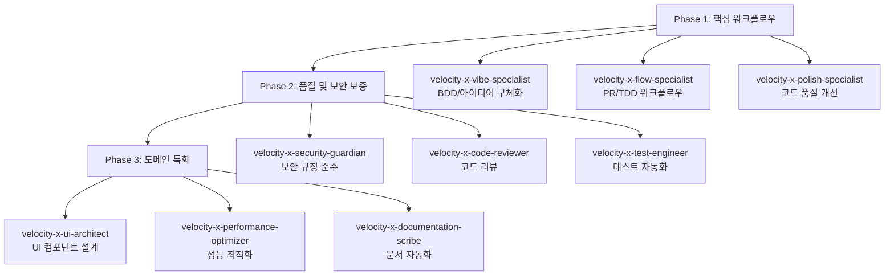

# VELOCITY-X (Velocity-X Agentic Engine) 🤖

차세대 개발을 위한 에이전틱 워크플로우 시스템

  

## 📖 개요

**VELOCITY-X (Velocity-X Agentic Engine)**는 소프트웨어 개발 생명주기(SDLC)를 자동화하는 다중 에이전트 협업 프레임워크입니다. 9개의 전문화된 AI 에이전트가 유기적으로 협력하여 코드 품질 향상, 보안 강화, 개발 속도 증진을 실현합니다.

### 🎯 핵심 가치

- **기술 부채 감소**: 자동화된 코드 품질 개선 및 리팩토링
- **일관된 품질 보장**: AI 기반 코드 리뷰 및 표준 준수 검증
- **개발 속도 향상**: 반복적 작업의 자동화를 통한 개발자 생산성 증대
- **지속적 학습**: 프로젝트별 맞춤형 개선 제안 및 베스트 프랙티스 적용

## 🏗️ 시스템 아키텍처

### 3-Phase 에이전트 구조



### 워크플로우 통합 시스템

VELOCITY-X는 `temp_hooks/commands/` 기반의 통합 시스템을 통해 각 에이전트의 자동 호출과 전문화된 도구 접근을 제공합니다.

```
temp_hooks/commands/
├── config/                    # 에이전트 및 도구 설정
│   ├── agents.yaml           # 에이전트 구성 및 의존성
│   ├── tools.yaml            # 전문화된 도구 설정  
│   └── workflow.yaml         # 워크플로우 정의
├── agents/                   # 에이전트별 실행 스크립트
│   ├── velocity-x-polish-specialist/
│   └── velocity-x-code-reviewer/
├── scripts/                  # 워크플로우 오케스트레이션
│   ├── run-quality-trio.sh   # Quality Trio 워크플로우
│   └── run-workflow.sh       # 범용 워크플로우 실행기
└── core/                     # 핵심 시스템
    ├── common.sh             # 공통 유틸리티
    └── workflow_engine.py    # 워크플로우 엔진
```

## 🚀 빠른 시작

### 1. 환경 설정

```bash
# 저장소 클론
git clone https://github.com/jayleekr/protocol-jae.git
cd protocol-jae

# 실행 권한 부여
chmod +x temp_hooks/commands/agents/*/run.sh
chmod +x temp_hooks/commands/scripts/*.sh
```

### 2. Quality Trio 워크플로우 실행

```bash
# 코드 품질 개선 + 리뷰 워크플로우
./temp_hooks/commands/scripts/run-quality-trio.sh your_file.py

# 상세 로그와 함께 실행
./temp_hooks/commands/scripts/run-quality-trio.sh --verbose your_file.py
```

### 3. 개별 에이전트 실행

```bash
# 코드 품질 개선 (Polish Specialist)
./temp_hooks/commands/agents/velocity-x-polish-specialist/run.sh your_file.py

# 코드 리뷰 (Code Reviewer)  
./temp_hooks/commands/agents/velocity-x-code-reviewer/run.sh your_file.py
```

## 🤖 에이전트 소개

### Phase 1: 핵심 워크플로우 에이전트

| 에이전트 | 역할 | 상태 |
|---------|------|------|
| **velocity-x-vibe-specialist** | BDD/아이디어 구체화 전문가 | 📋 설계 완료 |
| **velocity-x-flow-specialist** | PR/TDD 워크플로우 최적화 전문가 | 📋 설계 완료 |  
| **velocity-x-polish-specialist** | 코드 품질 개선 및 리팩토링 전문가 | ✅ 구현 완료 |

### Phase 2: 품질 및 보안 보증 에이전트

| 에이전트 | 역할 | 상태 |
|---------|------|------|
| **velocity-x-security-guardian** | ISMS-P/보안 규정 준수 전문가 | 📋 설계 완료 |
| **velocity-x-code-reviewer** | 코드 리뷰 및 표준 준수 전문가 | ✅ 구현 완료 |
| **velocity-x-test-engineer** | 테스트 자동화 및 커버리지 전문가 | 📋 설계 완료 |

### Phase 3: 도메인 특화 에이전트

| 에이전트 | 역할 | 상태 |
|---------|------|------|
| **velocity-x-ui-architect** | UI 컴포넌트 설계 및 생성 전문가 | 📋 설계 완료 |
| **velocity-x-performance-optimizer** | 성능 분석 및 최적화 전문가 | 📋 설계 완료 |
| **velocity-x-documentation-scribe** | 기술 문서 작성 및 관리 전문가 | 📋 설계 완료 |

## 📊 실제 성과 예시

### Quality Trio 워크플로우 결과

```json
{
  "overall_score": 83.7,
  "detailed_scores": {
    "functionality": 55,
    "security": 100,
    "performance": 90,  
    "style": 96
  },
  "recommendation": "APPROVE"
}
```

### 개선 효과
- **코드 스멜 탐지**: 11개 항목 자동 감지 및 개선 제안
- **보안 검증**: 100점 만점으로 보안 취약점 없음 확인
- **성능 최적화**: 알고리즘 복잡도 분석 및 최적화 기회 식별
- **스타일 일관성**: PEP 8 준수 96점으로 높은 코드 품질 유지

## 📚 상세 문서

### 에이전트별 상세 정보
- [VELOCITY-X Vibe Specialist](agents/velocity-x-vibe-specialist.md) - BDD/아이디어 구체화
- [VELOCITY-X Flow Specialist](agents/velocity-x-flow-specialist.md) - PR/TDD 워크플로우  
- [VELOCITY-X Polish Specialist](agents/velocity-x-polish-specialist.md) - 코드 품질 개선
- [VELOCITY-X Security Guardian](agents/velocity-x-security-guardian.md) - 보안 규정 준수
- [VELOCITY-X Code Reviewer](agents/velocity-x-code-reviewer.md) - 코드 리뷰
- [VELOCITY-X Test Engineer](agents/velocity-x-test-engineer.md) - 테스트 자동화
- [VELOCITY-X UI Architect](agents/velocity-x-ui-architect.md) - UI 컴포넌트 설계
- [VELOCITY-X Performance Optimizer](agents/velocity-x-performance-optimizer.md) - 성능 최적화  
- [VELOCITY-X Documentation Scribe](agents/velocity-x-documentation-scribe.md) - 문서 자동화

### 워크플로우 및 시스템
- [VELOCITY-X 통합 워크플로우](velocity-x-integrated-workflow.md) - 전체 시스템 아키텍처
- [사용법 가이드](temp_hooks/commands/docs/USAGE_GUIDE.md) - 상세 사용 방법

## 🛠️ 기술 스택

- **Language**: Python 3.11+
- **Framework**: Bash Scripts + Python Orchestration
- **LLM Integration**: Claude, GPT-4 호환
- **Tools**: 
  - 정적 분석: ruff, pylint
  - 코드 포맷팅: black, isort
  - 복잡도 분석: radon
  - 보안 검사: bandit
- **Infrastructure**: Docker, GitHub Actions

## 🤝 기여 방법

1. **Fork** 프로젝트
2. **Feature branch** 생성 (`git checkout -b feature/AmazingFeature`)
3. **변경사항 커밋** (`git commit -m 'Add some AmazingFeature'`)
4. **브랜치에 푸시** (`git push origin feature/AmazingFeature`)
5. **Pull Request** 생성

### 개발 워크플로우

```bash
# 개발 중 코드 품질 확인
./temp_hooks/commands/agents/velocity-x-polish-specialist/run.sh --analyze-only src/feature.py

# 커밋 전 전체 품질 검사
./temp_hooks/commands/scripts/run-quality-trio.sh src/feature.py

# PR 생성 전 포맷팅 적용
./temp_hooks/commands/agents/velocity-x-polish-specialist/run.sh --format-only src/feature.py
```

## 📈 로드맵

### ✅ 완료된 기능
- [x] 9개 에이전트 역할 정의 및 아키텍처 설계
- [x] temp_hooks/commands/ 기반 워크플로우 시스템
- [x] Polish Specialist & Code Reviewer 에이전트 구현
- [x] Quality Trio 워크플로우 통합 테스트
- [x] 사용법 가이드 문서 작성

### 🚧 진행 중
- [ ] 나머지 7개 에이전트 구현 (vibe, flow, security, test, ui, performance, documentation)
- [ ] Git hooks 기반 이벤트 트리거 시스템
- [ ] CI/CD 파이프라인 통합

### 🔮 향후 계획
- [ ] 웹 기반 대시보드 및 모니터링
- [ ] 팀 협업 기능 및 리포트 생성
- [ ] 엔터프라이즈 기능 (SSO, 감사 로그, 커스텀 규칙)
- [ ] 다양한 언어 지원 (JavaScript, Go, Rust, Java)

## 📄 라이선스

이 프로젝트는 MIT 라이선스 하에 배포됩니다. 자세한 내용은 [LICENSE](LICENSE) 파일을 참조하세요.

## 🙏 감사 인사

- **CrewAI** - 에이전트 오케스트레이션 영감
- **Anthropic Claude** - AI 에이전트 개발 파트너
- **오픈소스 커뮤니티** - 도구 및 라이브러리 제공

---

## 📞 문의 및 지원

- **이슈 리포트**: [GitHub Issues](https://github.com/jayleekr/protocol-jae/issues)
- **기능 요청**: [GitHub Discussions](https://github.com/jayleekr/protocol-jae/discussions)
- **이메일**: jae@example.com

**VELOCITY-X와 함께 더 스마트한 개발 경험을 시작하세요! 🚀**