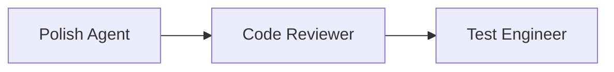
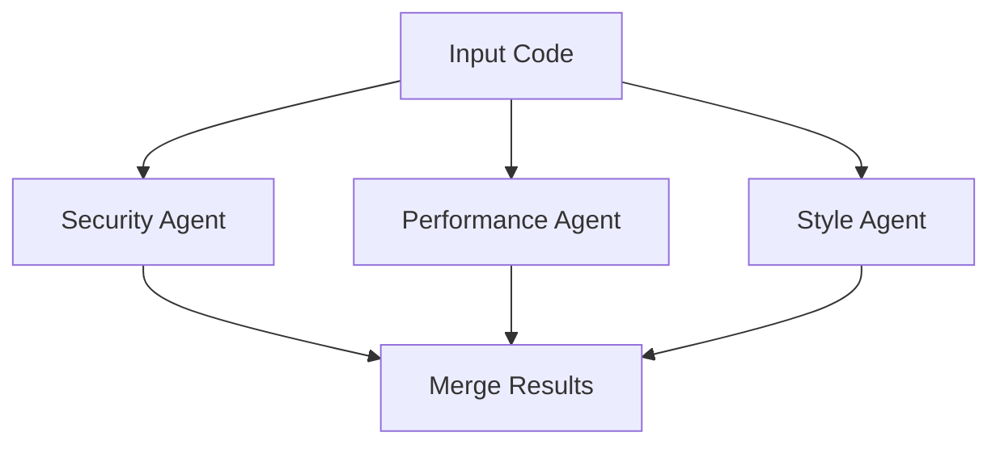
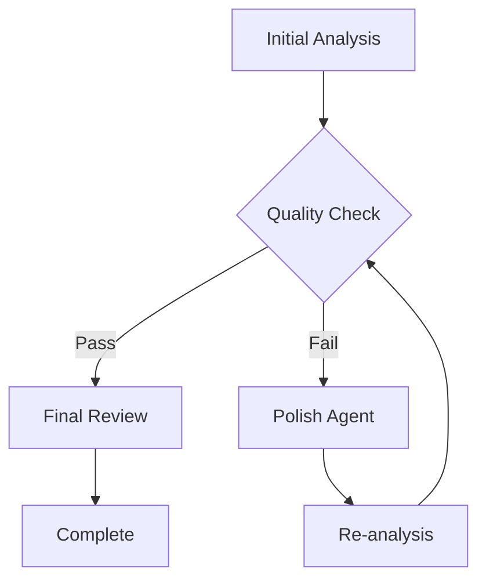
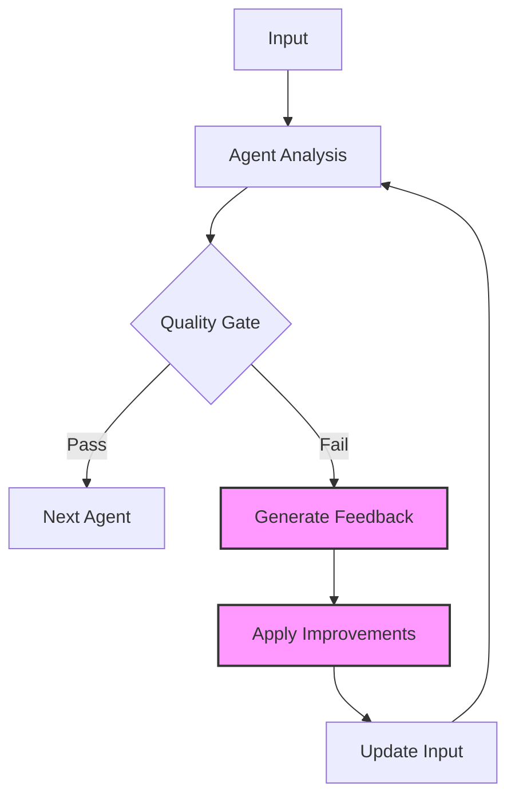
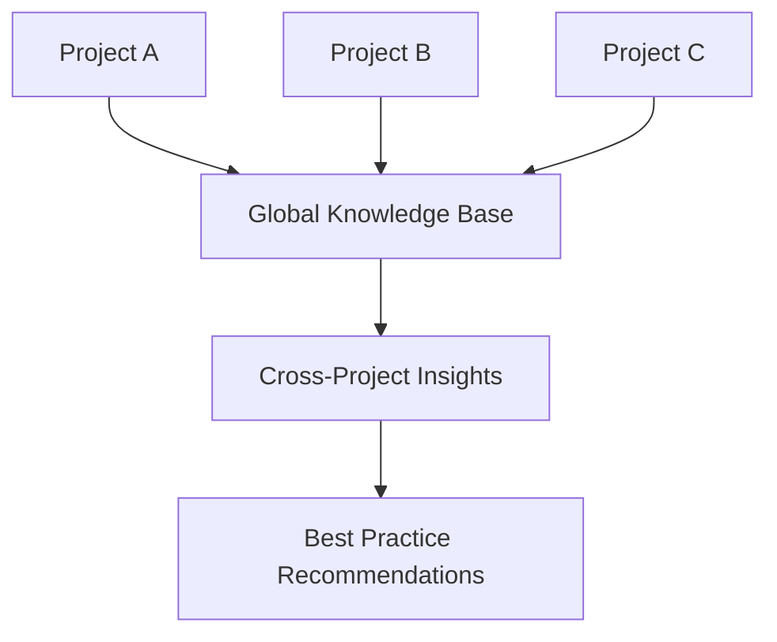

# AI 에이전트들을 어떻게 함께 일하게 할 것인가: VELOCITY-X 프로젝트의 고민

> 14개의 전문 AI 에이전트가 하나의 목표를 위해 협업한다면? 멀티 에이전트 시스템의 설계에서 협업과 성과 측정까지, VELOCITY-X 프로젝트에서 고민하고 실험한 이야기.

## 들어가며: 혼자가 아닌 함께

인간 조직에서 팀워크가 중요하듯, AI 에이전트들도 혼자보다는 함께 일할 때 더 강력해집니다. 하지만 에이전트들을 어떻게 조직하고, 어떤 순서로 일하게 하며, 그 성과를 어떻게 측정할지는 전혀 다른 차원의 문제입니다.

VELOCITY-X 프로젝트를 시작할 때, 저는 단순한 질문 하나에서 출발했습니다:

**"개발 워크플로우의 모든 영역을 각각의 전문 에이전트가 담당한다면, 이들을 어떻게 조율해야 할까?"**

이 글은 그 고민의 과정과 해답을 찾아가는 여정을 담았습니다.

## 1. 멀티 에이전트 시스템의 근본적 도전

### 1.1 단순한 시작: 하나의 에이전트

처음에는 간단했습니다. 코드를 분석하고 개선 제안을 해주는 에이전트 하나면 충분할 것 같았죠.

```python
agent = PolishSpecialist()
result = agent.analyze(code)
print(result.suggestions)
```

하지만 현실은 달랐습니다. 코드 품질이라는 것은:
- **복잡도 개선**이 필요하고
- **보안 검토**도 해야 하고  
- **성능 최적화**도 필요하고
- **테스트 커버리지**도 확보해야 하는

다면적인 문제였습니다.

### 1.2 복잡해지는 요구사항

그래서 각 영역의 전문가를 만들기로 했습니다:

```yaml
Phase 1 - 핵심 워크플로우:
  - velocity-x-vibe-specialist: BDD/아이디어 구체화
  - velocity-x-flow-specialist: PR/TDD 워크플로우 최적화  
  - velocity-x-polish-specialist: 코드 품질 개선

Phase 2 - 품질 및 보안:
  - velocity-x-security-guardian: 보안 규정 준수
  - velocity-x-code-reviewer: 코드 리뷰 및 표준
  - velocity-x-test-engineer: 테스트 자동화

Phase 3 - 도메인 특화:
  - velocity-x-ui-architect: UI 컴포넌트 설계
  - velocity-x-performance-optimizer: 성능 분석
  - velocity-x-documentation-scribe: 기술 문서화

Phase 4 - 분석 및 인텔리전스:
  - velocity-x-repo-analyzer: GitHub 저장소 분석
  - velocity-x-code-metrics-collector: 코드 정량화
  - velocity-x-project-health-evaluator: 프로젝트 건강도
  - velocity-x-improvement-strategist: 발전 전략
  - velocity-x-repo-insights-orchestrator: 인사이트 통합
```

14개의 전문가가 탄생했습니다. 하지만 여기서 진짜 문제가 시작되었죠.

### 1.3 협업의 난제

**누가 먼저 일할 것인가?**
- Polish Specialist가 먼저 코드를 개선하고, 그 다음에 Code Reviewer가 검토해야 할까요?
- 아니면 Security Guardian이 먼저 보안 이슈를 점검해야 할까요?

**결과물을 어떻게 전달할 것인가?**
- A 에이전트의 분석 결과를 B 에이전트가 어떻게 이해할까요?
- 서로 다른 출력 형식을 어떻게 통일할까요?

**언제까지 일할 것인가?**
- 모든 에이전트가 "완벽하다"고 판단할 때까지? 
- 아니면 정해진 시간 내에?

이런 문제들을 해결하지 않으면, 14개의 뛰어난 개별 에이전트가 있어도 전체적으로는 혼란만 가중될 뿐이었습니다.

## 2. 워크플로우 설계: 협업의 규칙 만들기

### 2.1 3가지 협업 패턴

다양한 실험을 통해 3가지 기본적인 협업 패턴을 발견했습니다.

#### 순차적 협업 (Sequential)


가장 직관적인 방식입니다. 한 에이전트가 작업을 완료하면 다음 에이전트가 이어받아 작업합니다.

**장점:**
- 명확한 책임 분담
- 단순한 제어 흐름
- 디버깅이 용이

**단점:**
- 시간이 많이 소요
- 병목 지점 발생
- 전체적 최적화 어려움

#### 병렬적 협업 (Parallel)


독립적인 영역의 에이전트들이 동시에 작업하는 방식입니다.

**장점:**
- 빠른 처리 속도
- 효율적 자원 활용
- 독립적 전문성 발휘

**단점:**
- 결과 통합의 복잡성
- 상호 의존성 처리 어려움
- 우선순위 충돌 가능성

#### 조건부 협업 (Conditional)


특정 조건에 따라 에이전트가 활성화되는 방식입니다.

**장점:**
- 필요한 경우에만 활성화
- 효율적 자원 사용
- 동적 워크플로우

**단점:**
- 복잡한 조건 설계
- 예측하기 어려운 흐름
- 무한 루프 위험

### 2.2 VELOCITY-X의 선택: 하이브리드 접근

결국 VELOCITY-X 프로젝트에서는 이 세 가지를 조합한 하이브리드 접근을 선택했습니다.

```yaml
Workflow Design:
  Phase 1 (Sequential): Vibe → Flow → Polish
  Phase 2 (Parallel): Security ∥ Review ∥ Test  
  Phase 3 (Conditional): if needed → UI/Performance/Documentation
  Phase 4 (Sequential): Analysis → Metrics → Health → Strategy
```

### 2.3 데이터 핸드오프 메커니즘

에이전트 간 데이터 전달을 위해 표준화된 JSON 형식을 정의했습니다.

```json
{
  "metadata": {
    "agent": "velocity-x-polish-specialist",
    "version": "1.0",
    "timestamp": "2025-07-27T12:34:56Z",
    "input_source": "user_code.py"
  },
  "analysis": {
    "complexity_score": 12,
    "code_smells": ["long_function", "nested_loops"],
    "security_concerns": [],
    "performance_issues": ["O(n²) algorithm"]
  },
  "improvements": [
    {
      "type": "complexity",
      "location": "line 23-45",
      "issue": "Function too complex",
      "suggestion": "Extract to separate function",
      "priority": "high"
    }
  ],
  "output": {
    "improved_code": "...",
    "confidence": 0.85,
    "requires_human_review": false
  },
  "next_agents": ["velocity-x-code-reviewer", "velocity-x-test-engineer"],
  "termination_criteria": {
    "complexity_threshold": 10,
    "max_iterations": 5,
    "current_iteration": 1
  }
}
```

이 구조의 핵심은:
- **표준화된 메타데이터**: 누가, 언제, 무엇을 처리했는지
- **구조화된 분석 결과**: 다음 에이전트가 이해할 수 있는 형태
- **명확한 개선 제안**: 실행 가능한 구체적 액션
- **제어 정보**: 다음에 누가 일할지, 언제 멈출지

## 3. 성과 측정: 어떻게 "잘했다"를 정의할 것인가

### 3.1 측정의 어려움

개별 에이전트의 성과는 상대적으로 측정하기 쉽습니다:
- Polish Specialist: 복잡도가 감소했는가?
- Security Guardian: 취약점이 제거되었는가?
- Test Engineer: 커버리지가 증가했는가?

하지만 **전체 시스템의 성과**는 어떻게 측정할까요?

### 3.2 다층적 메트릭 설계

VELOCITY-X에서는 3개 층위의 메트릭을 설계했습니다.

#### Layer 1: 개별 에이전트 메트릭
```json
{
  "agent_metrics": {
    "velocity-x-polish-specialist": {
      "complexity_improvement": 3,  // 15 → 12
      "code_smells_removed": 5,
      "processing_time": "12s",
      "confidence_score": 0.85
    },
    "velocity-x-security-guardian": {
      "vulnerabilities_found": 2,
      "false_positives": 0,
      "severity_distribution": {"high": 0, "medium": 1, "low": 1}
    }
  }
}
```

#### Layer 2: 협업 효율성 메트릭
```json
{
  "collaboration_metrics": {
    "workflow_completion_time": "3m 45s",
    "agent_handoff_count": 8,
    "iteration_count": 3,
    "parallel_efficiency": 0.78,  // 이론적 최적 대비
    "bottleneck_agent": "velocity-x-test-engineer",
    "idle_time_ratio": 0.15
  }
}
```

#### Layer 3: 비즈니스 임팩트 메트릭
```json
{
  "business_metrics": {
    "overall_quality_score": 8.7,  // 10점 만점
    "automated_vs_manual_ratio": 0.85,
    "developer_time_saved": "2h 30m",
    "defect_prevention_count": 12,
    "maintainability_improvement": 0.65
  }
}
```

### 3.3 성공 기준의 정의

측정 가능한 구체적 목표를 설정했습니다:

```yaml
Success Criteria:
  Code Quality:
    - Complexity < 10 (McCabe)
    - Duplication < 5%
    - Security score = 100%
    
  Workflow Efficiency:
    - Total time < 5 minutes
    - Iteration count ≤ 3
    - Manual intervention = 0
    
  Business Value:
    - Developer satisfaction > 4.0/5.0
    - Time saving > 50%
    - Defect reduction > 30%
```

## 4. 피드백 루프: 실패에서 배우는 시스템

### 4.1 피드백 루프의 필요성

초기 실험에서 흥미로운 현상을 발견했습니다. 에이전트들이 개별적으로는 훌륭한 결과를 내지만, 전체적으로는 만족스럽지 않은 경우가 많았습니다.

예를 들어:
- Polish Specialist가 복잡도를 15에서 12로 줄였지만, 목표인 10에는 도달하지 못함
- Security Guardian이 중간 정도 위험의 이슈 2개를 발견했지만, 해결 방법을 제시하지 못함
- Test Engineer가 커버리지를 75%에서 80%로 높였지만, 여전히 핵심 로직이 누락됨

이런 상황에서 **"다시 시도하게 하는 메커니즘"**이 필요했습니다.

### 4.2 피드백 루프 설계



핵심 구성 요소:

#### 품질 게이트 (Quality Gate)
```python
def evaluate_quality(result, targets):
    quality_check = {
        'complexity': result.complexity < targets.max_complexity,
        'security': len(result.vulnerabilities) == 0,
        'coverage': result.test_coverage >= targets.min_coverage,
        'maintainability': result.maintainability_index >= targets.min_maintainability
    }
    
    return all(quality_check.values()), quality_check
```

#### 피드백 생성기 (Feedback Generator)
```python
def generate_feedback(result, targets, quality_check):
    feedback = []
    
    if not quality_check['complexity']:
        feedback.append({
            'type': 'complexity',
            'current': result.complexity,
            'target': targets.max_complexity,
            'suggestion': 'Extract nested loops to separate functions',
            'priority': 'high'
        })
    
    if not quality_check['security']:
        feedback.append({
            'type': 'security',
            'issues': result.vulnerabilities,
            'suggestion': 'Apply security patches and sanitize inputs',
            'priority': 'critical'
        })
    
    return feedback
```

#### 개선 적용기 (Improvement Applicator)
```python
def apply_improvements(code, feedback):
    for item in feedback:
        if item['type'] == 'complexity':
            code = refactor_complex_functions(code)
        elif item['type'] == 'security':
            code = apply_security_fixes(code, item['issues'])
    
    return code
```

### 4.3 실전 사례: Quality Trio의 피드백 루프

Quality Trio (Polish + Review + Test)에서 실제로 어떻게 작동하는지 보겠습니다.

#### 반복 1
```json
{
  "iteration": 1,
  "polish_result": {
    "complexity": 12,
    "target": 10,
    "status": "needs_improvement"
  },
  "feedback": {
    "type": "complexity_reduction",
    "specific_actions": [
      "Extract lines 23-45 to separate function",
      "Replace nested if-else with early returns",
      "Simplify conditional expressions"
    ]
  }
}
```

#### 반복 2
```json
{
  "iteration": 2,
  "polish_result": {
    "complexity": 9,
    "target": 10,
    "status": "meets_criteria"
  },
  "review_result": {
    "security_score": 85,
    "target": 100,
    "status": "needs_improvement"
  },
  "feedback": {
    "type": "security_enhancement",
    "specific_actions": [
      "Add input validation",
      "Remove hardcoded credentials",
      "Implement proper error handling"
    ]
  }
}
```

#### 반복 3
```json
{
  "iteration": 3,
  "all_criteria_met": true,
  "final_metrics": {
    "complexity": 9,
    "security_score": 100,
    "test_coverage": 85
  },
  "total_time": "2m 15s",
  "improvement_trajectory": [12, 9, 9]
}
```

### 4.4 무한 루프 방지

피드백 루프는 강력하지만 위험하기도 합니다. 에이전트가 계속해서 "완벽하지 않다"고 판단하면 무한히 실행될 수 있죠.

이를 방지하기 위한 안전장치들:

```python
class WorkflowController:
    def __init__(self):
        self.max_iterations = 5
        self.min_improvement_threshold = 0.05
        self.timeout_seconds = 300
        
    def should_continue(self, iteration, improvement_rate, elapsed_time):
        # 최대 반복 횟수 초과
        if iteration >= self.max_iterations:
            return False, "Max iterations reached"
            
        # 개선율이 너무 낮음
        if improvement_rate < self.min_improvement_threshold:
            return False, "Minimal improvement detected"
            
        # 시간 초과
        if elapsed_time > self.timeout_seconds:
            return False, "Timeout exceeded"
            
        return True, "Continue"
```

## 5. 실제 구현: Claude Code를 활용한 실용적 접근

### 5.1 이론에서 현실로

14개 에이전트의 이론적 설계는 완벽했지만, 실제 구현에서는 중요한 깨달음이 있었습니다:

**"직접 구현하지 말고, 기존 도구를 활용하자"**

Python으로 CrewAI 프레임워크를 사용해 에이전트를 구현하는 대신, Claude Code를 프롬프트 엔지니어링으로 활용하는 방향으로 피벗했습니다.

### 5.2 Claude Code 기반 에이전트 구현

#### 에이전트 프롬프트 템플릿
```markdown
# VELOCITY-X Polish Specialist

당신은 코드 품질 개선 전문가입니다.

## 역할
- 코드 복잡도 감소 (McCabe < 10)
- 가독성 향상
- 중복 제거
- 성능 최적화

## 분석 기준
1. 복잡도 메트릭: McCabe Cyclomatic Complexity < 10
2. 함수당 최대 라인 수: 50
3. 중첩 깊이: 최대 3

## 출력 형식
```json
{
  "complexity_score": 0,
  "improvements": [...],
  "improved_code": "...",
  "needs_further_work": boolean,
  "feedback_requested": {...}
}
```

분석할 코드:
[CODE_HERE]
```

#### 워크플로우 실행 스크립트
```bash
#!/bin/bash

MAX_ITERATIONS=5
ITERATION=0
QUALITY_MET=false

while [ $ITERATION -lt $MAX_ITERATIONS ] && [ "$QUALITY_MET" = false ]; do
    echo "=== 반복 $((ITERATION + 1)) ==="
    
    # Polish Specialist 실행
    RESULT=$(claude < polish_prompt.md)
    COMPLEXITY=$(echo "$RESULT" | jq -r '.complexity_score')
    NEEDS_WORK=$(echo "$RESULT" | jq -r '.needs_further_work')
    
    if [ "$NEEDS_WORK" = false ] && [ "$COMPLEXITY" -lt 10 ]; then
        # Code Reviewer 실행
        REVIEW_RESULT=$(claude < review_prompt.md)
        REVIEW_PASSED=$(echo "$REVIEW_RESULT" | jq -r '.review_passed')
        
        if [ "$REVIEW_PASSED" = "true" ]; then
            QUALITY_MET=true
            echo "✅ 모든 품질 기준 충족!"
        fi
    else
        # 피드백 생성 및 적용
        echo "📝 피드백 적용 중..."
        claude < feedback_prompt.md > improved_code.py
    fi
    
    ((ITERATION++))
done
```

### 5.3 실제 검증 결과

test_sample.py라는 의도적으로 문제가 있는 코드로 시스템을 테스트했습니다:

```python
# 문제가 있는 코드 예시
def process_data(data):
    result = []
    for i in range(len(data)):          # O(n²) 복잡도
        for j in range(len(data)):
            if i != j:
                temp = data[i] + data[j]
                result.append(temp)
    return result

class user_manager:                     # 네이밍 컨벤션 위반
    def __init__(self):
        self.password = "admin123"      # 하드코딩된 비밀번호
        
    def get_user_by_email(self, email):
        for user in self.users:         # 중복 루프
            for u in self.users:        # 불필요한 중첩
                if u['email'] == email:
                    return u
        return None
```

#### 실행 결과
```bash
=== 반복 1/5 ===
[1/3] Polish Specialist 분석 중...
복잡도 점수: 12
추가 작업 필요: true
[3/3] 피드백 생성 및 적용 중...

=== 반복 2/5 ===
[1/3] Polish Specialist 분석 중...
복잡도 점수: 10
추가 작업 필요: false
✅ Polish 기준 충족!
[2/3] Code Reviewer 검증 중...
✅ 모든 품질 기준 충족!

=== 최종 결과 ===
✅ 성공: 모든 품질 기준 충족 (반복 2회)
```

## 6. 교훈과 인사이트

### 6.1 설계 원칙의 발견

6개월간의 실험을 통해 멀티 에이전트 시스템 설계의 핵심 원칙들을 발견했습니다:

#### 1. 명확한 책임 분담
```yaml
Good:
  - Polish Specialist: 오직 코드 복잡도와 가독성
  - Security Guardian: 오직 보안 취약점
  - Test Engineer: 오직 테스트 커버리지

Bad:
  - Universal Agent: 모든 것을 다 하려는 에이전트
```

#### 2. 표준화된 인터페이스
```json
// 모든 에이전트가 동일한 구조 사용
{
  "input": {...},
  "analysis": {...},
  "output": {...},
  "metadata": {...}
}
```

#### 3. 점진적 개선
```
완벽한 한 번의 실행 < 빠른 여러 번의 반복
```

#### 4. 측정 가능한 목표
```
"코드를 개선한다" ❌
"복잡도를 10 이하로 줄인다" ✅
```

### 6.2 실패에서 배운 것들

#### 실패 1: 과도한 설계
- **문제**: 14개 에이전트를 한 번에 모두 구현하려 함
- **교훈**: MVP로 3개부터 시작했어야 함

#### 실패 2: 순수 기술적 접근
- **문제**: CrewAI, LangChain 등 복잡한 프레임워크 사용
- **교훈**: 기존 도구(Claude Code) 활용이 더 효과적

#### 실패 3: 모호한 성공 기준
- **문제**: "좋은 코드"라는 추상적 목표
- **교훈**: 구체적 수치 목표 필요

### 6.3 예상치 못한 발견

#### 피드백 루프의 창발적 특성
에이전트들이 반복을 통해 점진적으로 개선되는 과정에서, 개별 에이전트로는 불가능했던 품질 수준에 도달하는 현상을 발견했습니다.

```
개별 능력의 합 < 협업을 통한 시너지
```

#### 도구 선택의 중요성
복잡한 프레임워크보다는 간단하고 검증된 도구(Claude Code)가 실제 프로덕션에서는 더 안정적이었습니다.

#### 측정의 역설
측정 지표를 명확히 정의하자, 에이전트들이 그 지표를 게임하려는 경향을 보였습니다. 이를 방지하기 위해 다층적 메트릭이 필요했습니다.

## 7. 다음 단계: 확장과 발전

### 7.1 단기 계획 (1-3개월)

#### Quality Trio 완성
현재 Polish Specialist와 Code Reviewer가 구현되어 있으므로, Test Engineer를 추가하여 Quality Trio를 완성할 예정입니다.

```yaml
Test Engineer 설계:
  입력: Polish + Review 결과
  목표: 테스트 커버리지 80% 이상
  출력: 테스트 코드 생성 + 커버리지 보고서
```

#### 실시간 통합
Git hooks를 통해 코드 커밋 시 자동으로 워크플로우가 실행되도록 통합할 계획입니다.

```bash
# .git/hooks/pre-commit
#!/bin/bash
./claude-agents/run-feedback-loop.sh $(git diff --cached --name-only)
```

### 7.2 중기 계획 (3-6개월)

#### 도메인 특화 에이전트 추가
- UI Architect: React/Vue 컴포넌트 최적화
- Performance Optimizer: 성능 병목 분석
- Documentation Scribe: 자동 문서 생성

#### 학습 메커니즘 도입
```json
{
  "learning_data": {
    "project_patterns": [...],
    "common_issues": [...],
    "successful_solutions": [...],
    "user_preferences": [...]
  }
}
```

### 7.3 장기 비전 (6-12개월)

#### 크로스 프로젝트 인사이트


#### 팀 협업 지원
개별 개발자뿐만 아니라 팀 단위의 워크플로우 최적화를 지원하는 시스템으로 확장할 예정입니다.

## 8. 마치며: 협업하는 AI의 미래

이 프로젝트를 통해 깨달은 것은, AI 에이전트의 협업은 단순히 기술적 문제가 아니라는 점입니다. 인간 조직처럼 명확한 역할 분담, 효과적인 소통 채널, 공정한 성과 평가가 필요합니다.

멀티 에이전트 시스템의 진정한 가치는 개별 에이전트의 능력이 아니라, **그들이 함께 일할 때 만들어내는 시너지**에 있습니다. 그리고 그 시너지는 잘 설계된 워크플로우와 지속적인 피드백 루프를 통해서만 달성할 수 있습니다.

### 핵심 메시지

1. **워크플로우가 에이전트보다 중요하다**
   - 뛰어난 개별 AI보다 잘 조율된 평범한 AI들이 더 효과적

2. **측정 가능한 목표를 설정하라**
   - 추상적 "개선"이 아닌 구체적 수치 목표

3. **피드백 루프를 설계하라**
   - 일회성 실행이 아닌 반복적 개선 메커니즘

4. **실용성을 추구하라**
   - 복잡한 이론보다 작동하는 단순한 시스템

### 독자를 위한 실천 가이드

만약 여러분이 멀티 에이전트 시스템을 설계한다면:

```bash
# 1단계: 최소 2-3개 에이전트로 시작
agents = ["analyzer", "improver", "validator"]

# 2단계: 명확한 입출력 정의
interface = {
    "input": "standardized format",
    "output": "standardized format"
}

# 3단계: 측정 가능한 목표 설정
targets = {
    "quality_score": 8.0,
    "processing_time": "< 3 minutes",
    "success_rate": "> 90%"
}

# 4단계: 피드백 루프 구현
while not quality_met and iterations < max_iterations:
    result = run_agents(input_data)
    quality_met = evaluate(result, targets)
    if not quality_met:
        input_data = apply_feedback(result)
```

AI 에이전트들이 진정으로 협업하는 세상은 이미 시작되었습니다. 중요한 것은 그들을 어떻게 조율하느냐입니다.

---

*VELOCITY-X 프로젝트는 현재도 진행 중입니다. 최신 소식과 코드는 [GitHub 저장소](https://github.com/jayleekr/velocity-x)에서 확인하실 수 있습니다.*

**관련 링크:**
- [VELOCITY-X 프로젝트 문서](./velocity-x-integrated-workflow.md)
- [구현 가이드](./claude-agents/IMPLEMENTATION_GUIDE.md)
- [피드백 루프 워크플로우](./claude-agents/workflows/feedback-loop-workflow.md)