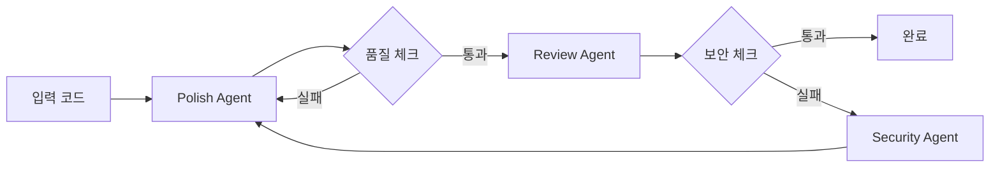

# Claude Code 기반 에이전트 구현 가이드

## 핵심 변경사항

1. **Python 구현 제거** → Claude Code 직접 활용
2. **피드백 루프 추가** → 반복적 품질 개선

## 실제 사용 방법

### 1. 단일 에이전트 실행

```bash
# Polish Specialist 실행
cat test_sample.py | claude "$(cat claude-agents/prompts/polish-specialist.md)" > result.json
```

### 2. 피드백 루프 실행

```bash
# 자동 피드백 루프 (시뮬레이션)
./claude-agents/run-feedback-loop.sh test_sample.py

# 실제 Claude Code 연동 버전
./claude-agents/run-feedback-loop-real.sh test_sample.py
```

### 3. 실제 Claude Code 통합 스크립트

```bash
#!/bin/bash
# run-feedback-loop-real.sh

TARGET_FILE="$1"
ITERATION=0
MAX_ITER=5

while [ $ITERATION -lt $MAX_ITER ]; do
    # Claude Code에 직접 프롬프트 전달
    RESULT=$(claude "당신은 Polish Specialist입니다. 
    다음 코드를 분석하세요: $(cat $TARGET_FILE)
    
    복잡도가 10 미만이 되도록 개선하고 JSON으로 결과를 출력하세요:
    {
        'complexity': int,
        'improved_code': str,
        'needs_more_work': bool
    }")
    
    # 결과 파싱
    COMPLEXITY=$(echo "$RESULT" | jq -r '.complexity')
    NEEDS_WORK=$(echo "$RESULT" | jq -r '.needs_more_work')
    
    if [ "$NEEDS_WORK" = "false" ]; then
        echo "✅ 품질 기준 충족!"
        break
    fi
    
    # 개선된 코드로 업데이트
    echo "$RESULT" | jq -r '.improved_code' > $TARGET_FILE
    
    ((ITERATION++))
done
```

## 피드백 메커니즘

### 자동 피드백 생성
```yaml
triggers:
  - complexity > 10: "함수를 더 작은 단위로 분할하세요"
  - duplicate_code: "공통 로직을 추출하세요"
  - security_issue: "보안 전문가 에이전트 활성화"
```

### 피드백 적용 프로세스
1. 현재 상태 분석
2. 목표와의 차이 계산
3. 구체적 개선 지시 생성
4. Claude Code에 개선 요청
5. 결과 검증

## 에이전트 체인



## 실행 예시

### 1. 기본 실행
```bash
$ ./claude-agents/run-feedback-loop.sh test_sample.py

=== VELOCITY-X 피드백 루프 워크플로우 시작 ===
대상 파일: test_sample.py
최대 반복: 5

=== 반복 1/5 ===
[1/3] Polish Specialist 분석 중...
복잡도 점수: 12
추가 작업 필요: true

[3/3] 피드백 생성 및 적용 중...
피드백 적용: 복잡도 12 -> 10

=== 반복 2/5 ===
[1/3] Polish Specialist 분석 중...
복잡도 점수: 10
추가 작업 필요: false
✅ Polish 기준 충족!

[2/3] Code Reviewer 검증 중...
✅ 모든 품질 기준 충족!

=== 최종 결과 ===
✅ 성공: 모든 품질 기준 충족 (반복 2회)
```

### 2. 실시간 Claude Code 활용
```bash
# 실제 Claude Code를 사용하는 경우
$ claude < claude-agents/prompts/polish-specialist.md

# 파이프라인으로 연결
$ cat code.py | claude "Polish this code" | claude "Review for security"
```

## 장점

1. **빠른 프로토타이핑**: Python 구현 없이 즉시 테스트
2. **유연한 수정**: 프롬프트만 변경하여 동작 조정
3. **실제 LLM 활용**: Claude의 최신 능력 직접 사용
4. **피드백 루프**: 자동으로 품질 개선

## 확장 방법

1. **새 에이전트 추가**
   - `prompts/` 디렉토리에 프롬프트 파일 생성
   - 워크플로우에 통합

2. **피드백 규칙 추가**
   - 트리거 조건 정의
   - 개선 액션 명시

3. **메트릭 확장**
   - 새로운 품질 지표 추가
   - 임계값 조정