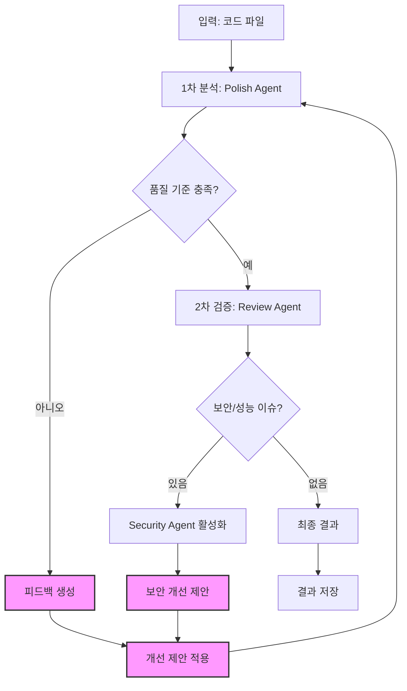

# Claude Code 기반 피드백 루프 워크플로우

## 워크플로우 구조



## 피드백 루프 메커니즘

### 1. **자동 피드백 트리거**
- 코드 복잡도 > 임계값
- 테스트 커버리지 < 목표치
- 보안 취약점 발견
- 성능 병목 감지

### 2. **피드백 수집 포인트**
```yaml
feedback_points:
  - after_polish:
      triggers:
        - complexity_score > 10
        - code_smells > 3
      action: request_simplification
      
  - after_review:
      triggers:
        - security_issues > 0
        - performance_issues > 0
      action: activate_specialist_agent
      
  - after_test:
      triggers:
        - coverage < 80%
        - failing_tests > 0
      action: improve_test_coverage
```

### 3. **반복 개선 프로세스**
1. 초기 분석 수행
2. 결과 평가 (자동 메트릭)
3. 개선 필요 영역 식별
4. 구체적 개선 지시 생성
5. 재분석 수행
6. 목표 달성까지 반복

## Claude Code 에이전트 실행 방법

### Polish Agent 호출
```bash
# 1차 분석
claude "당신은 VELOCITY-X Polish Specialist입니다. 
다음 코드를 분석하고 개선하세요:
$(cat target_file.py)

평가 기준:
- 복잡도 점수 < 10
- 중복 코드 제거
- 명확한 변수명

결과를 JSON으로 출력하세요:
{
  'complexity_score': int,
  'improvements': [],
  'code': 'improved code',
  'needs_further_work': bool
}"
```

### Review Agent 호출 (피드백 포함)
```bash
# Polish 결과를 받아 검토
claude "당신은 VELOCITY-X Code Reviewer입니다.
이전 분석 결과: $(cat polish_output.json)

추가 검토 사항:
- 보안 취약점
- 성능 이슈
- 코딩 표준 준수

피드백이 필요한 경우:
{
  'feedback_required': true,
  'feedback_type': 'security|performance|style',
  'specific_issues': [],
  'suggested_fixes': []
}"
```

## 실행 스크립트

### run-with-feedback.sh
```bash
#!/bin/bash

MAX_ITERATIONS=5
CURRENT_ITERATION=0
FEEDBACK_FILE="feedback.json"
IMPROVEMENT_NEEDED=true

while [ "$IMPROVEMENT_NEEDED" = true ] && [ $CURRENT_ITERATION -lt $MAX_ITERATIONS ]; do
    echo "=== Iteration $((CURRENT_ITERATION + 1)) ==="
    
    # Polish 실행
    claude < prompts/polish-with-metrics.md > polish_output.json
    
    # 메트릭 확인
    COMPLEXITY=$(jq -r '.complexity_score' polish_output.json)
    NEEDS_WORK=$(jq -r '.needs_further_work' polish_output.json)
    
    if [ "$NEEDS_WORK" = false ] && [ "$COMPLEXITY" -lt 10 ]; then
        # Review 실행
        claude < prompts/review-with-security.md > review_output.json
        
        SECURITY_ISSUES=$(jq -r '.security_issues | length' review_output.json)
        
        if [ "$SECURITY_ISSUES" -eq 0 ]; then
            IMPROVEMENT_NEEDED=false
            echo "✅ 모든 품질 기준 충족!"
        else
            # Security 피드백 생성
            claude < prompts/generate-security-feedback.md > $FEEDBACK_FILE
        fi
    else
        # Polish 피드백 생성
        claude < prompts/generate-polish-feedback.md > $FEEDBACK_FILE
    fi
    
    # 피드백 적용
    if [ "$IMPROVEMENT_NEEDED" = true ]; then
        echo "📝 피드백 적용 중..."
        claude < prompts/apply-feedback.md > improved_code.py
        cp improved_code.py target_file.py
    fi
    
    ((CURRENT_ITERATION++))
done

# 최종 결과 저장
mkdir -p results/$(date +%Y%m%d_%H%M%S)
cp *.json results/$(date +%Y%m%d_%H%M%S)/
```

## 피드백 데이터 구조

### feedback.json
```json
{
  "iteration": 1,
  "timestamp": "2025-07-27T10:00:00Z",
  "source_agent": "polish-specialist",
  "target_metrics": {
    "complexity": 10,
    "coverage": 80,
    "security_score": 100
  },
  "current_metrics": {
    "complexity": 15,
    "coverage": 65,
    "security_score": 85
  },
  "specific_feedback": [
    {
      "type": "complexity",
      "location": "function calculate_total",
      "issue": "Nested loops with complexity 12",
      "suggestion": "Extract inner loop to separate function"
    }
  ],
  "priority": "high",
  "estimated_iterations": 2
}
```

## 성공 기준

1. **수렴 조건**
   - 모든 메트릭이 목표치 달성
   - 최대 반복 횟수 도달
   - 개선률이 임계값 이하

2. **품질 지표**
   - 복잡도: McCabe < 10
   - 커버리지: > 80%
   - 보안 점수: 100
   - 성능: 응답시간 < 100ms

3. **학습 메커니즘**
   - 각 반복의 피드백 저장
   - 패턴 분석을 통한 개선
   - 다음 프로젝트에 적용