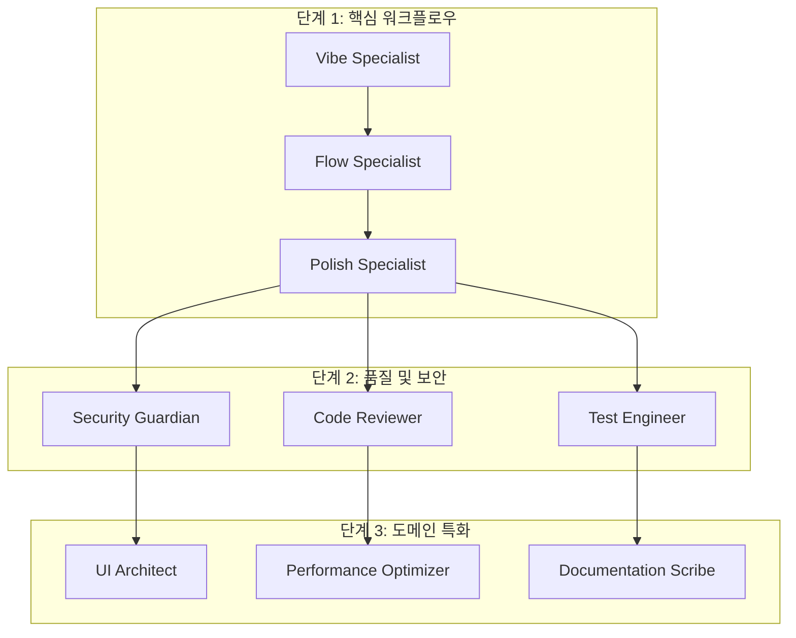

# 에이전틱 개발 이해하기

> *"소프트웨어 개발의 미래는 더 많은 코드를 작성하는 것이 아니라, 우리를 위해 코드를 작성하고, 검토하고, 개선하는 지능형 에이전트를 조율하는 것입니다."* - JAE Team

## 개요

혁신적인 에이전틱 개발의 세계에 오신 것을 환영합니다! 이 장에서는 소프트웨어 개발에 대한 사고방식을 변화시킬 근본적인 개념들을 소개합니다. 자율적인 에이전트들이 어떻게 협력하여 전례 없는 효율성과 품질로 코드를 생성하고, 개선하고, 유지보수하는지 탐구해보겠습니다.

이 장을 마친 후, 여러분은 다음을 이해하게 될 것입니다:
- 에이전틱 개발이 무엇이며 왜 중요한지
- 에이전트 기반 워크플로우를 이끄는 핵심 원칙들
- JAE가 이러한 개념들을 실제로 어떻게 구현하는지
- 개발자와 조직에게 가져다주는 실질적인 이익들

## 1. 서론

### 소프트웨어 개발의 진화

소프트웨어 개발은 여러 패러다임 변화를 겪어왔습니다:

1. **수동 시대 (1950년대-1970년대)**: 직접적인 기계어와 어셈블리
2. **구조화 시대 (1970년대-1990년대)**: 고급 언어와 방법론
3. **객체지향 시대 (1990년대-2010년대)**: 캡슐화와 재사용성
4. **데브옵스 시대 (2010년대-2020년대)**: 자동화와 지속적 배포
5. **에이전틱 시대 (2020년대-현재)**: 지능적이고 자율적인 개발

각 시대는 이전 시대를 기반으로 구축되어 복잡성을 추상화하고 개발자 생산성을 증가시켰습니다. 에이전틱 시대는 AI 기반 에이전트가 일상적인 작업을 처리하는 동안 개발자는 창의적 문제 해결과 전략적 의사결정에 집중하는 다음 도약을 나타냅니다.

### 에이전틱 개발이란?

에이전틱 개발은 전문화된 AI 에이전트들이 협력하여 소프트웨어 개발 라이프사이클의 다양한 측면을 처리하는 패러다임입니다. 개발자가 모든 작업을 수동으로 수행하는 대신, 다음과 같은 일을 하는 지능형 에이전트들을 조율합니다:

- **분석**: 요구사항을 분석하고 초기 구현을 생성
- **검토**: 품질, 보안, 성능을 위한 코드 검토
- **테스트**: 다양한 시나리오에서 기능성 테스트
- **문서화**: 코드와 아키텍처 결정 문서화
- **최적화**: 성능과 리소스 사용 최적화
- **유지보수**: 문제를 식별하고 수정하여 코드베이스 유지보수

## 2. 핵심 개념

### 주요 용어

에이전틱 개발을 이해하려면 몇 가지 핵심 개념에 익숙해져야 합니다:

- **에이전트**: 정의된 작업을 수행하는 특정 전문성을 가진 자율적 개체
- **워크플로우**: 목표를 달성하기 위한 에이전트 동작의 조정된 순서
- **파이프라인**: 지속적 통합과 배포를 위한 자동화된 프로세스
- **핸드오프**: 에이전트들이 서로 간에 작업과 컨텍스트를 전달하는 메커니즘
- **오케스트레이션**: 복잡한 작업을 완료하기 위한 여러 에이전트의 조정

### 에이전트 모델

에이전틱 시스템의 각 에이전트는 다음을 가집니다:

```python
class Agent:
    def __init__(self, name: str, expertise: str):
        self.name = name
        self.expertise = expertise
        self.tools = []
        self.context = {}
    
    def analyze(self, input_data):
        """에이전트의 전문성을 기반으로 입력 분석"""
        pass
    
    def execute(self, task):
        """할당된 작업 실행"""
        pass
    
    def handoff(self, next_agent, data):
        """워크플로우의 다음 에이전트로 결과 전달"""
        pass
```

### 기본 원칙

#### 1. 전문화
각 에이전트는 특정 도메인에 집중하여 깊은 전문성을 허용합니다:
- 코드 품질 에이전트는 스타일과 모범 사례를 이해
- 보안 에이전트는 취약점과 완화 전략을 파악
- 성능 에이전트는 속도와 효율성을 최적화

#### 2. 협력
에이전트들은 서로의 출력을 기반으로 함께 작업합니다:
- 종속적인 작업을 위한 순차 처리
- 독립적인 작업을 위한 병렬 실행
- 결과에 기반한 조건부 라우팅

#### 3. 자율성
에이전트들은 자신의 도메인 내에서 결정을 내립니다:
- 자동 오류 감지 및 수정
- 개선을 위한 지능적 제안
- 프로젝트 요구에 기반한 자체 조직화 워크플로우

#### 4. 지속적 학습
에이전트들은 시간이 지남에 따라 개선됩니다:
- 코드 검토와 수정에서 학습
- 프로젝트별 패턴에 적응
- 새로운 모범 사례 통합

## 3. 실제 구현

### JAE의 3단계 아키텍처

JAE는 구조화된 3단계 접근법을 통해 에이전틱 개발을 구현합니다:



### 실제 예시: Quality Trio 워크플로우

JAE의 Quality Trio가 실제로 어떻게 작동하는지 살펴보겠습니다:

```bash
# Quality Trio 워크플로우 실행
./temp_hooks/commands/scripts/run-quality-trio.sh my_module.py

# 워크플로우는 자동으로:
# 1. Polish Specialist가 코드를 분석하고 개선
# 2. Code Reviewer가 변경사항을 검증
# 3. 결과가 집계되어 제시됨
```

예시 출력:
```json
{
  "overall_score": 87.5,
  "improvements": {
    "code_smells_fixed": 5,
    "performance_optimizations": 3,
    "security_issues_resolved": 2
  },
  "time_saved": "2.5 hours"
}
```

### 커스텀 에이전트 구축

특정 요구사항을 위한 전문화된 에이전트를 생성할 수 있습니다:

```markdown
---
name: api-contract-validator
description: API 계약을 검증하고 하위 호환성을 보장
tools: Read, Grep, WebFetch
---

당신은 API 계약 검증 전문가입니다...
```

## 4. 고급 주제

### 에이전틱 워크플로우 확장

대규모로 에이전틱 개발을 구현할 때 고려사항:

#### 병렬 실행 전략
- 여러 에이전트에 독립적인 작업 분산
- 비동기 처리를 위한 메시지 큐 사용
- 장애 허용을 위한 회로 차단기 구현

```python
from concurrent.futures import ThreadPoolExecutor

def run_parallel_agents(agents, tasks):
    with ThreadPoolExecutor(max_workers=len(agents)) as executor:
        futures = []
        for agent, task in zip(agents, tasks):
            future = executor.submit(agent.execute, task)
            futures.append(future)
        
        results = [f.result() for f in futures]
        return aggregate_results(results)
```

#### 리소스 최적화
- 중복 처리를 피하기 위한 에이전트 출력 캐싱
- 대규모 코드베이스를 위한 지연 로딩 구현
- 지속적 통합을 위한 점진적 분석 사용

#### 성능 모니터링
```python
class AgentMetrics:
    def __init__(self):
        self.execution_times = {}
        self.success_rates = {}
        self.resource_usage = {}
    
    def track_execution(self, agent_name, duration, success, memory_used):
        # 최적화를 위한 성능 메트릭 추적
        pass
```

### 일반적인 함정과 해결책

1. **과도한 자동화**: 모든 것이 에이전트를 필요로 하지는 않습니다
   - 해결책: 가치가 높고 반복적인 작업부터 시작
   
2. **에이전트 충돌**: 서로 다른 에이전트가 상반되는 변경을 제안
   - 해결책: 명확한 우선순위 규칙 수립
   
3. **컨텍스트 손실**: 에이전트 간에 중요한 정보가 전달되지 않음
   - 해결책: 포괄적인 핸드오프 프로토콜 구현

## 5. 요약

이 장에서는 에이전틱 개발의 기본 개념들을 탐구했습니다:

✅ **패러다임 변화 이해**: 수동에서 에이전트 지원 개발로의 전환

✅ **핵심 개념 학습**: 에이전트, 워크플로우, 오케스트레이션과 같은 개념들

✅ **JAE의 구현 탐구**: 3단계 아키텍처를 통한 구현

✅ **실제 예시 확인**: 실제 워크플로우에서 에이전트들이 협력하는 방법

✅ **고급 주제 고려**: 확장과 최적화를 위한 고급 주제들

### 핵심 요점

1. 에이전틱 개발은 개발자 능력을 증폭시키며, 대체하지 않습니다
2. 함께 작업하는 전문화된 에이전트들이 일반적인 접근법보다 뛰어난 성능을 발휘합니다
3. 3단계 아키텍처는 유연성을 유지하면서 구조를 제공합니다
4. Quality Trio와 같은 검증된 워크플로우로 작게 시작하세요
5. 실제 성능 메트릭을 기반으로 측정하고 최적화하세요

## 연습 문제

1. **개념적 이해**: 세 개의 에이전트가 새로운 기능을 구현하기 위해 어떻게 협력할 수 있는지 다이어그램을 그려보세요

2. **실제 적용**: 자신의 코드에서 Quality Trio 워크플로우를 실행하고 결과를 분석해보세요

3. **커스텀 에이전트 설계**: 자주 수행하는 작업을 위한 전문화된 에이전트를 설계해보세요

4. **워크플로우 생성**: 기존 에이전트들을 결합하여 팀의 요구사항을 위한 새로운 워크플로우를 만들어보세요

## 추가 읽기

- [JAE 아키텍처 심화 탐구](02-architecture.md)
- [에이전트 개발 가이드](07-custom-agent-development.md)
- [워크플로우 설계 패턴](08-workflow-design-patterns.md)

---

*다음 장: [JAE 시스템 아키텍처](02-architecture.md) - JAE 프레임워크의 기술적 구현에 대해 깊이 알아보기*