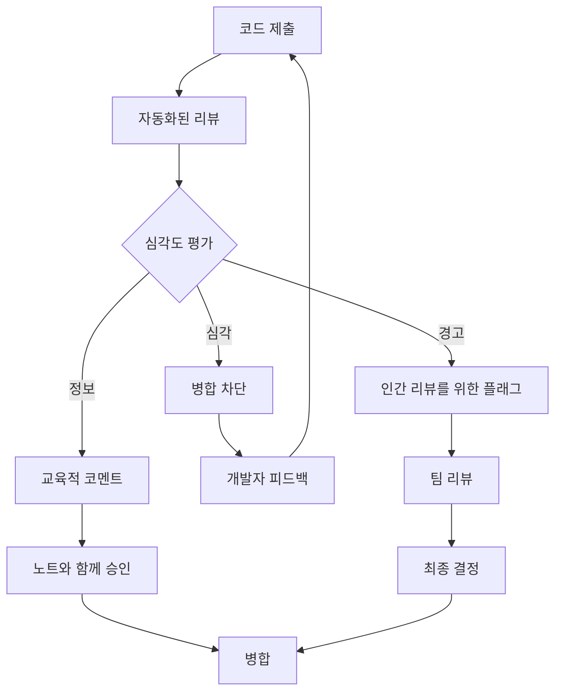

# Code Reviewer 활용

> *"코드 리뷰는 버그를 찾는 것이 아니라 지식을 공유하고, 일관성을 보장하며, 더 나은 소프트웨어를 함께 구축하는 것이다."* - Jeff Atwood

## 개요

Code Reviewer 에이전트는 자동화되고 지능적인 리뷰를 통해 높은 코드 품질을 유지하겠다는 JAE의 약속을 나타냅니다. 이 장에서는 이 에이전트를 효과적으로 활용하여 팀과 함께 확장되는 견고하고 일관되며 교육적인 리뷰 프로세스를 만드는 방법을 탐구합니다.

이 장을 마치면 다음을 이해하게 됩니다:
- Code Reviewer의 분석 방법론과 기능
- 다양한 리뷰 시나리오를 위한 고급 구성
- 기존 리뷰 워크플로우 및 도구와의 통합
- 팀별 표준 및 관행에 대한 사용자 정의
- 리뷰 효과성 측정 및 개선

## 1. Code Reviewer 소개

### 임무와 범위

Code Reviewer 에이전트는 다음과 같은 지능적이고 지치지 않는 리뷰어 역할을 합니다:

- **일관성 보장**: 모든 코드 변경사항에 동일한 표준 적용
- **조기 문제 발견**: 프로덕션에 도달하기 전에 문제 식별
- **개발자 교육**: 학습을 위한 설명적 피드백 제공
- **리뷰 용량 확장**: 초기 리뷰 부하를 처리하여 복잡한 결정을 위해 인간을 자유롭게 함
- **표준 유지**: 코딩 가이드라인과 모범 사례 강화

### 리뷰 철학



Code Reviewer는 심각도 기반 접근 방식을 따르며, 명확한 문제에 대한 즉각적인 피드백을 제공하면서 인간의 판단이 필요한 문제만 에스컬레이션합니다.

## 2. 핵심 리뷰 기능

### 다차원 분석

Code Reviewer는 여러 차원에서 코드를 평가합니다:

```python
class ReviewDimensions:
    """코드 리뷰 분석의 핵심 차원"""
    
    FUNCTIONALITY = "functionality"
    READABILITY = "readability"
    MAINTAINABILITY = "maintainability"
    PERFORMANCE = "performance"
    SECURITY = "security"
    TESTING = "testing"
    DOCUMENTATION = "documentation"
    ARCHITECTURE = "architecture"

class CodeReviewEngine:
    def __init__(self, config: ReviewConfig):
        self.config = config
        self.analyzers = self._initialize_analyzers()
        self.knowledge_base = ReviewKnowledgeBase()
    
    def review_changeset(self, changeset: Changeset) -> ReviewResult:
        """코드 변경사항의 포괄적인 리뷰"""
        result = ReviewResult(changeset.id)
        
        for file_change in changeset.files:
            file_review = self._review_file_change(file_change)
            result.add_file_review(file_review)
        
        # 파일 간 분석
        architectural_issues = self._analyze_architecture(changeset)
        result.add_architectural_feedback(architectural_issues)
        
        # 요약 및 권장사항 생성
        result.summary = self._generate_review_summary(result)
        
        return result
    
    def _review_file_change(self, file_change: FileChange) -> FileReview:
        """개별 파일 변경사항의 상세 리뷰"""
        review = FileReview(file_change.path)
        
        # 변경된 각 라인 분석
        for line_change in file_change.line_changes:
            if line_change.type == ChangeType.ADDITION:
                issues = self._analyze_new_code(line_change)
                review.add_line_issues(line_change.line_number, issues)
            elif line_change.type == ChangeType.MODIFICATION:
                issues = self._analyze_code_modification(line_change)
                review.add_line_issues(line_change.line_number, issues)
        
        # 파일 수준 분석
        file_issues = self._analyze_file_structure(file_change)
        review.add_file_issues(file_issues)
        
        return review
```

### 지능형 패턴 인식

에이전트는 일반적인 코드 문제에 대한 정교한 패턴 인식을 사용합니다:

```python
class ReviewPatternMatcher:
    def __init__(self):
        self.patterns = self._load_review_patterns()
        self.ml_classifier = self._load_ml_model()
    
    def match_patterns(self, code_block: CodeBlock) -> List[ReviewIssue]:
        """알려진 문제 패턴에 대해 코드 매칭"""
        issues = []
        
        # 정적 패턴 매칭
        for pattern in self.patterns:
            if pattern.matches(code_block):
                issues.append(ReviewIssue(
                    type=pattern.issue_type,
                    severity=pattern.severity,
                    message=pattern.message,
                    suggestion=pattern.suggestion,
                    confidence=pattern.confidence
                ))
        
        # ML 기반 패턴 감지
        ml_issues = self.ml_classifier.predict_issues(code_block)
        issues.extend(ml_issues)
        
        return issues
    
    def _load_review_patterns(self) -> List[ReviewPattern]:
        """미리 정의된 리뷰 패턴 로드"""
        return [
            # 보안 패턴
            ReviewPattern(
                name="sql_injection_risk",
                pattern=r"execute\s*\(\s*[\"'].*\%.*[\"']\s*\)",
                issue_type="security",
                severity="high",
                message="잠재적인 SQL 인젝션 취약점",
                suggestion="파라미터화된 쿼리를 사용하세요"
            ),
            
            # 성능 패턴
            ReviewPattern(
                name="inefficient_loop",
                pattern=r"for.*in.*:\s*if.*in.*:",
                issue_type="performance",
                severity="medium",
                message="멤버십 테스트가 있는 중첩 루프",
                suggestion="더 빠른 검색을 위해 set 사용을 고려하세요"
            ),
            
            # 유지보수성 패턴
            ReviewPattern(
                name="magic_numbers",
                pattern=r"(?<![\w.])[0-9]{2,}(?![\w.])",
                issue_type="maintainability",
                severity="low",
                message="매직 넘버 감지",
                suggestion="명명된 상수 사용을 고려하세요"
            )
        ]
```

### 컨텍스트 인식 분석

Code Reviewer는 더 정확한 리뷰를 위해 컨텍스트 정보를 고려합니다:

```python
class ContextualAnalyzer:
    def __init__(self, repository: Repository):
        self.repository = repository
        self.history_analyzer = HistoryAnalyzer()
        self.dependency_graph = DependencyGraph()
    
    def analyze_with_context(self, change: FileChange) -> ContextualReview:
        """전체 컨텍스트와 함께 코드 변경사항 분석"""
        context = self._build_context(change)
        
        review = ContextualReview()
        
        # 히스토리 컨텍스트
        historical_issues = self._analyze_historical_patterns(change, context)
        review.add_historical_insights(historical_issues)
        
        # 의존성 컨텍스트
        dependency_impacts = self._analyze_dependency_impact(change, context)
        review.add_dependency_analysis(dependency_impacts)
        
        # 팀 컨텍스트
        team_patterns = self._analyze_team_patterns(change, context)
        review.add_team_insights(team_patterns)
        
        return review
    
    def _build_context(self, change: FileChange) -> ReviewContext:
        """리뷰를 위한 포괄적인 컨텍스트 구축"""
        return ReviewContext(
            file_history=self.repository.get_file_history(change.path),
            recent_changes=self.repository.get_recent_changes(change.path),
            related_files=self.dependency_graph.get_dependencies(change.path),
            team_members=self.repository.get_contributors(change.path),
            project_conventions=self._extract_conventions(change.path)
        )
```

## 3. 고급 구성

### 리뷰 프로파일

다양한 시나리오에 대해 다른 리뷰 강도를 구성합니다:

```yaml
# review-profiles.yaml
profiles:
  strict:
    description: "중요한 코드에 대한 최대 정밀 검사"
    enabled_analyzers:
      - security_analyzer
      - performance_analyzer
      - maintainability_analyzer
      - architecture_analyzer
      - documentation_analyzer
    thresholds:
      block_merge_on: ["high", "critical"]
      require_human_review: ["medium", "high", "critical"]
      auto_approve: []
    
  standard:
    description: "일반 개발을 위한 균형 잡힌 리뷰"
    enabled_analyzers:
      - security_analyzer
      - maintainability_analyzer
      - documentation_analyzer
    thresholds:
      block_merge_on: ["critical"]
      require_human_review: ["high", "critical"]
      auto_approve: ["info", "low"]
    
  rapid:
    description: "기능 브랜치를 위한 빠른 피드백"
    enabled_analyzers:
      - security_analyzer
      - basic_quality_analyzer
    thresholds:
      block_merge_on: ["critical"]
      require_human_review: ["critical"]
      auto_approve: ["info", "low", "medium"]

# 프로파일 할당
file_patterns:
  "src/core/**": "strict"
  "src/api/**": "strict"
  "tests/**": "standard"
  "examples/**": "rapid"
  "docs/**": "rapid"
```

### 사용자 정의 리뷰 규칙

조직별 리뷰 규칙 생성:

```python
# custom_review_rules.py
class CustomReviewRules:
    def __init__(self, rules_config: dict):
        self.rules = self._parse_rules(rules_config)
    
    def apply_custom_rules(self, code_change: CodeChange) -> List[ReviewIssue]:
        """조직별 리뷰 규칙 적용"""
        issues = []
        
        for rule in self.rules:
            if rule.applies_to(code_change):
                violations = rule.check(code_change)
                issues.extend(violations)
        
        return issues

class APICompatibilityRule(ReviewRule):
    """API 하위 호환성 보장"""
    
    def applies_to(self, code_change: CodeChange) -> bool:
        return code_change.affects_public_api()
    
    def check(self, code_change: CodeChange) -> List[ReviewIssue]:
        issues = []
        
        # 중단 변경사항 확인
        if code_change.removes_public_method():
            issues.append(ReviewIssue(
                type="api_compatibility",
                severity="critical",
                message="퍼블릭 메소드 제거 감지",
                suggestion="제거 대신 메소드를 사용 중단(deprecate)하세요"
            ))
        
        if code_change.changes_method_signature():
            issues.append(ReviewIssue(
                type="api_compatibility",
                severity="high",
                message="퍼블릭 메소드 시그니처 변경",
                suggestion="새 메소드를 추가하고 기존 메소드를 사용 중단하세요"
            ))
        
        return issues

class DatabaseSchemaRule(ReviewRule):
    """데이터베이스 스키마 변경 검증"""
    
    def applies_to(self, code_change: CodeChange) -> bool:
        return any("migration" in file.path for file in code_change.files)
    
    def check(self, code_change: CodeChange) -> List[ReviewIssue]:
        issues = []
        
        for migration_file in code_change.get_migration_files():
            # 파괴적인 작업 확인
            if migration_file.contains_drop_table():
                issues.append(ReviewIssue(
                    type="data_safety",
                    severity="critical",
                    message="마이그레이션에서 DROP TABLE 감지",
                    suggestion="IF EXISTS를 사용하고 먼저 데이터를 백업하세요"
                ))
            
            # 롤백 누락 확인
            if not migration_file.has_rollback():
                issues.append(ReviewIssue(
                    type="migration_safety",
                    severity="medium",
                    message="마이그레이션에 롤백 절차 누락",
                    suggestion="롤백을 위한 DOWN 마이그레이션을 추가하세요"
                ))
        
        return issues
```

### 팀별 사용자 정의

팀의 전문성과 선호도에 맞게 리뷰를 조정:

```python
class TeamCustomization:
    def __init__(self, team_config: TeamConfig):
        self.team_config = team_config
        self.skill_matrix = SkillMatrix()
    
    def customize_review_for_author(self, author: Developer, 
                                  change: CodeChange) -> ReviewCustomization:
        """작성자의 프로필에 따라 리뷰 사용자 정의"""
        author_profile = self.skill_matrix.get_profile(author)
        
        customization = ReviewCustomization()
        
        # 경험에 따른 정밀도 조정
        if author_profile.experience_level == "junior":
            customization.increase_scrutiny = True
            customization.provide_educational_comments = True
        elif author_profile.experience_level == "senior":
            customization.focus_on_architecture = True
            customization.reduce_basic_checks = True
        
        # 개발 영역에 집중
        if author_profile.is_developing_skill("security"):
            customization.emphasize_security_feedback = True
        
        # 전문 영역 고려
        if change.affects_area(author_profile.expertise_areas):
            customization.trust_level = "high"
        else:
            customization.request_domain_expert_review = True
        
        return customization
```

## 4. 통합 패턴

### Git 워크플로우 통합

다양한 Git 워크플로우와 원활하게 통합:

```python
# git_integration.py
class GitWorkflowIntegration:
    def __init__(self, workflow_type: str):
        self.workflow_type = workflow_type
        self.hooks = self._setup_hooks()
    
    def setup_pull_request_review(self):
        """풀 리퀘스트를 위한 자동화된 리뷰 설정"""
        if self.workflow_type == "github":
            return GitHubPRIntegration()
        elif self.workflow_type == "gitlab":
            return GitLabMRIntegration()
        elif self.workflow_type == "bitbucket":
            return BitbucketPRIntegration()

class GitHubPRIntegration:
    def __init__(self):
        self.github_client = GitHubClient()
    
    def handle_pull_request(self, pr_event: PullRequestEvent):
        """GitHub 풀 리퀘스트 이벤트 처리"""
        if pr_event.action == "opened" or pr_event.action == "synchronize":
            self._trigger_review(pr_event.pull_request)
    
    def _trigger_review(self, pull_request: PullRequest):
        """풀 리퀘스트에 대한 코드 리뷰 트리거"""
        changeset = self._extract_changeset(pull_request)
        review_result = self.code_reviewer.review_changeset(changeset)
        
        # 리뷰 댓글 게시
        self._post_review_comments(pull_request, review_result)
        
        # 리뷰 상태 설정
        status = self._determine_status(review_result)
        self.github_client.set_status(pull_request, status)
    
    def _post_review_comments(self, pr: PullRequest, review: ReviewResult):
        """라인별 리뷰 댓글 게시"""
        for file_review in review.file_reviews:
            for line_issue in file_review.line_issues:
                self.github_client.create_review_comment(
                    pr.number,
                    file_review.path,
                    line_issue.line_number,
                    line_issue.message
                )
```

### IDE 통합

개발 환경에서 실시간 리뷰 피드백 제공:

```python
# ide_integration.py
class IDEReviewIntegration:
    def __init__(self, ide_type: str):
        self.ide_type = ide_type
        self.review_engine = CodeReviewEngine()
        self.background_processor = BackgroundProcessor()
    
    def enable_real_time_review(self):
        """개발자가 타이핑할 때 실시간 리뷰 활성화"""
        self.background_processor.start()
        self._register_event_handlers()
    
    def on_file_save(self, file_path: str):
        """파일이 저장될 때 리뷰 트리거"""
        # 즉시 피드백을 위한 빠른 리뷰
        quick_review = self.review_engine.quick_review(file_path)
        self._update_ide_annotations(file_path, quick_review)
    
    def on_commit_prepare(self, staged_files: List[str]):
        """커밋 전 포괄적인 리뷰"""
        changeset = self._create_changeset(staged_files)
        full_review = self.review_engine.review_changeset(changeset)
        
        if full_review.has_blocking_issues():
            self._show_commit_warning(full_review)
        else:
            self._show_commit_summary(full_review)
    
    def _update_ide_annotations(self, file_path: str, review: QuickReview):
        """리뷰 주석으로 IDE 업데이트"""
        annotations = []
        
        for issue in review.issues:
            annotation = IDEAnnotation(
                line=issue.line_number,
                message=issue.message,
                severity=self._map_severity(issue.severity),
                quick_fix=issue.suggested_fix if issue.has_fix else None
            )
            annotations.append(annotation)
        
        self.ide_client.update_annotations(file_path, annotations)
```

### CI/CD 파이프라인 통합

지속적 통합 파이프라인에 리뷰 임베드:

```yaml
# .github/workflows/code-review.yml
name: Automated Code Review
on:
  pull_request:
    types: [opened, synchronize]

jobs:
  code-review:
    runs-on: ubuntu-latest
    steps:
      - name: Checkout code
        uses: actions/checkout@v3
        with:
          fetch-depth: 0  # 더 나은 컨텍스트를 위한 전체 히스토리
      
      - name: Setup JAE environment
        uses: ./.github/actions/setup-jae
      
      - name: Run Code Reviewer
        id: review
        run: |
          ./temp_hooks/commands/agents/jae-code-reviewer/command.sh \
            --base-ref ${{ github.event.pull_request.base.sha }} \
            --head-ref ${{ github.event.pull_request.head.sha }} \
            --output-format github-actions \
            --profile standard
      
      - name: Post Review Comments
        uses: ./.github/actions/post-review-comments
        with:
          review-file: ${{ steps.review.outputs.review-file }}
          github-token: ${{ secrets.GITHUB_TOKEN }}
      
      - name: Update Check Status
        run: |
          if [ "${{ steps.review.outputs.blocking-issues }}" == "true" ]; then
            echo "차단 이슈 발견"
            exit 1
          fi
```

## 5. 리뷰 품질 메트릭

### 리뷰 효과성 측정

자동화된 리뷰의 영향과 정확성 추적:

```python
class ReviewMetrics:
    def __init__(self, metrics_store: MetricsStore):
        self.metrics_store = metrics_store
    
    def calculate_review_effectiveness(self, time_period: str) -> EffectivenessReport:
        """리뷰가 문제를 잡는 데 얼마나 효과적인지 계산"""
        data = self.metrics_store.get_review_data(time_period)
        
        # 주요 메트릭 계산
        precision = self._calculate_precision(data)
        recall = self._calculate_recall(data)
        false_positive_rate = self._calculate_false_positive_rate(data)
        developer_satisfaction = self._calculate_satisfaction(data)
        
        return EffectivenessReport(
            precision=precision,
            recall=recall,
            false_positive_rate=false_positive_rate,
            developer_satisfaction=developer_satisfaction,
            issues_caught=data.automated_issues_count,
            issues_missed=data.missed_issues_count,
            time_saved=data.estimated_time_saved
        )
    
    def _calculate_precision(self, data: ReviewData) -> float:
        """정밀도 계산: 참양성 / (참양성 + 거짓양성)"""
        true_positives = data.valid_issues_found
        false_positives = data.invalid_issues_flagged
        
        if true_positives + false_positives == 0:
            return 0.0
        
        return true_positives / (true_positives + false_positives)
    
    def generate_improvement_recommendations(self, 
                                           metrics: EffectivenessReport) -> List[Recommendation]:
        """리뷰 품질 개선을 위한 권장사항 생성"""
        recommendations = []
        
        if metrics.false_positive_rate > 0.2:
            recommendations.append(Recommendation(
                type="threshold_adjustment",
                priority="high",
                description="높은 거짓 양성 비율 감지",
                action="감지 임계값 검토 및 조정"
            ))
        
        if metrics.recall < 0.8:
            recommendations.append(Recommendation(
                type="coverage_expansion",
                priority="medium",
                description="일부 문제가 놓치고 있음",
                action="리뷰 패턴 및 규칙 확장"
            ))
        
        return recommendations
```

### 개발자 피드백 통합

개발자 피드백 수집 및 활용:

```python
class FeedbackSystem:
    def __init__(self):
        self.feedback_store = FeedbackStore()
        self.pattern_updater = PatternUpdater()
    
    def collect_feedback(self, review_id: str, feedback: ReviewFeedback):
        """리뷰 품질에 대한 개발자 피드백 수집"""
        self.feedback_store.store(review_id, feedback)
        
        # 명확한 피드백에 대한 즉시 조정
        if feedback.is_false_positive():
            self._adjust_pattern_sensitivity(feedback.issue_type, decrease=True)
        elif feedback.is_missed_issue():
            self._enhance_pattern_detection(feedback.issue_type)
    
    def analyze_feedback_trends(self) -> FeedbackAnalysis:
        """피드백 패턴을 분석하여 리뷰 개선"""
        recent_feedback = self.feedback_store.get_recent_feedback()
        
        analysis = FeedbackAnalysis()
        
        # 문제 패턴 식별
        problem_patterns = self._identify_problem_patterns(recent_feedback)
        analysis.add_problem_patterns(problem_patterns)
        
        # 성공 패턴 식별
        successful_patterns = self._identify_successful_patterns(recent_feedback)
        analysis.add_successful_patterns(successful_patterns)
        
        # 개선 액션 생성
        actions = self._generate_improvement_actions(analysis)
        analysis.add_recommended_actions(actions)
        
        return analysis
```

## 6. 고급 기능

### 머신러닝 강화

머신러닝을 통한 리뷰 정확도 지속적 개선:

```python
class MLEnhancedReviewer:
    def __init__(self):
        self.model = self._load_review_model()
        self.training_pipeline = TrainingPipeline()
    
    def predict_issue_severity(self, code_change: CodeChange) -> IssueSeverity:
        """ML을 사용하여 문제 심각도를 더 정확하게 예측"""
        features = self._extract_features(code_change)
        prediction = self.model.predict(features)
        
        return IssueSeverity(
            level=prediction.severity_level,
            confidence=prediction.confidence,
            reasoning=prediction.explanation
        )
    
    def continuous_learning(self):
        """피드백을 바탕으로 모델 지속적 개선"""
        # 최근 리뷰와 피드백에서 훈련 데이터 수집
        training_data = self._collect_training_data()
        
        # 주기적으로 모델 재훈련
        if self._should_retrain(training_data):
            self.training_pipeline.retrain_model(training_data)
            self.model = self.training_pipeline.get_updated_model()
    
    def _extract_features(self, code_change: CodeChange) -> FeatureVector:
        """ML 예측을 위한 특성 추출"""
        return FeatureVector([
            code_change.complexity_delta,
            code_change.lines_added,
            code_change.lines_removed,
            code_change.file_count,
            code_change.test_coverage_change,
            code_change.author_experience_level,
            code_change.affects_critical_path,
            code_change.time_since_last_change
        ])
```

### 스마트 리뷰 라우팅

적절한 인간 리뷰어에게 지능적으로 리뷰 라우팅:

```python
class SmartReviewRouter:
    def __init__(self, team_structure: TeamStructure):
        self.team_structure = team_structure
        self.expertise_matcher = ExpertiseMatcher()
        self.workload_balancer = WorkloadBalancer()
    
    def route_for_human_review(self, review_result: ReviewResult) -> ReviewAssignment:
        """인간 리뷰어를 지능적으로 할당"""
        assignment = ReviewAssignment()
        
        # 필요한 전문성 결정
        required_expertise = self._analyze_required_expertise(review_result)
        
        # 적합한 리뷰어 찾기
        candidate_reviewers = self.expertise_matcher.find_experts(required_expertise)
        
        # 작업량 및 가용성 고려
        available_reviewers = self.workload_balancer.filter_available(candidate_reviewers)
        
        # 주 리뷰어와 부 리뷰어 할당
        assignment.primary_reviewer = self._select_primary_reviewer(available_reviewers)
        assignment.secondary_reviewer = self._select_secondary_reviewer(
            available_reviewers, assignment.primary_reviewer)
        
        # 긴급도 및 컨텍스트 설정
        assignment.urgency = self._determine_urgency(review_result)
        assignment.context = self._prepare_context(review_result)
        
        return assignment
    
    def _analyze_required_expertise(self, review_result: ReviewResult) -> List[Expertise]:
        """인간 리뷰에 필요한 전문성 결정"""
        expertise_needed = []
        
        if review_result.has_security_issues():
            expertise_needed.append(Expertise.SECURITY)
        
        if review_result.has_performance_issues():
            expertise_needed.append(Expertise.PERFORMANCE)
        
        if review_result.has_architectural_concerns():
            expertise_needed.append(Expertise.ARCHITECTURE)
        
        # 영향받는 컴포넌트를 기반으로 도메인별 전문성 추가
        domain_expertise = self._determine_domain_expertise(review_result)
        expertise_needed.extend(domain_expertise)
        
        return expertise_needed
```

## 7. 모범 사례

### 리뷰 구성 전략

```yaml
# 권장 구성 진행
stages:
  initial_deployment:
    profile: "permissive"
    block_merge: false
    focus: "education"
    feedback_collection: "aggressive"
  
  stabilization:
    profile: "standard"
    block_merge: true
    severity_threshold: "high"
    focus: "quality_improvement"
  
  mature_adoption:
    profile: "strict"
    custom_rules: "enabled"
    ml_enhancement: "enabled"
    focus: "continuous_optimization"

# 팀별 조정
team_profiles:
  frontend:
    emphasized_areas: ["accessibility", "performance", "user_experience"]
    tools: ["eslint", "lighthouse", "axe"]
  
  backend:
    emphasized_areas: ["security", "performance", "scalability"]
    tools: ["sonarqube", "snyk", "performance_profiler"]
  
  devops:
    emphasized_areas: ["security", "reliability", "maintainability"]
    tools: ["checkov", "hadolint", "yamllint"]
```

### 점진적 도입 전략

```python
class GradualAdoptionStrategy:
    def __init__(self, team_size: int, current_practices: dict):
        self.team_size = team_size
        self.current_practices = current_practices
        self.adoption_phases = self._plan_adoption_phases()
    
    def _plan_adoption_phases(self) -> List[AdoptionPhase]:
        """점진적 도입 단계 계획"""
        return [
            AdoptionPhase(
                name="observation",
                duration_weeks=2,
                configuration="non_blocking",
                goals=["collect_baseline_metrics", "familiarize_team"]
            ),
            AdoptionPhase(
                name="education",
                duration_weeks=4,
                configuration="educational",
                goals=["provide_learning_feedback", "adjust_thresholds"]
            ),
            AdoptionPhase(
                name="enforcement",
                duration_weeks=8,
                configuration="standard",
                goals=["enforce_quality_gates", "optimize_workflow"]
            ),
            AdoptionPhase(
                name="optimization",
                duration_weeks=float('inf'),
                configuration="custom",
                goals=["continuous_improvement", "advanced_features"]
            )
        ]
```

## 8. 일반적인 문제 해결

### 높은 거짓 양성 비율

```python
def diagnose_false_positives(review_history: List[ReviewResult]) -> Diagnosis:
    """거짓 양성의 원인 진단"""
    false_positives = [r for r in review_history if r.marked_as_false_positive]
    
    # 거짓 양성의 패턴 분석
    common_patterns = analyze_common_patterns(false_positives)
    problematic_rules = identify_problematic_rules(false_positives)
    
    recommendations = []
    
    for pattern in common_patterns:
        if pattern.frequency > 0.15:  # 거짓 양성의 15% 이상
            recommendations.append(
                f"{pattern.rule_type}에 대한 임계값 조정 - "
                f"현재 거짓 양성의 {pattern.frequency:.1%}를 야기함"
            )
    
    return Diagnosis(
        issue="high_false_positive_rate",
        causes=common_patterns,
        recommendations=recommendations
    )
```

### 성능 문제

```python
def optimize_review_performance(performance_data: PerformanceData) -> OptimizationPlan:
    """리뷰 성능 최적화 계획 생성"""
    bottlenecks = identify_bottlenecks(performance_data)
    
    optimizations = []
    
    if bottlenecks.includes("file_analysis"):
        optimizations.append(Optimization(
            type="caching",
            description="파일 수준 결과 캐싱 구현",
            expected_improvement="40-60% 속도 증가"
        ))
    
    if bottlenecks.includes("pattern_matching"):
        optimizations.append(Optimization(
            type="parallel_processing",
            description="패턴 매칭 병렬화",
            expected_improvement="25-40% 속도 증가"
        ))
    
    return OptimizationPlan(optimizations)
```

## 9. 요약

Code Reviewer 에이전트는 대규모로 코드 품질을 유지하는 정교한 접근 방식을 나타냅니다. 지능적인 분석, 컨텍스트 인식, 지속적인 학습을 통해 리뷰 용량을 확장하면서 가치 있는 피드백을 제공합니다.

### 주요 포인트

✅ **다차원 분석**: 기능성, 보안, 성능, 유지보수성에 걸쳐 코드 리뷰

✅ **컨텍스트 지능**: 히스토리 패턴, 의존성, 팀 역학 고려

✅ **유연한 구성**: 다양한 팀, 프로젝트, 개발 단계에 적응

✅ **원활한 통합**: 기존 Git 워크플로우, IDE, CI/CD 파이프라인과 협력

✅ **지속적인 개선**: 피드백으로부터 학습하고 시간에 따라 최적화

### 구현 체크리스트

- [ ] 다양한 코드 영역에 대한 리뷰 프로파일 구성
- [ ] Git 워크플로우 통합 설정
- [ ] 조직 표준에 대한 사용자 정의 규칙 정의
- [ ] 피드백 수집 메커니즘 설정
- [ ] 팀별 사용자 정의 구성
- [ ] 메트릭 및 모니터링 설정
- [ ] 점진적 도입 전략 계획

## 연습 문제

1. **프로파일 구성**: 팀의 다양한 코드 영역(프론트엔드, 백엔드, 테스트)에 대한 리뷰 프로파일 생성

2. **사용자 정의 규칙 개발**: 조직의 특정 요구사항에 대한 사용자 정의 리뷰 규칙 구현

3. **통합 설정**: 기존 Git 워크플로우로 Code Reviewer 구성

4. **메트릭 분석**: 리뷰 효과성 추적 설정 및 초기 결과 분석

5. **피드백 루프**: 개발자 피드백 수집 및 활용 시스템 구현

## 추가 자료

- [Quality Trio 워크플로우](06-quality-trio.md)
- [사용자 정의 에이전트 개발](07-custom-agent-development.md)
- [팀 협업 전략](10-team-collaboration.md)
- [리뷰 메트릭 대시보드](appendix-metrics.md)

---

*다음 장: [Quality Trio 워크플로우](06-quality-trio.md) - 최대 효과를 위해 Polish Specialist, Code Reviewer, Test Engineer를 조율하기*