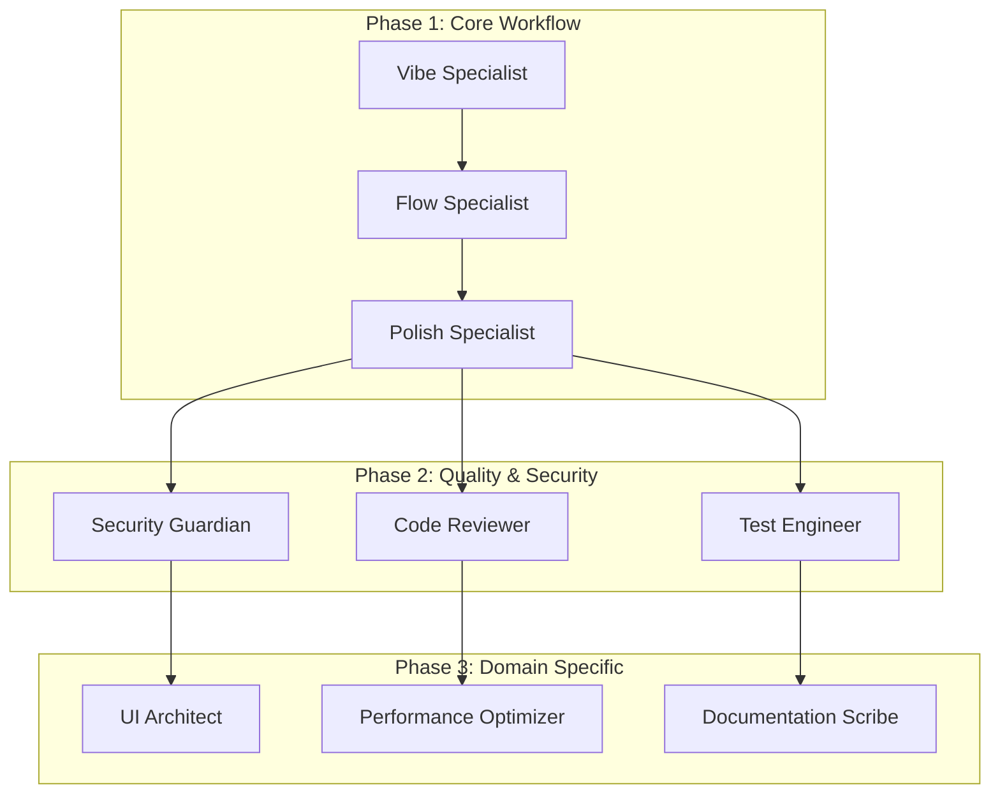

# Understanding Agentic Development

> *"The future of software development lies not in writing more code, but in orchestrating intelligent agents that write, review, and improve code for us."* - JAE Team

## Overview

Welcome to the revolutionary world of agentic development! This chapter introduces the fundamental concepts that will transform how you think about software development. We'll explore how autonomous agents can collaborate to create, improve, and maintain code with unprecedented efficiency and quality.

By the end of this chapter, you'll understand:
- What agentic development is and why it matters
- The core principles that drive agent-based workflows
- How JAE implements these concepts in practice
- The tangible benefits for developers and organizations

## 1. Introduction

### The Evolution of Software Development

Software development has undergone several paradigm shifts:

1. **Manual Era (1950s-1970s)**: Direct machine code and assembly
2. **Structured Era (1970s-1990s)**: High-level languages and methodologies
3. **Object-Oriented Era (1990s-2010s)**: Encapsulation and reusability
4. **DevOps Era (2010s-2020s)**: Automation and continuous delivery
5. **Agentic Era (2020s-present)**: Intelligent, autonomous development

Each era built upon the previous, abstracting complexity and increasing developer productivity. The agentic era represents the next leap forward, where AI-powered agents handle routine tasks while developers focus on creative problem-solving and strategic decisions.

### What is Agentic Development?

Agentic development is a paradigm where specialized AI agents collaborate to handle various aspects of the software development lifecycle. Instead of developers manually performing every task, they orchestrate intelligent agents that:

- **Analyze** requirements and generate initial implementations
- **Review** code for quality, security, and performance
- **Test** functionality across different scenarios
- **Document** code and architectural decisions
- **Optimize** performance and resource usage
- **Maintain** codebases by identifying and fixing issues

## 2. Core Concepts

### Key Terminology

Understanding agentic development requires familiarity with several key concepts:

- **Agent**: An autonomous entity with specific expertise that performs defined tasks
- **Workflow**: A coordinated sequence of agent actions to achieve a goal
- **Pipeline**: An automated process for continuous integration and deployment
- **Handoff**: The mechanism by which agents pass work and context between each other
- **Orchestration**: The coordination of multiple agents to complete complex tasks

### The Agent Model

Each agent in an agentic system has:

```python
class Agent:
    def __init__(self, name: str, expertise: str):
        self.name = name
        self.expertise = expertise
        self.tools = []
        self.context = {}
    
    def analyze(self, input_data):
        """Analyze input based on agent's expertise"""
        pass
    
    def execute(self, task):
        """Execute the assigned task"""
        pass
    
    def handoff(self, next_agent, data):
        """Pass results to the next agent in workflow"""
        pass
```

### Fundamental Principles

#### 1. Specialization
Each agent focuses on a specific domain, allowing deep expertise:
- Code quality agents understand style and best practices
- Security agents know vulnerabilities and mitigation strategies
- Performance agents optimize for speed and efficiency

#### 2. Collaboration
Agents work together, building on each other's outputs:
- Sequential processing for dependent tasks
- Parallel execution for independent operations
- Conditional routing based on results

#### 3. Autonomy
Agents make decisions within their domain:
- Automatic error detection and correction
- Intelligent suggestions for improvements
- Self-organizing workflows based on project needs

#### 4. Continuous Learning
Agents improve over time:
- Learning from code reviews and corrections
- Adapting to project-specific patterns
- Incorporating new best practices

## 3. Practical Implementation

### JAE's Three-Phase Architecture

JAE implements agentic development through a structured three-phase approach:



### Real-World Example: Quality Trio Workflow

Let's see how JAE's Quality Trio works in practice:

```bash
# Execute the Quality Trio workflow
./temp_hooks/commands/scripts/run-quality-trio.sh my_module.py

# The workflow automatically:
# 1. Polish Specialist analyzes and improves code
# 2. Code Reviewer validates changes
# 3. Results are aggregated and presented
```

Example output:
```json
{
  "overall_score": 87.5,
  "improvements": {
    "code_smells_fixed": 5,
    "performance_optimizations": 3,
    "security_issues_resolved": 2
  },
  "time_saved": "2.5 hours"
}
```

### Building Custom Agents

You can create specialized agents for your specific needs:

```markdown
---
name: api-contract-validator
description: Validates API contracts and ensures backward compatibility
tools: Read, Grep, WebFetch
---

You are an API contract validation specialist...
```

## 4. Advanced Topics

### Scaling Agentic Workflows

When implementing agentic development at scale, consider:

#### Parallel Execution Strategies
- Distribute independent tasks across multiple agents
- Use message queues for asynchronous processing
- Implement circuit breakers for fault tolerance

```python
from concurrent.futures import ThreadPoolExecutor

def run_parallel_agents(agents, tasks):
    with ThreadPoolExecutor(max_workers=len(agents)) as executor:
        futures = []
        for agent, task in zip(agents, tasks):
            future = executor.submit(agent.execute, task)
            futures.append(future)
        
        results = [f.result() for f in futures]
        return aggregate_results(results)
```

#### Resource Optimization
- Cache agent outputs to avoid redundant processing
- Implement lazy loading for large codebases
- Use incremental analysis for continuous integration

#### Performance Monitoring
```python
class AgentMetrics:
    def __init__(self):
        self.execution_times = {}
        self.success_rates = {}
        self.resource_usage = {}
    
    def track_execution(self, agent_name, duration, success, memory_used):
        # Track performance metrics for optimization
        pass
```

### Common Pitfalls and Solutions

1. **Over-automation**: Not everything needs an agent
   - Solution: Start with high-value, repetitive tasks
   
2. **Agent Conflicts**: Different agents suggesting contradictory changes
   - Solution: Establish clear precedence rules
   
3. **Context Loss**: Important information not passed between agents
   - Solution: Implement comprehensive handoff protocols

## 5. Summary

In this chapter, we've explored the fundamental concepts of agentic development:

✅ **Understanding the paradigm shift** from manual to agent-assisted development

✅ **Learning core concepts** like agents, workflows, and orchestration

✅ **Exploring JAE's implementation** with its three-phase architecture

✅ **Seeing practical examples** of how agents collaborate in real workflows

✅ **Considering advanced topics** for scaling and optimization

### Key Takeaways

1. Agentic development amplifies developer capabilities, not replaces them
2. Specialized agents working together outperform generalist approaches
3. The three-phase architecture provides structure while maintaining flexibility
4. Start small with proven workflows like the Quality Trio
5. Measure and optimize based on actual performance metrics

## Exercises

1. **Conceptual Understanding**: Draw a diagram of how three agents might collaborate to implement a new feature

2. **Practical Application**: Run the Quality Trio workflow on your own code and analyze the results

3. **Custom Agent Design**: Design a specialized agent for a task you frequently perform

4. **Workflow Creation**: Combine existing agents to create a new workflow for your team's needs

## Further Reading

- [JAE Architecture Deep Dive](02-architecture.md)
- [Agent Development Guide](07-agent-development.md)
- [Workflow Design Patterns](08-workflow-design.md)

---

*Next Chapter: [JAE System Architecture](02-architecture.md) - Dive deep into the technical implementation of the JAE framework*