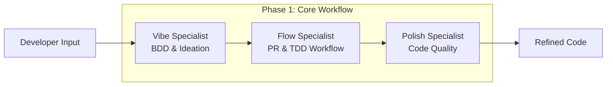
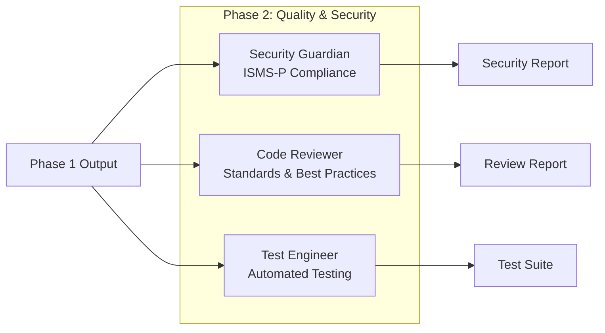
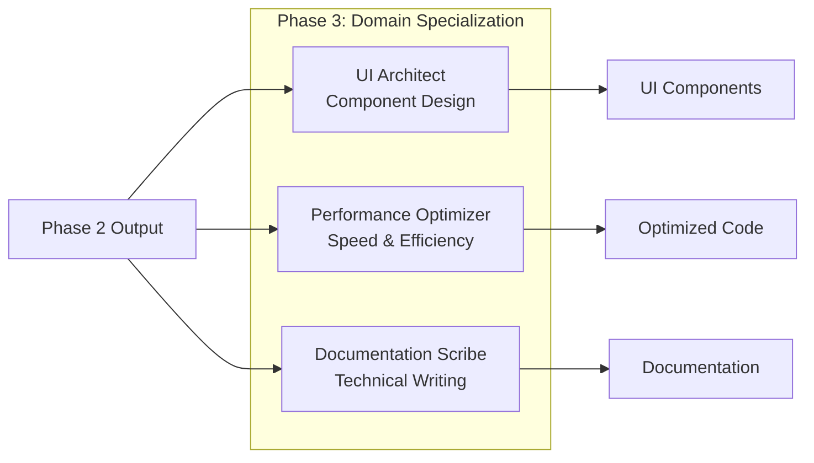
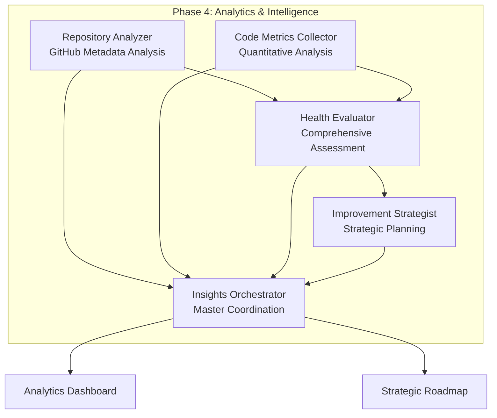

# JAE System Architecture

> *"Architecture is the art of how to waste space."* - Philip Johnson  
> *"But good software architecture is the art of how to organize complexity."* - JAE Team

## Overview

Understanding JAE's architecture is crucial for effectively leveraging its capabilities. This chapter provides a deep dive into the technical foundations, design principles, and implementation details that make JAE a powerful agentic development platform.

By the end of this chapter, you'll understand:
- The three-phase architectural framework and its rationale
- How agents communicate and collaborate within the system
- The technical infrastructure supporting JAE workflows
- Design patterns and principles that ensure scalability and maintainability

## 1. Architectural Philosophy

### Design Principles

JAE's architecture is built on five fundamental principles:

#### 1. Separation of Concerns
Each agent has a single, well-defined responsibility:
```
Polish Specialist    → Code quality and refactoring
Security Guardian    → Security compliance and vulnerability detection
Performance Optimizer → Performance analysis and optimization
```

#### 2. Loose Coupling
Agents communicate through standardized interfaces, allowing for:
- Independent development and testing
- Easy replacement or upgrading of individual agents
- Flexible workflow composition

#### 3. High Cohesion
Related functionality is grouped within specialized agents:
```python
class CodeReviewer:
    def review_style(self):        # Style-related review logic
    def review_security(self):     # Security-related review logic
    def review_performance(self):  # Performance-related review logic
    def generate_report(self):     # Unified reporting
```

#### 4. Event-Driven Architecture
Agents respond to events and trigger downstream actions:
```
Code Change Event → Polish Specialist → Quality Report Event → Code Reviewer → Final Report
```

#### 5. Extensibility
New agents can be added without modifying existing components:
```yaml
# Adding a new agent is configuration-driven
new-agent:
  phase: 2
  dependencies: [polish-specialist]
  command: "agents/new-agent/run.sh"
```

## 2. Three-Phase Architecture

### Phase 1: Core Workflow Foundation

The first phase establishes the fundamental development workflow:



#### Vibe Specialist
- **Purpose**: Transforms high-level ideas into structured requirements
- **Input**: Natural language descriptions, user stories
- **Output**: BDD scenarios, acceptance criteria, technical specifications
- **Tools**: Natural language processing, requirement analysis

#### Flow Specialist  
- **Purpose**: Optimizes development workflows and processes
- **Input**: Project requirements, team structure
- **Output**: PR templates, TDD patterns, workflow configurations
- **Tools**: Git analysis, workflow optimization algorithms

#### Polish Specialist
- **Purpose**: Ensures code quality and maintainability
- **Input**: Raw code, coding standards
- **Output**: Refactored code, quality metrics, improvement suggestions
- **Tools**: Static analyzers (ruff, pylint), formatters (black), complexity analyzers (radon)

### Phase 2: Quality & Security Assurance

The second phase focuses on validation and security:



#### Security Guardian
- **Purpose**: Ensures security compliance and vulnerability detection
- **Input**: Code, dependencies, configuration files
- **Output**: Security reports, compliance status, remediation suggestions
- **Tools**: Security scanners (bandit), dependency checkers, compliance validators

#### Code Reviewer
- **Purpose**: Automated code review based on best practices
- **Input**: Code changes, coding standards, team guidelines
- **Output**: Review comments, approval/rejection, quality scores
- **Tools**: Code analyzers, pattern matchers, style checkers

#### Test Engineer
- **Purpose**: Automated test generation and coverage analysis
- **Input**: Code, requirements, existing tests
- **Output**: Test cases, coverage reports, test automation scripts
- **Tools**: Test generators, coverage analyzers, mock frameworks

### Phase 3: Domain Specialization

The third phase provides specialized capabilities:



#### UI Architect
- **Purpose**: Frontend component design and generation
- **Input**: Design requirements, UI frameworks, accessibility guidelines
- **Output**: React/Vue components, CSS, responsive layouts
- **Tools**: Component generators, design system validators, accessibility checkers

#### Performance Optimizer
- **Purpose**: Code and system performance optimization
- **Input**: Code, performance metrics, bottleneck analysis
- **Output**: Optimized algorithms, caching strategies, performance reports
- **Tools**: Profilers, benchmarking tools, optimization algorithms

#### Documentation Scribe
- **Purpose**: Automated technical documentation generation
- **Input**: Code, comments, API specifications
- **Output**: API docs, user guides, architecture documentation
- **Tools**: Doc generators, template engines, content analyzers

### Phase 4: Analytics and Intelligence

The fourth phase introduces advanced analytics and intelligence capabilities:



#### Repository Analyzer
- **Purpose**: GitHub metadata collection and repository health analysis
- **Input**: GitHub repository URL, access tokens, analysis parameters
- **Output**: Commit patterns, collaboration metrics, workflow efficiency data
- **Tools**: GitHub API, PyGithub, statistical analysis libraries

#### Code Metrics Collector
- **Purpose**: Quantitative code quality analysis and technical debt measurement
- **Input**: Source code, test files, dependency information
- **Output**: Complexity metrics, quality indicators, technical debt calculations
- **Tools**: AST parsers, complexity analyzers, duplication detectors

#### Health Evaluator
- **Purpose**: Comprehensive project health assessment and benchmarking
- **Input**: Repository data, code metrics, historical trends
- **Output**: Health scores, risk assessments, trend analysis
- **Tools**: Statistical models, benchmarking databases, risk calculators

#### Improvement Strategist
- **Purpose**: Data-driven improvement strategy development
- **Input**: Health evaluations, team capacity, organizational constraints
- **Output**: Prioritized action plans, ROI analysis, implementation roadmaps
- **Tools**: Optimization algorithms, ROI calculators, project planning frameworks

#### Repository Insights Orchestrator
- **Purpose**: Master coordination of analytics workflow and report generation
- **Input**: All analytics agent outputs, configuration settings
- **Output**: Comprehensive dashboards, executive reports, interactive visualizations
- **Tools**: Workflow engines, visualization libraries, report generators

## 3. Technical Infrastructure

### Command-Based Architecture

JAE uses a command-based system for agent execution:

```bash
# Directory structure
temp_hooks/commands/
├── config/
│   ├── agents.yaml      # Agent configuration
│   ├── tools.yaml       # Tool definitions  
│   └── workflows.yaml   # Workflow definitions
├── agents/
│   └── {agent-name}/
│       └── run.sh       # Agent executable
├── core/
│   ├── common.sh        # Shared utilities
│   └── workflow_engine.py # Orchestration engine
└── scripts/
    └── run-workflow.sh  # Workflow runner
```

### Agent Configuration System

Agents are defined through YAML configuration:

```yaml
# config/agents.yaml
agents:
  jae-polish-specialist:
    phase: 1
    order: 3
    command: "agents/jae-polish-specialist/run.sh"
    timeout: 450
    required_tools:
      - static_analyzer
      - code_formatter
      - complexity_analyzer
    inputs:
      - source_code
      - style_config
    outputs:
      - polished_code
      - quality_report
```

### Data Flow and Handoff Mechanism

Agents communicate through structured data exchange:

```python
# Agent output format
{
    "agent": "jae-polish-specialist",
    "status": "completed",
    "timestamp": "2025-01-27T10:30:00Z",
    "input_context": {
        "file": "src/example.py",
        "original_size": 1200,
        "complexity_score": 8.5
    },
    "outputs": {
        "polished_file": "output/example_polished.py",
        "improvements": [
            {
                "type": "code_smell",
                "description": "Removed duplicate code",
                "impact": "high"
            }
        ],
        "metrics": {
            "size_reduction": "15%",
            "complexity_improvement": "23%"
        }
    },
    "next_agents": ["jae-code-reviewer"]
}
```

### Workflow Engine

The workflow engine orchestrates agent execution:

```python
class WorkflowEngine:
    def __init__(self, config_path: str):
        self.agents_config = load_yaml(config_path)
        self.execution_graph = build_dependency_graph()
    
    def execute_workflow(self, workflow_name: str, input_files: List[str]):
        """Execute a defined workflow with dependency management"""
        workflow = self.workflows[workflow_name]
        
        # Sort agents by phase and order
        sorted_agents = sorted(workflow.agents, 
                             key=lambda a: (a.phase, a.order))
        
        results = {}
        for agent in sorted_agents:
            if self.can_execute(agent, results):
                result = self.execute_agent(agent, input_files, results)
                results[agent.name] = result
                
        return self.aggregate_results(results)
    
    def can_execute(self, agent: Agent, previous_results: Dict) -> bool:
        """Check if all dependencies are satisfied"""
        return all(dep in previous_results 
                  for dep in agent.dependencies)
```

## 4. Communication Patterns

### Synchronous Execution
For dependent operations requiring immediate results:
```python
result = polish_specialist.execute(code)
review_result = code_reviewer.execute(result.output)
```

### Asynchronous Processing
For independent operations that can run in parallel:
```python
import asyncio

async def parallel_analysis(code):
    tasks = [
        security_guardian.analyze(code),
        performance_optimizer.analyze(code),
        documentation_scribe.analyze(code)
    ]
    results = await asyncio.gather(*tasks)
    return aggregate_results(results)
```

### Event-Driven Workflows
For complex workflows with conditional logic:
```python
class EventBus:
    def __init__(self):
        self.listeners = defaultdict(list)
    
    def subscribe(self, event_type: str, handler: Callable):
        self.listeners[event_type].append(handler)
    
    def publish(self, event: Event):
        for handler in self.listeners[event.type]:
            handler(event)

# Usage
bus = EventBus()
bus.subscribe("code_polished", code_reviewer.handle_polished_code)
bus.subscribe("security_scan_complete", documentation_scribe.update_security_docs)
```

## 5. Scalability and Performance

### Horizontal Scaling
JAE supports scaling through:

#### Load Distribution
```yaml
# Multiple instances of resource-intensive agents
agents:
  jae-polish-specialist-1:
    instance: 1
    cpu_limit: "2"
    memory_limit: "4Gi"
  jae-polish-specialist-2:
    instance: 2
    cpu_limit: "2" 
    memory_limit: "4Gi"
```

#### Caching Strategy
```python
class AgentCache:
    def __init__(self, ttl: int = 3600):
        self.cache = {}
        self.ttl = ttl
    
    def get_cached_result(self, input_hash: str):
        """Return cached result if available and not expired"""
        if input_hash in self.cache:
            result, timestamp = self.cache[input_hash]
            if time.time() - timestamp < self.ttl:
                return result
        return None
    
    def cache_result(self, input_hash: str, result: Any):
        """Cache the result with timestamp"""
        self.cache[input_hash] = (result, time.time())
```

### Performance Optimization

#### Lazy Loading
```python
class Agent:
    def __init__(self):
        self._tools = None
    
    @property
    def tools(self):
        """Load tools only when needed"""
        if self._tools is None:
            self._tools = self.load_tools()
        return self._tools
```

#### Resource Management
```python
class ResourceManager:
    def __init__(self, max_concurrent: int = 4):
        self.semaphore = asyncio.Semaphore(max_concurrent)
        self.active_agents = {}
    
    async def execute_agent(self, agent: Agent, task: Task):
        async with self.semaphore:
            return await agent.execute(task)
```

## 6. Error Handling and Resilience

### Circuit Breaker Pattern
```python
class CircuitBreaker:
    def __init__(self, failure_threshold: int = 5, timeout: int = 60):
        self.failure_threshold = failure_threshold
        self.timeout = timeout
        self.failure_count = 0
        self.last_failure = None
        self.state = "CLOSED"  # CLOSED, OPEN, HALF_OPEN
    
    def call(self, func, *args, **kwargs):
        if self.state == "OPEN":
            if time.time() - self.last_failure > self.timeout:
                self.state = "HALF_OPEN"
            else:
                raise CircuitBreakerOpenError()
        
        try:
            result = func(*args, **kwargs)
            self.success()
            return result
        except Exception as e:
            self.failure()
            raise
```

### Retry Mechanism
```python
def retry_with_backoff(max_retries: int = 3, backoff_factor: float = 2.0):
    def decorator(func):
        def wrapper(*args, **kwargs):
            for attempt in range(max_retries + 1):
                try:
                    return func(*args, **kwargs)
                except Exception as e:
                    if attempt == max_retries:
                        raise
                    wait_time = backoff_factor ** attempt
                    time.sleep(wait_time)
        return wrapper
    return decorator

@retry_with_backoff(max_retries=3)
def execute_agent(agent, task):
    return agent.run(task)
```

## 7. Security Architecture

### Agent Isolation
```bash
# Each agent runs in isolated environment
docker run --rm \
  --memory=2g \
  --cpus=1.0 \
  --network=none \
  --user=agent \
  jae/polish-specialist:latest
```

### Input Validation
```python
class InputValidator:
    def __init__(self):
        self.allowed_extensions = {'.py', '.js', '.ts', '.java'}
        self.max_file_size = 10 * 1024 * 1024  # 10MB
    
    def validate_file(self, file_path: str) -> bool:
        """Validate file safety and constraints"""
        if not self.is_allowed_extension(file_path):
            raise ValueError(f"File type not allowed: {file_path}")
        
        if os.path.getsize(file_path) > self.max_file_size:
            raise ValueError(f"File too large: {file_path}")
        
        if self.contains_suspicious_content(file_path):
            raise SecurityError(f"Suspicious content detected: {file_path}")
        
        return True
```

### Secure Communication
```python
class SecureAgent:
    def __init__(self, private_key_path: str):
        self.private_key = load_private_key(private_key_path)
        self.session_key = generate_session_key()
    
    def encrypt_output(self, data: Dict) -> bytes:
        """Encrypt sensitive output data"""
        serialized = json.dumps(data)
        return encrypt_with_session_key(serialized, self.session_key)
    
    def decrypt_input(self, encrypted_data: bytes) -> Dict:
        """Decrypt input from previous agent"""
        decrypted = decrypt_with_session_key(encrypted_data, self.session_key)
        return json.loads(decrypted)
```

## Summary

JAE's architecture is designed for:

✅ **Modularity**: Independent, specialized agents with clear responsibilities

✅ **Scalability**: Horizontal scaling and resource optimization

✅ **Reliability**: Circuit breakers, retries, and graceful error handling

✅ **Security**: Isolated execution and secure communication

✅ **Extensibility**: Easy addition of new agents and workflows

✅ **Performance**: Caching, lazy loading, and efficient resource management

The three-phase architecture provides a clear separation between foundational workflow (Phase 1), quality assurance (Phase 2), and specialized capabilities (Phase 3), while the technical infrastructure ensures reliable, secure, and scalable execution.

## Exercises

1. **Design Challenge**: Design a new agent for dependency management and specify its inputs, outputs, and integration points

2. **Implementation**: Create a simple workflow engine that can execute two agents in sequence

3. **Analysis**: Analyze the trade-offs between synchronous and asynchronous agent execution for different use cases

4. **Security**: Design a security model for agent-to-agent communication in a distributed environment

## Further Reading

- [Environment Setup and Configuration](03-setup.md)
- [Polish Specialist Deep Dive](04-polish-specialist.md)
- [Workflow Design Patterns](08-workflow-design.md)

---

*Next Chapter: [Environment Setup and Configuration](03-setup.md) - Learn how to install and configure JAE for your development environment*