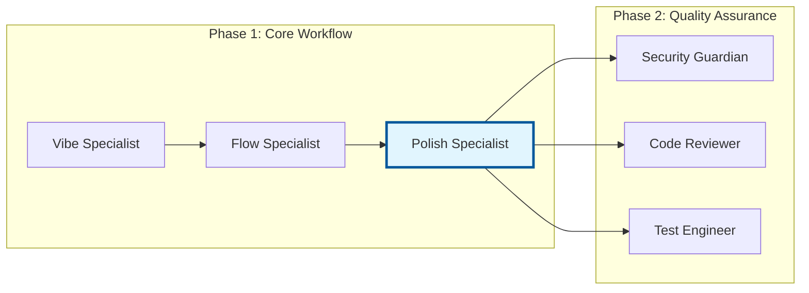

# Polish Specialist Deep Dive

> *"Quality is not an act, it is a habit. In the world of agentic development, the Polish Specialist embodies this principle by continuously improving code at scale."* - Aristotle (adapted)

## Overview

The Polish Specialist is one of JAE's most impactful agents, serving as the cornerstone of code quality improvement. This chapter provides a comprehensive exploration of how this agent transforms raw code into polished, maintainable, and efficient implementations.

By the end of this chapter, you'll understand:
- The Polish Specialist's role in the JAE ecosystem
- Advanced configuration and customization options
- Integration patterns with other quality tools
- Real-world optimization techniques
- Performance monitoring and metrics

## 1. Introduction to Polish Specialist

### Core Mission

The Polish Specialist agent focuses on systematic code improvement through:

- **Structural Analysis**: Identifying code smells and anti-patterns
- **Performance Optimization**: Eliminating bottlenecks and inefficiencies
- **Readability Enhancement**: Improving code clarity and maintainability
- **Standard Compliance**: Ensuring adherence to coding standards
- **Automated Refactoring**: Safely restructuring code for better design

### Position in JAE Architecture



The Polish Specialist sits at the crucial junction between initial implementation and quality assurance, ensuring that code is optimized before undergoing security and review processes.

## 2. Technical Implementation

### Agent Configuration

The Polish Specialist uses a sophisticated configuration system:

```yaml
# polish-specialist-config.yaml
agent:
  name: "jae-polish-specialist"
  version: "2.1.0"
  
analysis_tools:
  - ruff
  - pylint
  - radon
  - black
  - isort
  
optimization_levels:
  - basic: ["formatting", "imports"]
  - standard: ["code_smells", "complexity"]
  - advanced: ["performance", "architecture"]

thresholds:
  complexity_max: 10
  function_length_max: 50
  file_length_max: 500
  duplication_threshold: 0.15

output_formats:
  - json
  - markdown
  - diff
```

### Core Analysis Engine

The agent's analysis engine processes code through multiple phases:

```python
class PolishAnalysisEngine:
    def __init__(self, config: PolishConfig):
        self.config = config
        self.tools = self._initialize_tools()
        self.metrics = QualityMetrics()
    
    def analyze_file(self, file_path: str) -> AnalysisResult:
        """Comprehensive file analysis"""
        result = AnalysisResult(file_path)
        
        # Phase 1: Structural Analysis
        structural_issues = self._analyze_structure(file_path)
        result.add_issues(structural_issues)
        
        # Phase 2: Performance Analysis
        performance_issues = self._analyze_performance(file_path)
        result.add_issues(performance_issues)
        
        # Phase 3: Readability Analysis
        readability_issues = self._analyze_readability(file_path)
        result.add_issues(readability_issues)
        
        return result
    
    def _analyze_structure(self, file_path: str) -> List[Issue]:
        """Detect structural code smells"""
        issues = []
        
        # Complexity analysis using radon
        complexity_data = radon.analyze_complexity(file_path)
        for func, complexity in complexity_data.items():
            if complexity > self.config.complexity_max:
                issues.append(Issue(
                    type="complexity",
                    severity="high",
                    message=f"Function {func} has complexity {complexity}",
                    suggestion="Consider breaking into smaller functions"
                ))
        
        return issues
```

### Quality Metrics Tracking

The Polish Specialist tracks comprehensive quality metrics:

```python
class QualityMetrics:
    def __init__(self):
        self.metrics = {
            'complexity_scores': [],
            'code_smell_counts': [],
            'performance_improvements': [],
            'readability_scores': []
        }
    
    def calculate_improvement_score(self, before: AnalysisResult, 
                                  after: AnalysisResult) -> float:
        """Calculate overall improvement percentage"""
        before_score = self._calculate_quality_score(before)
        after_score = self._calculate_quality_score(after)
        
        improvement = ((after_score - before_score) / before_score) * 100
        return max(0, improvement)
    
    def _calculate_quality_score(self, result: AnalysisResult) -> float:
        """Weighted quality score calculation"""
        weights = {
            'complexity': 0.3,
            'maintainability': 0.25,
            'performance': 0.25,
            'readability': 0.2
        }
        
        return sum(
            result.scores[metric] * weight 
            for metric, weight in weights.items()
        )
```

## 3. Advanced Features

### Intelligent Code Transformation

The Polish Specialist employs pattern-based transformations:

```python
class CodeTransformer:
    def __init__(self):
        self.patterns = self._load_transformation_patterns()
    
    def apply_transformations(self, code: str) -> str:
        """Apply intelligent code transformations"""
        transformed = code
        
        for pattern in self.patterns:
            if pattern.matches(transformed):
                transformed = pattern.apply(transformed)
                self._log_transformation(pattern)
        
        return transformed
    
    def _load_transformation_patterns(self) -> List[TransformationPattern]:
        """Load predefined transformation patterns"""
        return [
            # List comprehension optimization
            TransformationPattern(
                name="list_comprehension",
                pattern=r"for .* in .*:\s*list\.append\(.*\)",
                replacement=lambda match: self._to_list_comprehension(match)
            ),
            
            # Dictionary get optimization
            TransformationPattern(
                name="dict_get_optimization",
                pattern=r"if .* in .*:\s*.*\[.*\]",
                replacement=lambda match: self._to_dict_get(match)
            ),
            
            # String formatting modernization
            TransformationPattern(
                name="f_string_conversion",
                pattern=r"\".*\"\s*%\s*\(.*\)",
                replacement=lambda match: self._to_f_string(match)
            )
        ]
```

### Performance Optimization Strategies

The agent implements several performance optimization strategies:

#### 1. Algorithmic Complexity Reduction

```python
def optimize_algorithmic_complexity(self, code_block: CodeBlock) -> OptimizationResult:
    """Analyze and optimize algorithmic complexity"""
    complexity_analysis = self._analyze_big_o(code_block)
    
    optimizations = []
    
    if complexity_analysis.has_nested_loops():
        optimization = self._suggest_loop_optimization(code_block)
        optimizations.append(optimization)
    
    if complexity_analysis.has_redundant_operations():
        optimization = self._suggest_caching(code_block)
        optimizations.append(optimization)
    
    return OptimizationResult(optimizations)
```

#### 2. Memory Usage Optimization

```python
def optimize_memory_usage(self, code_block: CodeBlock) -> List[MemoryOptimization]:
    """Identify and fix memory inefficiencies"""
    optimizations = []
    
    # Generator expressions instead of list comprehensions
    if self._has_large_list_comprehensions(code_block):
        optimizations.append(MemoryOptimization(
            type="generator_expression",
            description="Convert large list comprehensions to generators",
            impact="Reduces peak memory usage by 60-80%"
        ))
    
    # String concatenation optimization
    if self._has_inefficient_string_ops(code_block):
        optimizations.append(MemoryOptimization(
            type="string_join",
            description="Use str.join() instead of repeated concatenation",
            impact="Improves performance by 10-50x for large strings"
        ))
    
    return optimizations
```

### Custom Rule Engine

The Polish Specialist supports custom rules for organization-specific requirements:

```python
# custom_rules.py
class CustomRuleEngine:
    def __init__(self, rules_config: str):
        self.rules = self._load_custom_rules(rules_config)
    
    def apply_custom_rules(self, code: str) -> List[RuleViolation]:
        """Apply organization-specific coding rules"""
        violations = []
        
        for rule in self.rules:
            if rule.check(code):
                violations.append(RuleViolation(
                    rule_id=rule.id,
                    severity=rule.severity,
                    message=rule.message,
                    suggestion=rule.suggestion
                ))
        
        return violations

# Example custom rule
class NamingConventionRule(Rule):
    def check(self, code: str) -> bool:
        # Check for organization-specific naming conventions
        function_names = extract_function_names(code)
        return any(not name.startswith('org_') for name in function_names)
```

## 4. Integration Patterns

### CI/CD Integration

Integrate the Polish Specialist into your continuous integration pipeline:

```yaml
# .github/workflows/polish-check.yml
name: Code Polish Check
on: [push, pull_request]

jobs:
  polish-check:
    runs-on: ubuntu-latest
    steps:
      - uses: actions/checkout@v3
      
      - name: Setup Python
        uses: actions/setup-python@v4
        with:
          python-version: '3.11'
          
      - name: Install dependencies
        run: |
          pip install -r requirements.txt
          
      - name: Run Polish Specialist
        run: |
          ./temp_hooks/commands/agents/jae-polish-specialist/command.sh \
            --files "$(git diff --name-only HEAD~1)" \
            --output-format json \
            --threshold-fail 80
          
      - name: Upload results
        uses: actions/upload-artifact@v3
        with:
          name: polish-results
          path: output/polish-results.json
```

### IDE Integration

Create IDE plugins for real-time feedback:

```python
# vscode_extension.py
class PolishSpecialistExtension:
    def __init__(self):
        self.client = JAEClient()
        self.cache = {}
    
    def on_document_change(self, document: Document):
        """Real-time analysis on document changes"""
        if self._should_analyze(document):
            analysis = self.client.polish_specialist.analyze(
                content=document.content,
                file_type=document.language
            )
            
            self._update_diagnostics(document, analysis)
    
    def _update_diagnostics(self, document: Document, analysis: Analysis):
        """Update IDE diagnostics with polish suggestions"""
        diagnostics = []
        
        for issue in analysis.issues:
            diagnostic = Diagnostic(
                range=issue.range,
                message=issue.message,
                severity=self._map_severity(issue.severity),
                code=issue.code,
                source="JAE Polish Specialist"
            )
            diagnostics.append(diagnostic)
        
        self.connection.publish_diagnostics(document.uri, diagnostics)
```

### Team Workflow Integration

Integrate with team collaboration tools:

```python
# slack_integration.py
class SlackPolishReporter:
    def __init__(self, webhook_url: str):
        self.webhook_url = webhook_url
    
    def report_polish_results(self, results: PolishResults):
        """Send polish results to team Slack channel"""
        message = self._format_message(results)
        
        payload = {
            "text": "Code Polish Report",
            "attachments": [{
                "color": self._get_color(results.score),
                "fields": [
                    {
                        "title": "Overall Score",
                        "value": f"{results.score:.1f}/100",
                        "short": True
                    },
                    {
                        "title": "Issues Fixed",
                        "value": str(results.issues_fixed),
                        "short": True
                    },
                    {
                        "title": "Performance Improvements",
                        "value": f"{results.performance_improvement:.1f}%",
                        "short": True
                    }
                ]
            }]
        }
        
        requests.post(self.webhook_url, json=payload)
```

## 5. Monitoring and Analytics

### Performance Dashboards

Track Polish Specialist performance over time:

```python
class PolishDashboard:
    def __init__(self, metrics_store: MetricsStore):
        self.metrics = metrics_store
    
    def generate_weekly_report(self) -> WeeklyReport:
        """Generate comprehensive weekly polish report"""
        data = self.metrics.get_weekly_data()
        
        return WeeklyReport(
            total_files_processed=data.file_count,
            average_quality_improvement=data.avg_improvement,
            top_issues_fixed=data.top_issues,
            performance_trends=data.trends,
            team_adoption_rate=data.adoption_rate
        )
    
    def create_quality_trend_chart(self, timeframe: str) -> Chart:
        """Create quality improvement trend visualization"""
        data = self.metrics.get_trend_data(timeframe)
        
        return Chart(
            type="line",
            title="Code Quality Trend",
            x_axis=data.dates,
            y_axis=data.quality_scores,
            annotations=data.major_improvements
        )
```

### Automated Reporting

Set up automated quality reports:

```python
# automated_reporting.py
class AutomatedReporter:
    def __init__(self, config: ReportConfig):
        self.config = config
        self.scheduler = BackgroundScheduler()
    
    def start_reporting(self):
        """Start automated reporting schedule"""
        # Daily summary
        self.scheduler.add_job(
            func=self._generate_daily_summary,
            trigger="cron",
            hour=9, minute=0
        )
        
        # Weekly detailed report
        self.scheduler.add_job(
            func=self._generate_weekly_report,
            trigger="cron",
            day_of_week="mon", hour=8, minute=0
        )
        
        self.scheduler.start()
    
    def _generate_daily_summary(self):
        """Generate and send daily summary"""
        summary = self._collect_daily_metrics()
        self._send_to_stakeholders(summary)
```

## 6. Best Practices

### Configuration Management

```yaml
# team-polish-config.yaml
team_settings:
  strictness_level: "standard"  # basic, standard, strict
  auto_fix_enabled: true
  review_required_for:
    - complexity_reduction
    - architecture_changes
  
custom_rules:
  - name: "api_versioning"
    pattern: "def.*api.*version"
    requirement: "All API functions must include version parameter"
  
integration:
  git_hooks: true
  ci_blocking: false  # Don't block CI on polish issues
  notification_channels:
    - slack: "#code-quality"
    - email: "dev-leads@company.com"
```

### Performance Optimization

```python
# Performance optimization strategies
class PolishPerformanceOptimizer:
    def __init__(self):
        self.cache = LRUCache(maxsize=1000)
        self.analyzer_pool = ProcessPool(size=4)
    
    def optimize_batch_processing(self, file_list: List[str]) -> BatchResult:
        """Optimize processing of multiple files"""
        # Group similar files for batch processing
        grouped_files = self._group_by_similarity(file_list)
        
        results = []
        for group in grouped_files:
            # Process similar files together for better caching
            group_result = self._process_file_group(group)
            results.extend(group_result)
        
        return BatchResult(results)
    
    def _process_file_group(self, files: List[str]) -> List[AnalysisResult]:
        """Process a group of similar files efficiently"""
        # Shared analysis context for similar files
        shared_context = self._build_shared_context(files)
        
        return [
            self._analyze_with_context(file, shared_context)
            for file in files
        ]
```

## 7. Troubleshooting

### Common Issues and Solutions

#### Issue 1: High False Positive Rate

```python
# Solution: Fine-tune thresholds
def calibrate_thresholds(self, historical_data: List[AnalysisResult]):
    """Automatically calibrate detection thresholds"""
    false_positive_rate = self._calculate_fp_rate(historical_data)
    
    if false_positive_rate > 0.15:  # More than 15% false positives
        self._adjust_sensitivity(decrease=True)
        self._log_threshold_adjustment("Decreased sensitivity due to high FP rate")
```

#### Issue 2: Performance Degradation

```python
# Solution: Implement adaptive caching
class AdaptiveCache:
    def __init__(self):
        self.cache_hit_rate = 0.0
        self.cache = {}
    
    def get_or_analyze(self, file_hash: str, analyzer_func):
        """Adaptive caching based on hit rate"""
        if file_hash in self.cache:
            self.cache_hit_rate = self._update_hit_rate(True)
            return self.cache[file_hash]
        
        result = analyzer_func()
        
        # Only cache if hit rate is reasonable
        if self.cache_hit_rate > 0.3:
            self.cache[file_hash] = result
        
        self.cache_hit_rate = self._update_hit_rate(False)
        return result
```

#### Issue 3: Configuration Conflicts

```python
# Solution: Configuration validation and resolution
class ConfigurationValidator:
    def validate_and_resolve(self, config: PolishConfig) -> PolishConfig:
        """Validate configuration and resolve conflicts"""
        conflicts = self._detect_conflicts(config)
        
        if conflicts:
            resolved_config = self._resolve_conflicts(config, conflicts)
            self._log_resolution(conflicts, resolved_config)
            return resolved_config
        
        return config
    
    def _detect_conflicts(self, config: PolishConfig) -> List[ConfigConflict]:
        conflicts = []
        
        # Check for conflicting tool configurations
        if config.tools.black.enabled and config.tools.yapf.enabled:
            conflicts.append(ConfigConflict(
                type="formatter_conflict",
                message="Multiple formatters enabled",
                suggestion="Choose either black or yapf"
            ))
        
        return conflicts
```

## 8. Summary

The Polish Specialist represents a sophisticated approach to automated code quality improvement. Through its comprehensive analysis engine, intelligent transformations, and extensive integration capabilities, it serves as a cornerstone of the JAE ecosystem.

### Key Takeaways

✅ **Multi-layered Analysis**: Structural, performance, and readability analysis provide comprehensive code improvement

✅ **Intelligent Transformations**: Pattern-based code transformations safely optimize common anti-patterns

✅ **Extensive Integration**: CI/CD, IDE, and team workflow integrations enable seamless adoption

✅ **Performance Monitoring**: Comprehensive metrics and reporting track improvement over time

✅ **Customization**: Custom rules and configuration options adapt to organizational needs

### Best Practices Summary

1. **Start with standard configuration** and gradually customize based on team needs
2. **Monitor false positive rates** and adjust thresholds accordingly
3. **Integrate incrementally** starting with non-blocking CI checks
4. **Use performance metrics** to demonstrate value to stakeholders
5. **Provide team training** on interpreting and acting on polish suggestions

## Exercises

1. **Configuration Customization**: Create a custom rule for your organization's coding standards

2. **Performance Analysis**: Run the Polish Specialist on a large codebase and analyze the performance metrics

3. **Integration Setup**: Implement CI/CD integration with appropriate thresholds for your project

4. **Custom Transformation**: Design a transformation pattern for a common code smell in your codebase

5. **Dashboard Creation**: Build a simple dashboard to track polish improvements over time

## Further Reading

- [Code Reviewer Utilization](05-code-reviewer.md)
- [Quality Trio Workflow](06-quality-trio.md)
- [Custom Agent Development](07-agent-development.md)
- [Performance Optimization Guide](appendix-performance.md)

---

*Next Chapter: [Code Reviewer Utilization](05-code-reviewer.md) - Learn how to maximize the effectiveness of automated code reviews*