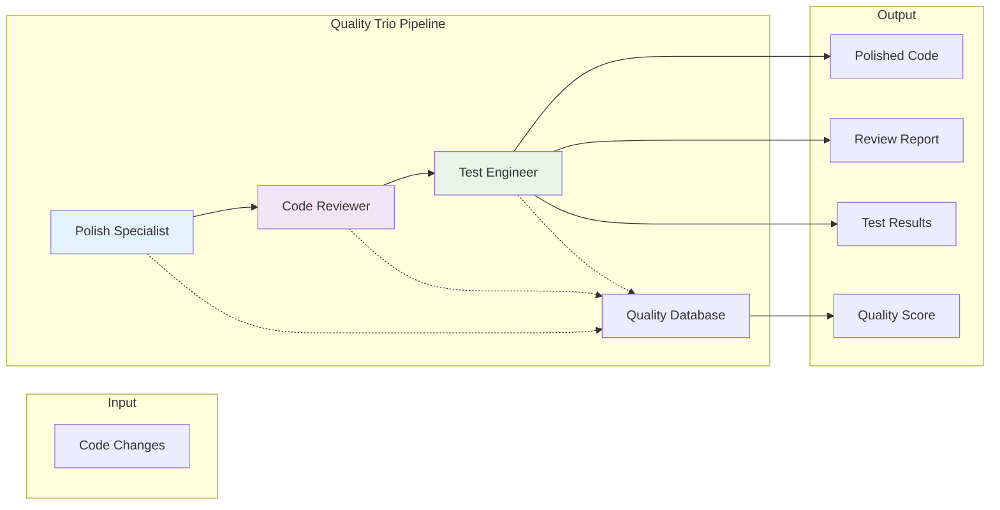

# Quality Trio Workflow

> *"Three agents working in harmony can achieve what ten developers working in isolation cannot."* - JAE Team

## Overview

The Quality Trio represents JAE's most powerful collaborative workflow, combining the strengths of the Polish Specialist, Code Reviewer, and Test Engineer into a seamless quality assurance pipeline. This chapter explores how these three agents work together to create a comprehensive quality gate that catches issues early, improves code continuously, and maintains high standards across your entire codebase.

By the end of this chapter, you'll understand:
- How the Quality Trio agents collaborate and hand off work
- Advanced orchestration patterns for maximum effectiveness
- Configuration strategies for different project types
- Performance optimization and monitoring techniques
- Real-world implementation scenarios and best practices

## 1. Introduction to Quality Trio

### The Collaborative Model

The Quality Trio implements a sophisticated three-stage quality assurance process:



### Agent Roles and Responsibilities

Each agent in the trio has distinct but complementary responsibilities:

#### Polish Specialist
- **Primary Focus**: Code quality improvement and optimization
- **Key Activities**: Structural analysis, performance optimization, style enforcement
- **Output**: Enhanced code with quality improvements
- **Handoff**: Provides improved code and quality metrics to Code Reviewer

#### Code Reviewer
- **Primary Focus**: Standards compliance and issue detection
- **Key Activities**: Best practices verification, security analysis, consistency checks
- **Output**: Review feedback and approval/rejection decisions
- **Handoff**: Provides reviewed code and feedback to Test Engineer

#### Test Engineer
- **Primary Focus**: Functional validation and test coverage
- **Key Activities**: Test generation, execution, coverage analysis
- **Output**: Test results, coverage reports, and final quality assessment
- **Handoff**: Provides final quality gate decision and comprehensive report

## 2. Workflow Orchestration

### Core Orchestration Engine

The Quality Trio uses a sophisticated orchestration engine that manages agent collaboration:

```python
class QualityTrioOrchestrator:
    def __init__(self, config: TrioConfig):
        self.config = config
        self.polish_specialist = PolishSpecialist(config.polish_config)
        self.code_reviewer = CodeReviewer(config.review_config)
        self.test_engineer = TestEngineer(config.test_config)
        self.quality_database = QualityDatabase()
        self.metrics_collector = TrioMetricsCollector()
    
    def execute_quality_pipeline(self, changeset: Changeset) -> QualityResult:
        """Execute the complete Quality Trio pipeline"""
        pipeline_id = self._generate_pipeline_id()
        context = PipelineContext(pipeline_id, changeset)
        
        try:
            # Stage 1: Polish Specialist
            polish_result = self._execute_polish_stage(context)
            context.add_stage_result("polish", polish_result)
            
            # Stage 2: Code Reviewer
            review_result = self._execute_review_stage(context)
            context.add_stage_result("review", review_result)
            
            # Stage 3: Test Engineer
            test_result = self._execute_test_stage(context)
            context.add_stage_result("test", test_result)
            
            # Generate final quality assessment
            final_result = self._generate_final_result(context)
            
            # Store results for future reference
            self.quality_database.store_pipeline_result(pipeline_id, final_result)
            
            return final_result
            
        except Exception as e:
            return self._handle_pipeline_failure(pipeline_id, e)
    
    def _execute_polish_stage(self, context: PipelineContext) -> PolishResult:
        """Execute Polish Specialist stage with context"""
        with self.metrics_collector.time_stage("polish"):
            # Prepare input for Polish Specialist
            polish_input = PolishInput(
                changeset=context.changeset,
                quality_history=self.quality_database.get_quality_history(
                    context.changeset.files
                ),
                team_preferences=context.get_team_preferences()
            )
            
            # Execute polish analysis and improvements
            result = self.polish_specialist.analyze_and_improve(polish_input)
            
            # Store intermediate results
            self.quality_database.store_polish_results(context.pipeline_id, result)
            
            return result
    
    def _execute_review_stage(self, context: PipelineContext) -> ReviewResult:
        """Execute Code Reviewer stage with polish context"""
        with self.metrics_collector.time_stage("review"):
            polish_result = context.get_stage_result("polish")
            
            # Prepare review input with polish improvements
            review_input = ReviewInput(
                original_changeset=context.changeset,
                polished_code=polish_result.improved_code,
                polish_improvements=polish_result.improvements,
                quality_metrics=polish_result.quality_metrics
            )
            
            # Execute review with context of improvements
            result = self.code_reviewer.review_with_context(review_input)
            
            # Store review results
            self.quality_database.store_review_results(context.pipeline_id, result)
            
            return result
    
    def _execute_test_stage(self, context: PipelineContext) -> TestResult:
        """Execute Test Engineer stage with full context"""
        with self.metrics_collector.time_stage("test"):
            polish_result = context.get_stage_result("polish")
            review_result = context.get_stage_result("review")
            
            # Prepare test input with all previous context
            test_input = TestInput(
                polished_code=polish_result.improved_code,
                review_feedback=review_result.feedback,
                quality_improvements=polish_result.improvements,
                identified_risks=review_result.risks
            )
            
            # Execute comprehensive testing
            result = self.test_engineer.test_with_context(test_input)
            
            # Store test results
            self.quality_database.store_test_results(context.pipeline_id, result)
            
            return result
```

### Advanced Handoff Mechanisms

The trio uses sophisticated handoff mechanisms to preserve context and maximize effectiveness:

```python
class ContextualHandoff:
    def __init__(self):
        self.context_serializer = ContextSerializer()
        self.handoff_validator = HandoffValidator()
    
    def create_handoff_package(self, sender: Agent, receiver: Agent, 
                              data: Any, context: Dict) -> HandoffPackage:
        """Create a comprehensive handoff package"""
        package = HandoffPackage(
            sender=sender.name,
            receiver=receiver.name,
            timestamp=datetime.utcnow(),
            data=data,
            context=context
        )
        
        # Add sender-specific context
        if sender.name == "polish_specialist":
            package.add_polish_context(
                improvements_made=data.improvements,
                quality_scores=data.quality_metrics,
                optimization_opportunities=data.remaining_opportunities
            )
        
        elif sender.name == "code_reviewer":
            package.add_review_context(
                issues_found=data.issues,
                standards_validated=data.validated_standards,
                approval_status=data.approval_status
            )
        
        # Validate handoff package
        validation_result = self.handoff_validator.validate(package)
        if not validation_result.is_valid:
            raise HandoffValidationError(validation_result.errors)
        
        return package
    
    def receive_handoff(self, receiver: Agent, package: HandoffPackage) -> ProcessedHandoff:
        """Process incoming handoff for receiving agent"""
        # Deserialize context for receiver
        receiver_context = self.context_serializer.deserialize_for_agent(
            package.context, receiver.name
        )
        
        # Create processed handoff with receiver-specific context
        processed = ProcessedHandoff(
            original_package=package,
            receiver_context=receiver_context,
            processing_timestamp=datetime.utcnow()
        )
        
        # Add receiver-specific processing
        if receiver.name == "code_reviewer":
            processed.add_review_context(
                polish_improvements=package.get_polish_context(),
                areas_to_focus=self._determine_review_focus(package)
            )
        
        elif receiver.name == "test_engineer":
            processed.add_test_context(
                polish_changes=package.get_polish_context(),
                review_findings=package.get_review_context(),
                critical_areas=self._determine_test_focus(package)
            )
        
        return processed
```

### Parallel Processing Optimization

For large changesets, the trio can employ parallel processing strategies:

```python
class ParallelTrioProcessor:
    def __init__(self, max_workers: int = 4):
        self.max_workers = max_workers
        self.task_splitter = TaskSplitter()
        self.result_aggregator = ResultAggregator()
    
    def process_large_changeset(self, changeset: Changeset) -> QualityResult:
        """Process large changesets using parallel strategies"""
        
        # Analyze changeset for parallelization opportunities
        parallelization_plan = self.task_splitter.analyze_changeset(changeset)
        
        if parallelization_plan.can_parallelize:
            return self._execute_parallel_pipeline(changeset, parallelization_plan)
        else:
            return self._execute_sequential_pipeline(changeset)
    
    def _execute_parallel_pipeline(self, changeset: Changeset, 
                                 plan: ParallelizationPlan) -> QualityResult:
        """Execute pipeline with parallel processing"""
        
        # Split changeset into independent chunks
        file_chunks = self.task_splitter.split_files(changeset.files, plan)
        
        # Process chunks in parallel for Polish Specialist
        with ThreadPoolExecutor(max_workers=self.max_workers) as executor:
            polish_futures = []
            for chunk in file_chunks:
                future = executor.submit(
                    self.polish_specialist.process_file_chunk, chunk
                )
                polish_futures.append(future)
            
            # Collect polish results
            polish_results = [future.result() for future in polish_futures]
        
        # Aggregate polish results
        aggregated_polish = self.result_aggregator.aggregate_polish_results(
            polish_results
        )
        
        # Continue with sequential processing for review and test
        # (these stages require full context and don't parallelize well)
        review_result = self.code_reviewer.review_aggregated_changes(
            aggregated_polish
        )
        
        test_result = self.test_engineer.test_aggregated_changes(
            aggregated_polish, review_result
        )
        
        return self._combine_parallel_results(
            aggregated_polish, review_result, test_result
        )
```

## 3. Configuration Strategies

### Project-Type Specific Configurations

Different project types require different Quality Trio configurations:

```yaml
# quality-trio-profiles.yaml
profiles:
  web_application:
    description: "Configuration for web applications"
    polish_specialist:
      focus_areas: ["performance", "security", "maintainability"]
      tools: ["ruff", "pylint", "black", "isort"]
      thresholds:
        complexity_max: 8
        function_length_max: 40
    
    code_reviewer:
      emphasis: ["security", "api_design", "error_handling"]
      security_tools: ["bandit", "safety"]
      custom_rules: ["api_versioning", "input_validation"]
    
    test_engineer:
      coverage_target: 85
      test_types: ["unit", "integration", "security"]
      tools: ["pytest", "coverage", "security_tests"]
  
  microservice:
    description: "Configuration for microservices"
    polish_specialist:
      focus_areas: ["performance", "resource_efficiency", "observability"]
      additional_tools: ["memory_profiler"]
      thresholds:
        complexity_max: 6
        memory_efficiency_min: 90
    
    code_reviewer:
      emphasis: ["distributed_systems", "error_handling", "monitoring"]
      custom_rules: ["circuit_breaker", "timeout_handling", "logging"]
    
    test_engineer:
      coverage_target: 90
      test_types: ["unit", "contract", "load", "chaos"]
      tools: ["pytest", "pact", "locust", "chaos_monkey"]
  
  data_pipeline:
    description: "Configuration for data processing pipelines"
    polish_specialist:
      focus_areas: ["performance", "memory_efficiency", "data_validation"]
      tools: ["ruff", "pandas_vet", "great_expectations"]
    
    code_reviewer:
      emphasis: ["data_quality", "schema_validation", "error_handling"]
      custom_rules: ["data_lineage", "schema_evolution"]
    
    test_engineer:
      coverage_target: 95
      test_types: ["unit", "data_quality", "integration", "performance"]
      tools: ["pytest", "great_expectations", "data_profiler"]
```

### Dynamic Configuration Adjustment

The Quality Trio can dynamically adjust its configuration based on project evolution:

```python
class DynamicConfigurationManager:
    def __init__(self, project_analyzer: ProjectAnalyzer):
        self.project_analyzer = project_analyzer
        self.config_history = ConfigurationHistory()
        self.adaptation_engine = AdaptationEngine()
    
    def adapt_configuration(self, project_metrics: ProjectMetrics) -> TrioConfig:
        """Dynamically adapt configuration based on project metrics"""
        
        current_config = self.get_current_config()
        project_characteristics = self.project_analyzer.analyze_characteristics(
            project_metrics
        )
        
        adaptations = []
        
        # Adapt based on code complexity trends
        if project_characteristics.complexity_trend == "increasing":
            adaptations.append(ConfigurationAdaptation(
                component="polish_specialist",
                parameter="complexity_threshold",
                change="decrease",
                reason="Rising complexity detected"
            ))
        
        # Adapt based on error patterns
        if project_characteristics.has_recurring_security_issues():
            adaptations.append(ConfigurationAdaptation(
                component="code_reviewer",
                parameter="security_scrutiny",
                change="increase",
                reason="Recurring security issues detected"
            ))
        
        # Adapt based on test failure patterns
        if project_characteristics.test_failure_rate > 0.1:
            adaptations.append(ConfigurationAdaptation(
                component="test_engineer",
                parameter="test_depth",
                change="increase",
                reason="High test failure rate"
            ))
        
        # Apply adaptations
        adapted_config = self.adaptation_engine.apply_adaptations(
            current_config, adaptations
        )
        
        # Store configuration history
        self.config_history.record_adaptation(
            timestamp=datetime.utcnow(),
            original_config=current_config,
            adapted_config=adapted_config,
            reasons=adaptations
        )
        
        return adapted_config
```

### Team-Specific Customization

Customize the trio for different team dynamics and skill levels:

```python
class TeamCustomizationEngine:
    def __init__(self, team_profile: TeamProfile):
        self.team_profile = team_profile
        self.skill_assessor = SkillAssessor()
        self.customization_rules = CustomizationRules()
    
    def customize_for_team(self, base_config: TrioConfig) -> TrioConfig:
        """Customize trio configuration for specific team"""
        
        team_assessment = self.skill_assessor.assess_team(self.team_profile)
        customized_config = base_config.copy()
        
        # Adjust based on team experience level
        if team_assessment.average_experience == "junior":
            customized_config = self._apply_junior_team_adjustments(customized_config)
        elif team_assessment.average_experience == "senior":
            customized_config = self._apply_senior_team_adjustments(customized_config)
        
        # Adjust based on team strengths and weaknesses
        if team_assessment.weak_in_security:
            customized_config.code_reviewer.security_emphasis = "high"
            customized_config.code_reviewer.educational_feedback = True
        
        if team_assessment.strong_in_testing:
            customized_config.test_engineer.autonomy_level = "high"
            customized_config.test_engineer.advanced_testing_enabled = True
        
        # Adjust based on team collaboration style
        if team_assessment.collaboration_style == "collaborative":
            customized_config.enable_cross_agent_feedback = True
            customized_config.shared_learning_mode = True
        
        return customized_config
    
    def _apply_junior_team_adjustments(self, config: TrioConfig) -> TrioConfig:
        """Apply adjustments for junior teams"""
        # More educational feedback
        config.polish_specialist.explanation_detail = "high"
        config.code_reviewer.educational_mode = True
        config.test_engineer.test_explanation = True
        
        # Lower thresholds for stricter quality gates
        config.polish_specialist.quality_threshold = 90
        config.code_reviewer.approval_threshold = 95
        config.test_engineer.coverage_requirement = 90
        
        return config
```

## 4. Performance Optimization

### Caching Strategies

Implement intelligent caching to improve trio performance:

```python
class TrioCacheManager:
    def __init__(self, cache_config: CacheConfig):
        self.file_cache = FileAnalysisCache()
        self.pattern_cache = PatternMatchCache()
        self.test_cache = TestResultCache()
        self.cross_agent_cache = CrossAgentCache()
    
    def get_cached_analysis(self, file_hash: str, agent_type: str) -> Optional[AnalysisResult]:
        """Retrieve cached analysis results"""
        cache_key = f"{agent_type}:{file_hash}"
        
        # Check file-specific cache
        if agent_type == "polish":
            return self.file_cache.get_polish_result(cache_key)
        elif agent_type == "review":
            return self.file_cache.get_review_result(cache_key)
        elif agent_type == "test":
            return self.test_cache.get_test_result(cache_key)
        
        return None
    
    def cache_analysis_result(self, file_hash: str, agent_type: str, 
                            result: AnalysisResult, dependencies: List[str]):
        """Cache analysis result with dependency tracking"""
        cache_key = f"{agent_type}:{file_hash}"
        
        # Cache with dependency information for invalidation
        cache_entry = CacheEntry(
            key=cache_key,
            result=result,
            dependencies=dependencies,
            timestamp=datetime.utcnow(),
            ttl=self._calculate_ttl(result)
        )
        
        if agent_type == "polish":
            self.file_cache.store_polish_result(cache_entry)
        elif agent_type == "review":
            self.file_cache.store_review_result(cache_entry)
        elif agent_type == "test":
            self.test_cache.store_test_result(cache_entry)
    
    def invalidate_dependent_cache(self, changed_files: List[str]):
        """Invalidate cache entries that depend on changed files"""
        for file_path in changed_files:
            file_hash = self._calculate_file_hash(file_path)
            
            # Find and invalidate dependent entries
            dependent_entries = self.cross_agent_cache.find_dependent_entries(file_hash)
            
            for entry in dependent_entries:
                self._invalidate_cache_entry(entry)
```

### Load Balancing and Scaling

Scale the Quality Trio for high-throughput scenarios:

```python
class TrioLoadBalancer:
    def __init__(self, scaling_config: ScalingConfig):
        self.scaling_config = scaling_config
        self.agent_pools = self._initialize_agent_pools()
        self.load_monitor = LoadMonitor()
        self.auto_scaler = AutoScaler()
    
    def execute_balanced_pipeline(self, changeset: Changeset) -> QualityResult:
        """Execute pipeline with load balancing"""
        
        # Assess current load
        current_load = self.load_monitor.get_current_load()
        
        # Determine optimal execution strategy
        execution_strategy = self._determine_execution_strategy(
            changeset, current_load
        )
        
        if execution_strategy == "single_instance":
            return self._execute_single_instance(changeset)
        elif execution_strategy == "parallel_agents":
            return self._execute_parallel_agents(changeset)
        elif execution_strategy == "distributed":
            return self._execute_distributed(changeset)
    
    def _execute_parallel_agents(self, changeset: Changeset) -> QualityResult:
        """Execute using parallel agent instances"""
        
        # Get available agent instances
        polish_agents = self.agent_pools["polish"].get_available_agents()
        review_agents = self.agent_pools["review"].get_available_agents()
        test_agents = self.agent_pools["test"].get_available_agents()
        
        # Distribute work across agents
        with ThreadPoolExecutor() as executor:
            # Polish stage with multiple agents
            polish_futures = []
            file_chunks = self._split_files_for_polish(changeset.files)
            
            for chunk, agent in zip(file_chunks, polish_agents):
                future = executor.submit(agent.process_chunk, chunk)
                polish_futures.append(future)
            
            # Aggregate polish results
            polish_results = [f.result() for f in polish_futures]
            aggregated_polish = self._aggregate_polish_results(polish_results)
            
            # Review stage (typically single agent due to context requirements)
            review_agent = review_agents[0]
            review_result = review_agent.review(aggregated_polish)
            
            # Test stage with multiple agents
            test_futures = []
            test_chunks = self._split_tests_for_execution(
                aggregated_polish, review_result
            )
            
            for chunk, agent in zip(test_chunks, test_agents):
                future = executor.submit(agent.execute_tests, chunk)
                test_futures.append(future)
            
            # Aggregate test results
            test_results = [f.result() for f in test_futures]
            aggregated_test = self._aggregate_test_results(test_results)
        
        return self._combine_results(aggregated_polish, review_result, aggregated_test)
```

## 5. Monitoring and Analytics

### Real-time Pipeline Monitoring

Monitor Quality Trio performance in real-time:

```python
class TrioMonitoringDashboard:
    def __init__(self, metrics_store: MetricsStore):
        self.metrics_store = metrics_store
        self.alert_manager = AlertManager()
        self.performance_analyzer = PerformanceAnalyzer()
    
    def monitor_pipeline_execution(self, pipeline_id: str) -> MonitoringSession:
        """Monitor pipeline execution in real-time"""
        session = MonitoringSession(pipeline_id)
        
        # Track stage execution times
        session.track_metric("polish_stage_duration")
        session.track_metric("review_stage_duration")
        session.track_metric("test_stage_duration")
        session.track_metric("total_pipeline_duration")
        
        # Track quality metrics
        session.track_metric("quality_improvement_score")
        session.track_metric("issues_found_count")
        session.track_metric("test_coverage_delta")
        
        # Track resource usage
        session.track_metric("memory_usage")
        session.track_metric("cpu_usage")
        session.track_metric("cache_hit_rate")
        
        # Set up real-time alerts
        session.add_alert_condition(
            metric="total_pipeline_duration",
            threshold=300,  # 5 minutes
            severity="warning",
            message="Pipeline execution taking longer than expected"
        )
        
        session.add_alert_condition(
            metric="memory_usage",
            threshold=2048,  # 2GB
            severity="critical",
            message="High memory usage detected"
        )
        
        return session
    
    def generate_performance_report(self, time_period: str) -> PerformanceReport:
        """Generate comprehensive performance report"""
        data = self.metrics_store.get_period_data(time_period)
        
        report = PerformanceReport()
        
        # Pipeline performance metrics
        report.add_section("Pipeline Performance", {
            "average_execution_time": data.avg_execution_time,
            "95th_percentile_time": data.p95_execution_time,
            "throughput": data.pipelines_per_hour,
            "success_rate": data.success_rate
        })
        
        # Agent performance metrics
        report.add_section("Agent Performance", {
            "polish_avg_time": data.avg_polish_time,
            "review_avg_time": data.avg_review_time,
            "test_avg_time": data.avg_test_time,
            "bottleneck_agent": data.bottleneck_agent
        })
        
        # Quality metrics
        report.add_section("Quality Impact", {
            "avg_quality_improvement": data.avg_quality_improvement,
            "issues_prevented": data.issues_prevented_count,
            "coverage_improvement": data.avg_coverage_improvement
        })
        
        # Resource utilization
        report.add_section("Resource Utilization", {
            "avg_memory_usage": data.avg_memory_usage,
            "peak_memory_usage": data.peak_memory_usage,
            "cache_effectiveness": data.cache_hit_rate
        })
        
        return report
```

### Quality Trend Analysis

Analyze quality trends over time:

```python
class QualityTrendAnalyzer:
    def __init__(self, historical_data: HistoricalDataStore):
        self.historical_data = historical_data
        self.trend_detector = TrendDetector()
        self.anomaly_detector = AnomalyDetector()
    
    def analyze_quality_trends(self, project_id: str, 
                             time_range: TimeRange) -> TrendAnalysis:
        """Analyze quality trends for a project"""
        
        # Collect historical quality data
        quality_history = self.historical_data.get_quality_history(
            project_id, time_range
        )
        
        analysis = TrendAnalysis(project_id, time_range)
        
        # Analyze overall quality trend
        overall_trend = self.trend_detector.detect_trend(
            quality_history.overall_scores
        )
        analysis.overall_trend = overall_trend
        
        # Analyze individual agent contributions
        polish_trend = self.trend_detector.detect_trend(
            quality_history.polish_improvements
        )
        review_trend = self.trend_detector.detect_trend(
            quality_history.review_scores
        )
        test_trend = self.trend_detector.detect_trend(
            quality_history.test_coverage
        )
        
        analysis.agent_trends = {
            "polish": polish_trend,
            "review": review_trend,
            "test": test_trend
        }
        
        # Detect anomalies
        anomalies = self.anomaly_detector.detect_anomalies(quality_history)
        analysis.anomalies = anomalies
        
        # Generate insights and recommendations
        insights = self._generate_insights(analysis)
        analysis.insights = insights
        
        return analysis
    
    def _generate_insights(self, analysis: TrendAnalysis) -> List[Insight]:
        """Generate actionable insights from trend analysis"""
        insights = []
        
        # Overall quality insights
        if analysis.overall_trend.direction == "declining":
            insights.append(Insight(
                type="quality_decline",
                severity="high",
                message="Overall code quality is declining",
                recommendations=[
                    "Review and tighten quality thresholds",
                    "Increase team training on quality practices",
                    "Consider pair programming for complex changes"
                ]
            ))
        
        # Agent-specific insights
        if analysis.agent_trends["test"].direction == "declining":
            insights.append(Insight(
                type="test_coverage_decline",
                severity="medium",
                message="Test coverage is declining over time",
                recommendations=[
                    "Enforce stricter test coverage requirements",
                    "Add test coverage gates to CI/CD pipeline",
                    "Provide testing best practices training"
                ]
            ))
        
        # Anomaly insights
        for anomaly in analysis.anomalies:
            if anomaly.type == "sudden_quality_drop":
                insights.append(Insight(
                    type="anomaly_alert",
                    severity="high",
                    message=f"Sudden quality drop detected on {anomaly.date}",
                    recommendations=[
                        "Investigate changes made on this date",
                        "Review team processes during this period",
                        "Consider additional quality measures"
                    ]
                ))
        
        return insights
```

## 6. Real-World Implementation Scenarios

### Enterprise Integration

Implement the Quality Trio in a large enterprise environment:

```python
class EnterpriseTrioDeployment:
    def __init__(self, enterprise_config: EnterpriseConfig):
        self.enterprise_config = enterprise_config
        self.department_configs = {}
        self.compliance_manager = ComplianceManager()
        self.audit_logger = AuditLogger()
    
    def deploy_across_departments(self) -> DeploymentResult:
        """Deploy Quality Trio across multiple departments"""
        
        deployment_result = DeploymentResult()
        
        for dept in self.enterprise_config.departments:
            try:
                # Customize configuration for department
                dept_config = self._customize_for_department(dept)
                
                # Deploy trio instance
                trio_instance = self._deploy_trio_instance(dept, dept_config)
                
                # Set up compliance monitoring
                compliance_monitor = self.compliance_manager.setup_monitoring(
                    dept, trio_instance
                )
                
                # Configure audit logging
                self.audit_logger.configure_for_department(dept, trio_instance)
                
                deployment_result.add_success(dept, trio_instance)
                
            except Exception as e:
                deployment_result.add_failure(dept, e)
        
        return deployment_result
    
    def _customize_for_department(self, department: Department) -> TrioConfig:
        """Customize trio configuration for specific department"""
        base_config = self.enterprise_config.base_trio_config
        
        # Apply department-specific customizations
        if department.type == "finance":
            return self._apply_finance_customizations(base_config)
        elif department.type == "healthcare":
            return self._apply_healthcare_customizations(base_config)
        elif department.type == "retail":
            return self._apply_retail_customizations(base_config)
        
        return base_config
    
    def _apply_finance_customizations(self, config: TrioConfig) -> TrioConfig:
        """Apply finance industry customizations"""
        # Enhanced security requirements
        config.code_reviewer.security_level = "maximum"
        config.code_reviewer.add_custom_rules([
            "pci_compliance",
            "sox_compliance",
            "data_privacy"
        ])
        
        # Stricter audit requirements
        config.audit_level = "detailed"
        config.require_approval_chain = True
        
        # Performance requirements for trading systems
        config.polish_specialist.performance_emphasis = "extreme"
        config.test_engineer.include_performance_tests = True
        
        return config
```

### Startup/Agile Environment

Adapt the Quality Trio for fast-moving startup environments:

```python
class AgileTrioDeployment:
    def __init__(self, team_size: int, sprint_length: int):
        self.team_size = team_size
        self.sprint_length = sprint_length
        self.agile_optimizer = AgileOptimizer()
    
    def setup_agile_trio(self) -> AgileTrioConfig:
        """Setup trio optimized for agile development"""
        
        config = AgileTrioConfig()
        
        # Optimize for speed while maintaining quality
        config.polish_specialist.mode = "rapid"
        config.polish_specialist.focus_on_critical_issues = True
        
        config.code_reviewer.review_depth = "standard"
        config.code_reviewer.educational_mode = True  # Help team learn
        
        config.test_engineer.prioritize_quick_tests = True
        config.test_engineer.minimum_coverage = 70  # Pragmatic for speed
        
        # Sprint-specific adaptations
        if self.sprint_length <= 7:  # One week sprints
            config.enable_continuous_feedback = True
            config.daily_quality_reports = True
        
        # Team size adaptations
        if self.team_size <= 5:  # Small team
            config.enable_shared_learning = True
            config.cross_training_mode = True
        
        return config
    
    def setup_sprint_integration(self, sprint_config: SprintConfig) -> SprintIntegration:
        """Integrate trio with sprint planning and retrospectives"""
        
        integration = SprintIntegration()
        
        # Sprint planning integration
        integration.add_planning_hook(
            "quality_estimation",
            self._estimate_quality_effort
        )
        
        # Daily standup integration
        integration.add_standup_hook(
            "quality_status_report",
            self._generate_daily_quality_status
        )
        
        # Sprint retrospective integration
        integration.add_retrospective_hook(
            "quality_retrospective",
            self._generate_quality_retrospective
        )
        
        return integration
```

## 7. Advanced Patterns and Techniques

### Conditional Workflow Execution

Implement smart workflow execution based on change characteristics:

```python
class ConditionalWorkflowEngine:
    def __init__(self):
        self.change_analyzer = ChangeAnalyzer()
        self.workflow_router = WorkflowRouter()
    
    def execute_conditional_workflow(self, changeset: Changeset) -> QualityResult:
        """Execute workflow based on changeset characteristics"""
        
        # Analyze changeset characteristics
        characteristics = self.change_analyzer.analyze(changeset)
        
        # Determine appropriate workflow
        workflow = self.workflow_router.route_workflow(characteristics)
        
        if workflow == "critical_path":
            return self._execute_critical_path_workflow(changeset)
        elif workflow == "experimental":
            return self._execute_experimental_workflow(changeset)
        elif workflow == "hotfix":
            return self._execute_hotfix_workflow(changeset)
        else:
            return self._execute_standard_workflow(changeset)
    
    def _execute_critical_path_workflow(self, changeset: Changeset) -> QualityResult:
        """High-scrutiny workflow for critical changes"""
        config = TrioConfig()
        config.polish_specialist.strictness = "maximum"
        config.code_reviewer.require_senior_approval = True
        config.test_engineer.include_stress_tests = True
        
        return self._execute_with_config(changeset, config)
    
    def _execute_experimental_workflow(self, changeset: Changeset) -> QualityResult:
        """Lightweight workflow for experimental changes"""
        config = TrioConfig()
        config.polish_specialist.mode = "exploratory"
        config.code_reviewer.focus_on_major_issues = True
        config.test_engineer.basic_coverage_only = True
        
        return self._execute_with_config(changeset, config)
```

### Machine Learning Integration

Enhance the trio with machine learning capabilities:

```python
class MLEnhancedTrio:
    def __init__(self):
        self.quality_predictor = QualityPredictor()
        self.issue_classifier = IssueClassifier()
        self.optimization_recommender = OptimizationRecommender()
    
    def predict_quality_impact(self, changeset: Changeset) -> QualityPrediction:
        """Predict quality impact before executing pipeline"""
        
        features = self._extract_changeset_features(changeset)
        prediction = self.quality_predictor.predict(features)
        
        return QualityPrediction(
            expected_quality_score=prediction.quality_score,
            confidence=prediction.confidence,
            potential_issues=prediction.potential_issues,
            recommended_focus_areas=prediction.focus_areas
        )
    
    def optimize_trio_configuration(self, historical_results: List[QualityResult]) -> TrioConfig:
        """Use ML to optimize trio configuration"""
        
        # Analyze historical performance
        performance_data = self._analyze_historical_performance(historical_results)
        
        # Generate optimization recommendations
        recommendations = self.optimization_recommender.recommend(performance_data)
        
        # Apply recommendations to configuration
        optimized_config = self._apply_ml_recommendations(recommendations)
        
        return optimized_config
```

## 8. Summary

The Quality Trio workflow represents the pinnacle of collaborative agent-based quality assurance. Through sophisticated orchestration, intelligent handoffs, and adaptive configuration, it provides comprehensive quality coverage while maintaining development velocity.

### Key Takeaways

✅ **Collaborative Intelligence**: Three specialized agents working together achieve better results than any single agent

✅ **Context Preservation**: Sophisticated handoff mechanisms ensure no information is lost between stages

✅ **Adaptive Configuration**: Dynamic configuration adjustment based on project needs and team characteristics

✅ **Performance Optimization**: Caching, load balancing, and parallel processing for scalable execution

✅ **Comprehensive Monitoring**: Real-time monitoring and trend analysis for continuous improvement

### Implementation Checklist

- [ ] Choose appropriate configuration profile for your project type
- [ ] Set up agent collaboration and handoff mechanisms
- [ ] Configure caching and performance optimization
- [ ] Implement monitoring and alerting
- [ ] Establish feedback loops for continuous improvement
- [ ] Train team on interpreting trio results
- [ ] Plan gradual adoption and scaling strategy

## Exercises

1. **Configuration Design**: Design a Quality Trio configuration for your specific project and team

2. **Workflow Optimization**: Identify bottlenecks in a sample trio execution and propose optimizations

3. **Custom Integration**: Implement integration with your existing development tools and workflows

4. **Performance Analysis**: Analyze trio performance metrics and create improvement recommendations

5. **Advanced Scenarios**: Design conditional workflows for different types of changes in your codebase

## Further Reading

- [Custom Agent Development](07-agent-development.md)
- [Workflow Design Patterns](08-workflow-design.md)
- [Enterprise Implementation](09-enterprise-implementation.md)
- [Performance Optimization Guide](appendix-performance.md)

---

*Next Chapter: [Custom Agent Development](07-agent-development.md) - Learn to create specialized agents for your unique requirements*