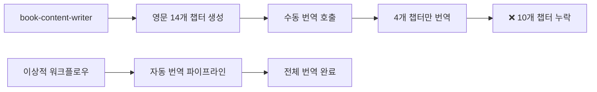

# VELOCITY-X 마스터링 북 번역 워크플로우 분석 보고서

*Created: 2025-07-27*
*Status: Critical Issue Identified & Action Plan Established*

## 📊 현황 분석

### 파일 완성도 비교
| 언어 | 완성 챕터 | 전체 챕터 | 완성률 | 상태 |
|------|-----------|-----------|---------|------|
| 영문 (EN) | 14개 | 14개 | 100% | ✅ 완료 |
| 한국어 (KO) | 4개 | 14개 | 28.6% | ❌ 불완전 |

### 누락된 한국어 챕터 (10개)
1. `04-polish-specialist.md` - Polish Specialist 심화 탐구
2. `05-code-reviewer.md` - Code Reviewer 활용
3. `06-quality-trio.md` - Quality Trio 워크플로우  
4. `07-custom-agent-development.md` - 커스텀 에이전트 개발
5. `08-workflow-design-patterns.md` - 워크플로우 설계 패턴
6. `09-enterprise-implementation.md` - 기업 구현
7. `10-team-collaboration.md` - 팀 협업 전략
8. `11-troubleshooting.md` - 문제해결 가이드
9. `12-future-prospects.md` - 미래 전망과 로드맵
10. `99-conclusion.md` - 결론 및 다음 단계

## 🔍 근본 원인 분석

### 1. 워크플로우 설계 결함


### 2. 자동화 부족
- **문제**: 각 챕터별 개별 번역 호출 필요
- **실제**: 첫 4개 챕터만 수동으로 번역 실행
- **결과**: 나머지 10개 챕터 자동 처리되지 않음

### 3. 품질 관리 시스템 부재
- 번역 완료율 자동 검증 없음
- 영문/한국어 파일 개수 불일치 감지 메커니즘 없음
- 워크플로우 실행 후 품질 보증 단계 누락

## 📋 즉시 조치 계획

### Phase 1: 누락 번역 완료 (즉시 실행)
```bash
# 우선순위별 번역 실행
1. 실무 핵심편 (4-6장): 높음
2. 고급 개발편 (7-8장): 높음  
3. 기업 도입편 (9-10장): 중간
4. 운영/미래편 (11-12, 99장): 중간
```

### Phase 2: 자동화 워크플로우 구축 (단기)
```yaml
# 개선된 워크플로우 설계
complete-book-workflow:
  steps:
    1. content-creation:
       agent: book-content-writer
       output: all-chapters-en
    
    2. auto-translation:
       agent: book-translator
       input: all-chapters-en
       output: all-chapters-ko
       validation: file-count-match
    
    3. quality-assurance:
       validation:
         - file-count-consistency
         - content-length-verification
         - technical-term-consistency
```

### Phase 3: 품질 관리 시스템 (중기)
- 번역 완료율 대시보드
- 자동 품질 검증 규칙
- CI/CD 파이프라인 통합

## 🛠️ 기술적 해결 방안

### 1. 자동 번역 스크립트
```bash
#!/bin/bash
# auto-translate-all.sh

EN_DIR="velocity-x-book/book"
KO_DIR="velocity-x-book/book-ko"

for en_file in $EN_DIR/*.md; do
    filename=$(basename "$en_file")
    ko_file="$KO_DIR/$filename"
    
    if [[ ! -f "$ko_file" ]]; then
        echo "Translating $filename..."
        book-translator "$en_file" "$ko_file"
    fi
done
```

### 2. 품질 검증 스크립트  
```bash
#!/bin/bash
# validate-translation-completeness.sh

EN_COUNT=$(ls velocity-x-book/book/*.md | wc -l)
KO_COUNT=$(ls velocity-x-book/book-ko/*.md | wc -l)

if [[ $EN_COUNT -ne $KO_COUNT ]]; then
    echo "❌ Translation incomplete: EN=$EN_COUNT, KO=$KO_COUNT"
    exit 1
else
    echo "✅ Translation complete: $EN_COUNT files in both languages"
fi
```

### 3. 통합 워크플로우 오케스트레이션
```python
# workflow_orchestrator.py
class BookProductionWorkflow:
    def execute_complete_workflow(self):
        # 1. 영문 컨텐츠 생성
        en_chapters = self.book_content_writer.create_all_chapters()
        
        # 2. 자동 번역 실행
        ko_chapters = []
        for chapter in en_chapters:
            ko_chapter = self.book_translator.translate(chapter)
            ko_chapters.append(ko_chapter)
        
        # 3. 품질 검증
        self.validate_translation_completeness(en_chapters, ko_chapters)
        
        # 4. 최종 검토
        return self.quality_assurance_check()
```

## 📈 예방 조치

### 1. 워크플로우 설계 원칙
- **완전성**: 모든 단계가 자동으로 실행되어야 함
- **검증성**: 각 단계별 결과 검증 필수
- **회복성**: 실패 시 재시도 및 복구 메커니즘
- **추적성**: 전체 과정 로깅 및 모니터링

### 2. 품질 관리 체크리스트
- [ ] 영문/한국어 파일 개수 일치 확인
- [ ] 각 파일 내용 완전성 검증
- [ ] 기술 용어 일관성 확인
- [ ] 링크 및 참조 무결성 검증

### 3. 지속적 개선
- 정기적 워크플로우 성능 평가
- 사용자 피드백 반영
- 자동화 수준 지속적 향상

## 🎯 성공 지표

### 단기 목표 (1주일)
- [ ] 누락된 10개 챕터 한국어 번역 완료
- [ ] 번역 품질 검증 완료
- [ ] 자동 번역 스크립트 구축

### 중기 목표 (1개월)  
- [ ] 완전 자동화 워크플로우 구축
- [ ] CI/CD 파이프라인 통합
- [ ] 품질 관리 대시보드 구축

### 장기 목표 (3개월)
- [ ] 다른 언어 지원 확장 가능한 구조
- [ ] 실시간 번역 품질 모니터링
- [ ] 커뮤니티 기여자를 위한 번역 도구

---

## 결론

이번 분석을 통해 수동 번역 프로세스의 한계와 자동화 워크플로우의 중요성을 명확히 확인했습니다. 즉시 누락된 번역을 완료하고, 향후 유사한 문제를 방지하기 위한 자동화 시스템을 구축해야 합니다.

**다음 단계**: 누락된 10개 챕터의 한국어 번역을 즉시 시작합니다.