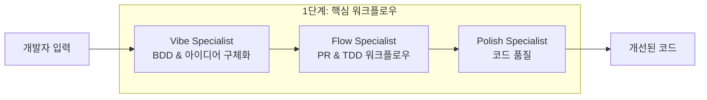
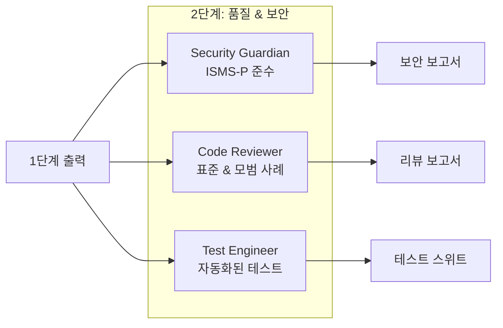
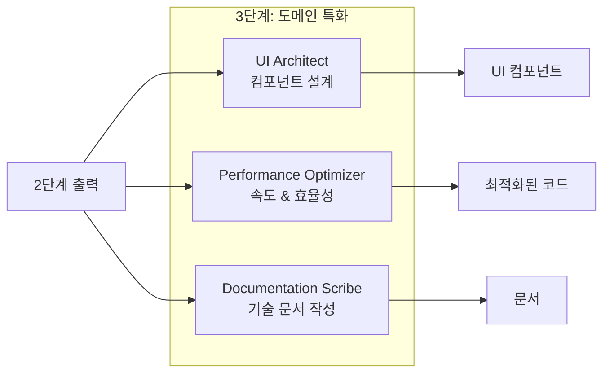
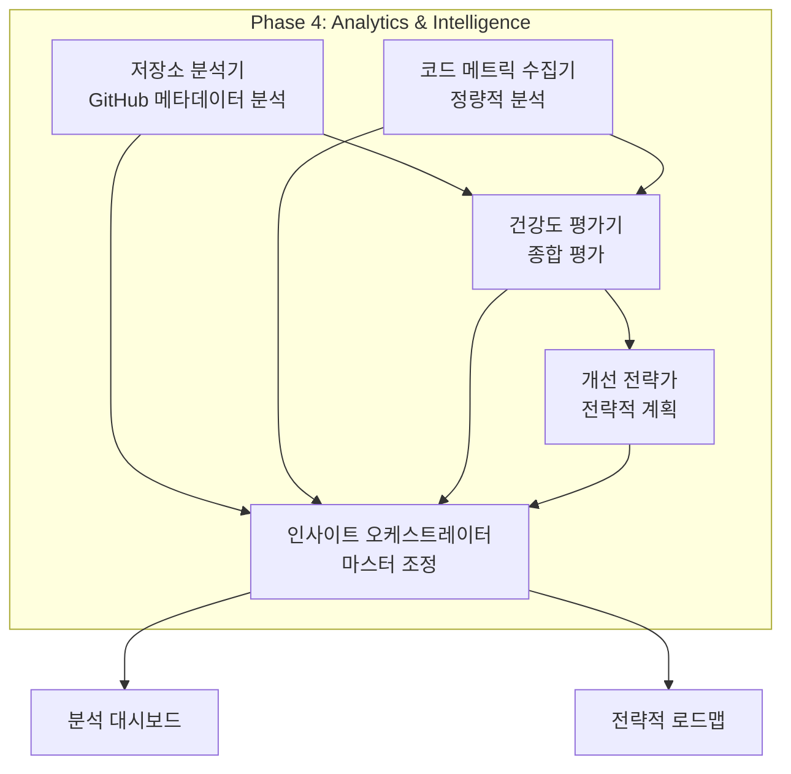

# VELOCITY-X 시스템 아키텍처

> *"건축은 공간을 낭비하는 예술이다."* - Philip Johnson  
> *"하지만 좋은 소프트웨어 아키텍처는 복잡성을 조직화하는 예술이다."* - VELOCITY-X Team

## 개요

VELOCITY-X의 아키텍처를 이해하는 것은 그 기능을 효과적으로 활용하기 위해 매우 중요합니다. 이 장에서는 VELOCITY-X를 강력한 에이전틱 개발 플랫폼으로 만드는 기술적 기초, 설계 원칙, 그리고 구현 세부 사항에 대해 자세히 살펴보겠습니다.

이 장을 마치면 다음을 이해하게 됩니다:
- 3단계 아키텍처 프레임워크와 그 근거
- 시스템 내에서 에이전트들이 소통하고 협업하는 방법
- VELOCITY-X 워크플로우를 지원하는 기술적 인프라
- 확장성과 유지보수성을 보장하는 설계 패턴과 원칙

## 1. 아키텍처 철학

### 설계 원칙

VELOCITY-X의 아키텍처는 다섯 가지 기본 원칙을 기반으로 구축되었습니다:

#### 1. 관심사 분리 (Separation of Concerns)
각 에이전트는 단일하고 명확히 정의된 책임을 가집니다:
```
Polish Specialist    → 코드 품질 및 리팩토링
Security Guardian    → 보안 준수 및 취약점 탐지
Performance Optimizer → 성능 분석 및 최적화
```

#### 2. 느슨한 결합 (Loose Coupling)
에이전트들은 표준화된 인터페이스를 통해 소통하여 다음을 가능하게 합니다:
- 독립적인 개발 및 테스트
- 개별 에이전트의 쉬운 교체 또는 업그레이드
- 유연한 워크플로우 구성

#### 3. 높은 응집성 (High Cohesion)
관련된 기능은 전문화된 에이전트 내에서 그룹화됩니다:
```python
class CodeReviewer:
    def review_style(self):        # 스타일 관련 리뷰 로직
    def review_security(self):     # 보안 관련 리뷰 로직
    def review_performance(self):  # 성능 관련 리뷰 로직
    def generate_report(self):     # 통합 보고서
```

#### 4. 이벤트 주도 아키텍처 (Event-Driven Architecture)
에이전트들은 이벤트에 응답하고 다운스트림 액션을 트리거합니다:
```
코드 변경 이벤트 → Polish Specialist → 품질 보고서 이벤트 → Code Reviewer → 최종 보고서
```

#### 5. 확장성 (Extensibility)
새로운 에이전트는 기존 컴포넌트를 수정하지 않고도 추가할 수 있습니다:
```yaml
# 새 에이전트 추가는 설정 중심으로 이루어집니다
new-agent:
  phase: 2
  dependencies: [polish-specialist]
  command: "agents/new-agent/run.sh"
```

## 2. 3단계 아키텍처

### 1단계: 핵심 워크플로우 기반

첫 번째 단계는 기본적인 개발 워크플로우를 구축합니다:



#### Vibe Specialist (바이브 전문가)
- **목적**: 고수준 아이디어를 구조화된 요구사항으로 변환
- **입력**: 자연어 설명, 사용자 스토리
- **출력**: BDD 시나리오, 수용 기준, 기술 사양
- **도구**: 자연어 처리, 요구사항 분석

#### Flow Specialist (플로우 전문가)
- **목적**: 개발 워크플로우와 프로세스 최적화
- **입력**: 프로젝트 요구사항, 팀 구조
- **출력**: PR 템플릿, TDD 패턴, 워크플로우 설정
- **도구**: Git 분석, 워크플로우 최적화 알고리즘

#### Polish Specialist (폴리시 전문가)
- **목적**: 코드 품질과 유지보수성 보장
- **입력**: 원시 코드, 코딩 표준
- **출력**: 리팩토링된 코드, 품질 메트릭, 개선 제안
- **도구**: 정적 분석기 (ruff, pylint), 포매터 (black), 복잡도 분석기 (radon)

### 2단계: 품질 & 보안 보증

두 번째 단계는 검증과 보안에 중점을 둡니다:



#### Security Guardian (보안 수호자)
- **목적**: 보안 준수 및 취약점 탐지 보장
- **입력**: 코드, 의존성, 설정 파일
- **출력**: 보안 보고서, 준수 상태, 해결 제안
- **도구**: 보안 스캐너 (bandit), 의존성 검사기, 준수 검증기

#### Code Reviewer (코드 리뷰어)
- **목적**: 모범 사례 기반 자동화된 코드 리뷰
- **입력**: 코드 변경, 코딩 표준, 팀 가이드라인
- **출력**: 리뷰 코멘트, 승인/거부, 품질 점수
- **도구**: 코드 분석기, 패턴 매처, 스타일 검사기

#### Test Engineer (테스트 엔지니어)
- **목적**: 자동화된 테스트 생성 및 커버리지 분석
- **입력**: 코드, 요구사항, 기존 테스트
- **출력**: 테스트 케이스, 커버리지 보고서, 테스트 자동화 스크립트
- **도구**: 테스트 생성기, 커버리지 분석기, 모킹 프레임워크

### 3단계: 도메인 특화

세 번째 단계는 전문화된 기능을 제공합니다:



#### UI Architect (UI 설계자)
- **목적**: 프론트엔드 컴포넌트 설계 및 생성
- **입력**: 설계 요구사항, UI 프레임워크, 접근성 가이드라인
- **출력**: React/Vue 컴포넌트, CSS, 반응형 레이아웃
- **도구**: 컴포넌트 생성기, 디자인 시스템 검증기, 접근성 검사기

#### Performance Optimizer (성능 최적화기)
- **목적**: 코드 및 시스템 성능 최적화
- **입력**: 코드, 성능 메트릭, 병목 분석
- **출력**: 최적화된 알고리즘, 캐싱 전략, 성능 보고서
- **도구**: 프로파일러, 벤치마킹 도구, 최적화 알고리즘

#### Documentation Scribe (문서 작성자)
- **목적**: 자동화된 기술 문서 생성
- **입력**: 코드, 주석, API 사양
- **출력**: API 문서, 사용자 가이드, 아키텍처 문서
- **도구**: 문서 생성기, 템플릿 엔진, 콘텐츠 분석기

### 4단계: 분석 및 인텔리전스

네 번째 단계는 고급 분석 및 인텔리전스 기능을 도입합니다:



#### Repository Analyzer (저장소 분석기)
- **목적**: GitHub 메타데이터 수집 및 저장소 건강도 분석
- **입력**: GitHub 저장소 URL, 액세스 토큰, 분석 매개변수
- **출력**: 커밋 패턴, 협업 메트릭, 워크플로우 효율성 데이터
- **도구**: GitHub API, PyGithub, 통계 분석 라이브러리

#### Code Metrics Collector (코드 메트릭 수집기)
- **목적**: 정량적 코드 품질 분석 및 기술 부채 측정
- **입력**: 소스 코드, 테스트 파일, 의존성 정보
- **출력**: 복잡도 메트릭, 품질 지표, 기술 부채 계산
- **도구**: AST 파서, 복잡도 분석기, 중복 탐지기

#### Health Evaluator (건강도 평가기)
- **목적**: 포괄적인 프로젝트 건강도 평가 및 벤치마킹
- **입력**: 저장소 데이터, 코드 메트릭, 과거 트렌드
- **출력**: 건강도 점수, 리스크 평가, 트렌드 분석
- **도구**: 통계 모델, 벤치마킹 데이터베이스, 리스크 계산기

#### Improvement Strategist (개선 전략가)
- **목적**: 데이터 기반 개선 전략 개발
- **입력**: 건강도 평가, 팀 역량, 조직 제약사항
- **출력**: 우선순위 액션 플랜, ROI 분석, 구현 로드맵
- **도구**: 최적화 알고리즘, ROI 계산기, 프로젝트 계획 프레임워크

#### Repository Insights Orchestrator (저장소 인사이트 오케스트레이터)
- **목적**: 분석 워크플로우의 마스터 조정 및 보고서 생성
- **입력**: 모든 분석 에이전트 출력, 설정 구성
- **출력**: 포괄적인 대시보드, 경영진 보고서, 인터랙티브 시각화
- **도구**: 워크플로우 엔진, 시각화 라이브러리, 보고서 생성기

## 3. 기술적 인프라

### 명령 기반 아키텍처

VELOCITY-X는 에이전트 실행을 위해 명령 기반 시스템을 사용합니다:

```bash
# 디렉토리 구조
temp_hooks/commands/
├── config/
│   ├── agents.yaml      # 에이전트 설정
│   ├── tools.yaml       # 도구 정의  
│   └── workflows.yaml   # 워크플로우 정의
├── agents/
│   └── {agent-name}/
│       └── run.sh       # 에이전트 실행 파일
├── core/
│   ├── common.sh        # 공유 유틸리티
│   └── workflow_engine.py # 오케스트레이션 엔진
└── scripts/
    └── run-workflow.sh  # 워크플로우 실행기
```

### 에이전트 설정 시스템

에이전트는 YAML 설정을 통해 정의됩니다:

```yaml
# config/agents.yaml
agents:
  velocity-x-polish-specialist:
    phase: 1
    order: 3
    command: "agents/velocity-x-polish-specialist/run.sh"
    timeout: 450
    required_tools:
      - static_analyzer
      - code_formatter
      - complexity_analyzer
    inputs:
      - source_code
      - style_config
    outputs:
      - polished_code
      - quality_report
```

### 데이터 플로우 및 핸드오프 메커니즘

에이전트들은 구조화된 데이터 교환을 통해 소통합니다:

```python
# 에이전트 출력 형식
{
    "agent": "velocity-x-polish-specialist",
    "status": "completed",
    "timestamp": "2025-01-27T10:30:00Z",
    "input_context": {
        "file": "src/example.py",
        "original_size": 1200,
        "complexity_score": 8.5
    },
    "outputs": {
        "polished_file": "output/example_polished.py",
        "improvements": [
            {
                "type": "code_smell",
                "description": "중복 코드 제거",
                "impact": "high"
            }
        ],
        "metrics": {
            "size_reduction": "15%",
            "complexity_improvement": "23%"
        }
    },
    "next_agents": ["velocity-x-code-reviewer"]
}
```

### 워크플로우 엔진

워크플로우 엔진은 에이전트 실행을 오케스트레이션합니다:

```python
class WorkflowEngine:
    def __init__(self, config_path: str):
        self.agents_config = load_yaml(config_path)
        self.execution_graph = build_dependency_graph()
    
    def execute_workflow(self, workflow_name: str, input_files: List[str]):
        """의존성 관리와 함께 정의된 워크플로우 실행"""
        workflow = self.workflows[workflow_name]
        
        # 단계와 순서에 따라 에이전트 정렬
        sorted_agents = sorted(workflow.agents, 
                             key=lambda a: (a.phase, a.order))
        
        results = {}
        for agent in sorted_agents:
            if self.can_execute(agent, results):
                result = self.execute_agent(agent, input_files, results)
                results[agent.name] = result
                
        return self.aggregate_results(results)
    
    def can_execute(self, agent: Agent, previous_results: Dict) -> bool:
        """모든 의존성이 만족되는지 확인"""
        return all(dep in previous_results 
                  for dep in agent.dependencies)
```

## 4. 통신 패턴

### 동기 실행
즉시 결과가 필요한 의존적 작업을 위해:
```python
result = polish_specialist.execute(code)
review_result = code_reviewer.execute(result.output)
```

### 비동기 처리
병렬로 실행할 수 있는 독립적 작업을 위해:
```python
import asyncio

async def parallel_analysis(code):
    tasks = [
        security_guardian.analyze(code),
        performance_optimizer.analyze(code),
        documentation_scribe.analyze(code)
    ]
    results = await asyncio.gather(*tasks)
    return aggregate_results(results)
```

### 이벤트 주도 워크플로우
조건부 로직을 가진 복잡한 워크플로우를 위해:
```python
class EventBus:
    def __init__(self):
        self.listeners = defaultdict(list)
    
    def subscribe(self, event_type: str, handler: Callable):
        self.listeners[event_type].append(handler)
    
    def publish(self, event: Event):
        for handler in self.listeners[event.type]:
            handler(event)

# 사용법
bus = EventBus()
bus.subscribe("code_polished", code_reviewer.handle_polished_code)
bus.subscribe("security_scan_complete", documentation_scribe.update_security_docs)
```

## 5. 확장성과 성능

### 수평적 확장
VELOCITY-X는 다음을 통해 확장을 지원합니다:

#### 로드 분산
```yaml
# 리소스 집약적 에이전트의 다중 인스턴스
agents:
  velocity-x-polish-specialist-1:
    instance: 1
    cpu_limit: "2"
    memory_limit: "4Gi"
  velocity-x-polish-specialist-2:
    instance: 2
    cpu_limit: "2" 
    memory_limit: "4Gi"
```

#### 캐싱 전략
```python
class AgentCache:
    def __init__(self, ttl: int = 3600):
        self.cache = {}
        self.ttl = ttl
    
    def get_cached_result(self, input_hash: str):
        """사용 가능하고 만료되지 않은 경우 캐시된 결과 반환"""
        if input_hash in self.cache:
            result, timestamp = self.cache[input_hash]
            if time.time() - timestamp < self.ttl:
                return result
        return None
    
    def cache_result(self, input_hash: str, result: Any):
        """타임스탬프와 함께 결과 캐시"""
        self.cache[input_hash] = (result, time.time())
```

### 성능 최적화

#### 지연 로딩 (Lazy Loading)
```python
class Agent:
    def __init__(self):
        self._tools = None
    
    @property
    def tools(self):
        """필요할 때만 도구 로드"""
        if self._tools is None:
            self._tools = self.load_tools()
        return self._tools
```

#### 리소스 관리
```python
class ResourceManager:
    def __init__(self, max_concurrent: int = 4):
        self.semaphore = asyncio.Semaphore(max_concurrent)
        self.active_agents = {}
    
    async def execute_agent(self, agent: Agent, task: Task):
        async with self.semaphore:
            return await agent.execute(task)
```

## 6. 오류 처리 및 복원력

### 회로 차단기 패턴 (Circuit Breaker Pattern)
```python
class CircuitBreaker:
    def __init__(self, failure_threshold: int = 5, timeout: int = 60):
        self.failure_threshold = failure_threshold
        self.timeout = timeout
        self.failure_count = 0
        self.last_failure = None
        self.state = "CLOSED"  # CLOSED, OPEN, HALF_OPEN
    
    def call(self, func, *args, **kwargs):
        if self.state == "OPEN":
            if time.time() - self.last_failure > self.timeout:
                self.state = "HALF_OPEN"
            else:
                raise CircuitBreakerOpenError()
        
        try:
            result = func(*args, **kwargs)
            self.success()
            return result
        except Exception as e:
            self.failure()
            raise
```

### 재시도 메커니즘
```python
def retry_with_backoff(max_retries: int = 3, backoff_factor: float = 2.0):
    def decorator(func):
        def wrapper(*args, **kwargs):
            for attempt in range(max_retries + 1):
                try:
                    return func(*args, **kwargs)
                except Exception as e:
                    if attempt == max_retries:
                        raise
                    wait_time = backoff_factor ** attempt
                    time.sleep(wait_time)
        return wrapper
    return decorator

@retry_with_backoff(max_retries=3)
def execute_agent(agent, task):
    return agent.run(task)
```

## 7. 보안 아키텍처

### 에이전트 격리
```bash
# 각 에이전트는 격리된 환경에서 실행
docker run --rm \
  --memory=2g \
  --cpus=1.0 \
  --network=none \
  --user=agent \
  jae/polish-specialist:latest
```

### 입력 검증
```python
class InputValidator:
    def __init__(self):
        self.allowed_extensions = {'.py', '.js', '.ts', '.java'}
        self.max_file_size = 10 * 1024 * 1024  # 10MB
    
    def validate_file(self, file_path: str) -> bool:
        """파일 안전성과 제약 조건 검증"""
        if not self.is_allowed_extension(file_path):
            raise ValueError(f"허용되지 않은 파일 형식: {file_path}")
        
        if os.path.getsize(file_path) > self.max_file_size:
            raise ValueError(f"파일이 너무 큼: {file_path}")
        
        if self.contains_suspicious_content(file_path):
            raise SecurityError(f"의심스러운 콘텐츠 감지: {file_path}")
        
        return True
```

### 보안 통신
```python
class SecureAgent:
    def __init__(self, private_key_path: str):
        self.private_key = load_private_key(private_key_path)
        self.session_key = generate_session_key()
    
    def encrypt_output(self, data: Dict) -> bytes:
        """민감한 출력 데이터 암호화"""
        serialized = json.dumps(data)
        return encrypt_with_session_key(serialized, self.session_key)
    
    def decrypt_input(self, encrypted_data: bytes) -> Dict:
        """이전 에이전트로부터의 입력 복호화"""
        decrypted = decrypt_with_session_key(encrypted_data, self.session_key)
        return json.loads(decrypted)
```

## 요약

VELOCITY-X의 아키텍처는 다음을 위해 설계되었습니다:

✅ **모듈성**: 명확한 책임을 가진 독립적이고 전문화된 에이전트

✅ **확장성**: 수평적 확장과 리소스 최적화

✅ **신뢰성**: 회로 차단기, 재시도, 우아한 오류 처리

✅ **보안**: 격리된 실행과 보안 통신

✅ **확장성**: 새로운 에이전트와 워크플로우의 쉬운 추가

✅ **성능**: 캐싱, 지연 로딩, 효율적인 리소스 관리

3단계 아키텍처는 기초 워크플로우(1단계), 품질 보증(2단계), 전문화된 기능(3단계) 간의 명확한 분리를 제공하며, 기술적 인프라는 신뢰할 수 있고 안전하며 확장 가능한 실행을 보장합니다.

## 연습 문제

1. **설계 도전**: 의존성 관리를 위한 새로운 에이전트를 설계하고 입력, 출력, 통합 지점을 명시하세요

2. **구현**: 두 개의 에이전트를 순차적으로 실행할 수 있는 간단한 워크플로우 엔진을 만드세요

3. **분석**: 다양한 사용 사례에서 동기와 비동기 에이전트 실행 간의 트레이드오프를 분석하세요

4. **보안**: 분산 환경에서 에이전트 간 통신을 위한 보안 모델을 설계하세요

## 추가 읽기

- [환경 설정 및 구성](03-setup.md)
- [Polish Specialist 심층 분석](04-polish-specialist.md)
- [워크플로우 설계 패턴](08-workflow-design.md)

---

*다음 장: [환경 설정 및 구성](03-setup.md) - 개발 환경에 VELOCITY-X를 설치하고 구성하는 방법을 배워보세요*