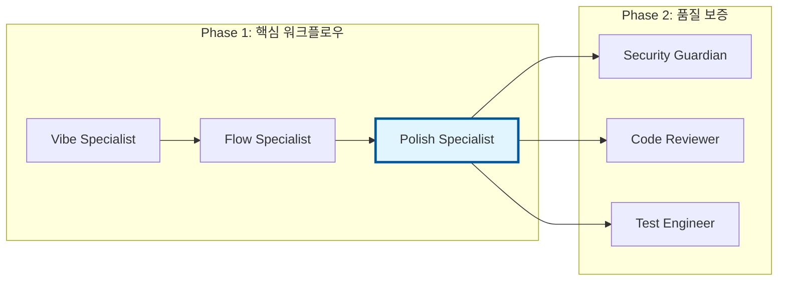

# Polish Specialist 심화 가이드

> *"품질은 행위가 아니라 습관이다. 에이전틱 개발의 세계에서 Polish Specialist는 대규모로 코드를 지속적으로 개선함으로써 이 원칙을 구현한다."* - 아리스토텔레스 (각색)

## 개요

Polish Specialist는 VELOCITY-X의 가장 영향력 있는 에이전트 중 하나로, 코드 품질 개선의 핵심 역할을 담당합니다. 이 장에서는 이 에이전트가 원시 코드를 세련되고 유지보수 가능하며 효율적인 구현으로 변환하는 방법을 포괄적으로 탐구합니다.

이 장을 마치면 다음을 이해하게 됩니다:
- VELOCITY-X 생태계에서 Polish Specialist의 역할
- 고급 구성 및 사용자 정의 옵션
- 다른 품질 도구와의 통합 패턴
- 실제 최적화 기법
- 성능 모니터링 및 메트릭

## 1. Polish Specialist 소개

### 핵심 임무

Polish Specialist 에이전트는 다음을 통한 체계적인 코드 개선에 중점을 둡니다:

- **구조적 분석**: 코드 스멜과 안티패턴 식별
- **성능 최적화**: 병목 현상과 비효율성 제거
- **가독성 향상**: 코드 명확성과 유지보수성 개선
- **표준 준수**: 코딩 표준 준수 보장
- **자동화된 리팩토링**: 더 나은 설계를 위한 안전한 코드 재구조화

### VELOCITY-X 아키텍처에서의 위치



Polish Specialist는 초기 구현과 품질 보증 사이의 중요한 지점에 위치하여, 코드가 보안 및 리뷰 프로세스를 거치기 전에 최적화되도록 보장합니다.

## 2. 기술적 구현

### 에이전트 구성

Polish Specialist는 정교한 구성 시스템을 사용합니다:

```yaml
# polish-specialist-config.yaml
agent:
  name: "velocity-x-polish-specialist"
  version: "2.1.0"
  
analysis_tools:
  - ruff
  - pylint
  - radon
  - black
  - isort
  
optimization_levels:
  - basic: ["formatting", "imports"]
  - standard: ["code_smells", "complexity"]
  - advanced: ["performance", "architecture"]

thresholds:
  complexity_max: 10
  function_length_max: 50
  file_length_max: 500
  duplication_threshold: 0.15

output_formats:
  - json
  - markdown
  - diff
```

### 핵심 분석 엔진

에이전트의 분석 엔진은 여러 단계를 통해 코드를 처리합니다:

```python
class PolishAnalysisEngine:
    def __init__(self, config: PolishConfig):
        self.config = config
        self.tools = self._initialize_tools()
        self.metrics = QualityMetrics()
    
    def analyze_file(self, file_path: str) -> AnalysisResult:
        """포괄적인 파일 분석"""
        result = AnalysisResult(file_path)
        
        # 1단계: 구조적 분석
        structural_issues = self._analyze_structure(file_path)
        result.add_issues(structural_issues)
        
        # 2단계: 성능 분석
        performance_issues = self._analyze_performance(file_path)
        result.add_issues(performance_issues)
        
        # 3단계: 가독성 분석
        readability_issues = self._analyze_readability(file_path)
        result.add_issues(readability_issues)
        
        return result
    
    def _analyze_structure(self, file_path: str) -> List[Issue]:
        """구조적 코드 스멜 감지"""
        issues = []
        
        # radon을 사용한 복잡도 분석
        complexity_data = radon.analyze_complexity(file_path)
        for func, complexity in complexity_data.items():
            if complexity > self.config.complexity_max:
                issues.append(Issue(
                    type="complexity",
                    severity="high",
                    message=f"함수 {func}의 복잡도가 {complexity}입니다",
                    suggestion="더 작은 함수로 분할하는 것을 고려하세요"
                ))
        
        return issues
```

### 품질 메트릭 추적

Polish Specialist는 포괄적인 품질 메트릭을 추적합니다:

```python
class QualityMetrics:
    def __init__(self):
        self.metrics = {
            'complexity_scores': [],
            'code_smell_counts': [],
            'performance_improvements': [],
            'readability_scores': []
        }
    
    def calculate_improvement_score(self, before: AnalysisResult, 
                                  after: AnalysisResult) -> float:
        """전반적인 개선 비율 계산"""
        before_score = self._calculate_quality_score(before)
        after_score = self._calculate_quality_score(after)
        
        improvement = ((after_score - before_score) / before_score) * 100
        return max(0, improvement)
    
    def _calculate_quality_score(self, result: AnalysisResult) -> float:
        """가중치 품질 점수 계산"""
        weights = {
            'complexity': 0.3,
            'maintainability': 0.25,
            'performance': 0.25,
            'readability': 0.2
        }
        
        return sum(
            result.scores[metric] * weight 
            for metric, weight in weights.items()
        )
```

## 3. 고급 기능

### 지능형 코드 변환

Polish Specialist는 패턴 기반 변환을 사용합니다:

```python
class CodeTransformer:
    def __init__(self):
        self.patterns = self._load_transformation_patterns()
    
    def apply_transformations(self, code: str) -> str:
        """지능형 코드 변환 적용"""
        transformed = code
        
        for pattern in self.patterns:
            if pattern.matches(transformed):
                transformed = pattern.apply(transformed)
                self._log_transformation(pattern)
        
        return transformed
    
    def _load_transformation_patterns(self) -> List[TransformationPattern]:
        """미리 정의된 변환 패턴 로드"""
        return [
            # 리스트 컴프리헨션 최적화
            TransformationPattern(
                name="list_comprehension",
                pattern=r"for .* in .*:\s*list\.append\(.*\)",
                replacement=lambda match: self._to_list_comprehension(match)
            ),
            
            # 딕셔너리 get 최적화
            TransformationPattern(
                name="dict_get_optimization",
                pattern=r"if .* in .*:\s*.*\[.*\]",
                replacement=lambda match: self._to_dict_get(match)
            ),
            
            # 문자열 포맷팅 현대화
            TransformationPattern(
                name="f_string_conversion",
                pattern=r"\".*\"\s*%\s*\(.*\)",
                replacement=lambda match: self._to_f_string(match)
            )
        ]
```

### 성능 최적화 전략

에이전트는 여러 성능 최적화 전략을 구현합니다:

#### 1. 알고리즘 복잡도 감소

```python
def optimize_algorithmic_complexity(self, code_block: CodeBlock) -> OptimizationResult:
    """알고리즘 복잡도 분석 및 최적화"""
    complexity_analysis = self._analyze_big_o(code_block)
    
    optimizations = []
    
    if complexity_analysis.has_nested_loops():
        optimization = self._suggest_loop_optimization(code_block)
        optimizations.append(optimization)
    
    if complexity_analysis.has_redundant_operations():
        optimization = self._suggest_caching(code_block)
        optimizations.append(optimization)
    
    return OptimizationResult(optimizations)
```

#### 2. 메모리 사용량 최적화

```python
def optimize_memory_usage(self, code_block: CodeBlock) -> List[MemoryOptimization]:
    """메모리 비효율성 식별 및 수정"""
    optimizations = []
    
    # 리스트 컴프리헨션 대신 제너레이터 표현식
    if self._has_large_list_comprehensions(code_block):
        optimizations.append(MemoryOptimization(
            type="generator_expression",
            description="큰 리스트 컴프리헨션을 제너레이터로 변환",
            impact="최대 메모리 사용량을 60-80% 감소"
        ))
    
    # 문자열 연결 최적화
    if self._has_inefficient_string_ops(code_block):
        optimizations.append(MemoryOptimization(
            type="string_join",
            description="반복적인 연결 대신 str.join() 사용",
            impact="큰 문자열에 대해 10-50배 성능 향상"
        ))
    
    return optimizations
```

### 사용자 정의 규칙 엔진

Polish Specialist는 조직별 요구사항을 위한 사용자 정의 규칙을 지원합니다:

```python
# custom_rules.py
class CustomRuleEngine:
    def __init__(self, rules_config: str):
        self.rules = self._load_custom_rules(rules_config)
    
    def apply_custom_rules(self, code: str) -> List[RuleViolation]:
        """조직별 코딩 규칙 적용"""
        violations = []
        
        for rule in self.rules:
            if rule.check(code):
                violations.append(RuleViolation(
                    rule_id=rule.id,
                    severity=rule.severity,
                    message=rule.message,
                    suggestion=rule.suggestion
                ))
        
        return violations

# 사용자 정의 규칙 예시
class NamingConventionRule(Rule):
    def check(self, code: str) -> bool:
        # 조직별 네이밍 컨벤션 확인
        function_names = extract_function_names(code)
        return any(not name.startswith('org_') for name in function_names)
```

## 4. 통합 패턴

### CI/CD 통합

지속적 통합 파이프라인에 Polish Specialist를 통합:

```yaml
# .github/workflows/polish-check.yml
name: Code Polish Check
on: [push, pull_request]

jobs:
  polish-check:
    runs-on: ubuntu-latest
    steps:
      - uses: actions/checkout@v3
      
      - name: Setup Python
        uses: actions/setup-python@v4
        with:
          python-version: '3.11'
          
      - name: Install dependencies
        run: |
          pip install -r requirements.txt
          
      - name: Run Polish Specialist
        run: |
          ./temp_hooks/commands/agents/velocity-x-polish-specialist/command.sh \
            --files "$(git diff --name-only HEAD~1)" \
            --output-format json \
            --threshold-fail 80
          
      - name: Upload results
        uses: actions/upload-artifact@v3
        with:
          name: polish-results
          path: output/polish-results.json
```

### IDE 통합

실시간 피드백을 위한 IDE 플러그인 생성:

```python
# vscode_extension.py
class PolishSpecialistExtension:
    def __init__(self):
        self.client = VELOCITY-XClient()
        self.cache = {}
    
    def on_document_change(self, document: Document):
        """문서 변경 시 실시간 분석"""
        if self._should_analyze(document):
            analysis = self.client.polish_specialist.analyze(
                content=document.content,
                file_type=document.language
            )
            
            self._update_diagnostics(document, analysis)
    
    def _update_diagnostics(self, document: Document, analysis: Analysis):
        """폴리시 제안으로 IDE 진단 업데이트"""
        diagnostics = []
        
        for issue in analysis.issues:
            diagnostic = Diagnostic(
                range=issue.range,
                message=issue.message,
                severity=self._map_severity(issue.severity),
                code=issue.code,
                source="VELOCITY-X Polish Specialist"
            )
            diagnostics.append(diagnostic)
        
        self.connection.publish_diagnostics(document.uri, diagnostics)
```

### 팀 워크플로우 통합

팀 협업 도구와의 통합:

```python
# slack_integration.py
class SlackPolishReporter:
    def __init__(self, webhook_url: str):
        self.webhook_url = webhook_url
    
    def report_polish_results(self, results: PolishResults):
        """팀 Slack 채널에 폴리시 결과 전송"""
        message = self._format_message(results)
        
        payload = {
            "text": "코드 폴리시 리포트",
            "attachments": [{
                "color": self._get_color(results.score),
                "fields": [
                    {
                        "title": "전체 점수",
                        "value": f"{results.score:.1f}/100",
                        "short": True
                    },
                    {
                        "title": "수정된 이슈",
                        "value": str(results.issues_fixed),
                        "short": True
                    },
                    {
                        "title": "성능 개선",
                        "value": f"{results.performance_improvement:.1f}%",
                        "short": True
                    }
                ]
            }]
        }
        
        requests.post(self.webhook_url, json=payload)
```

## 5. 모니터링 및 분석

### 성능 대시보드

시간에 따른 Polish Specialist 성능 추적:

```python
class PolishDashboard:
    def __init__(self, metrics_store: MetricsStore):
        self.metrics = metrics_store
    
    def generate_weekly_report(self) -> WeeklyReport:
        """포괄적인 주간 폴리시 리포트 생성"""
        data = self.metrics.get_weekly_data()
        
        return WeeklyReport(
            total_files_processed=data.file_count,
            average_quality_improvement=data.avg_improvement,
            top_issues_fixed=data.top_issues,
            performance_trends=data.trends,
            team_adoption_rate=data.adoption_rate
        )
    
    def create_quality_trend_chart(self, timeframe: str) -> Chart:
        """품질 개선 트렌드 시각화 생성"""
        data = self.metrics.get_trend_data(timeframe)
        
        return Chart(
            type="line",
            title="코드 품질 트렌드",
            x_axis=data.dates,
            y_axis=data.quality_scores,
            annotations=data.major_improvements
        )
```

### 자동화된 리포팅

자동화된 품질 리포트 설정:

```python
# automated_reporting.py
class AutomatedReporter:
    def __init__(self, config: ReportConfig):
        self.config = config
        self.scheduler = BackgroundScheduler()
    
    def start_reporting(self):
        """자동화된 리포팅 스케줄 시작"""
        # 일일 요약
        self.scheduler.add_job(
            func=self._generate_daily_summary,
            trigger="cron",
            hour=9, minute=0
        )
        
        # 주간 상세 리포트
        self.scheduler.add_job(
            func=self._generate_weekly_report,
            trigger="cron",
            day_of_week="mon", hour=8, minute=0
        )
        
        self.scheduler.start()
    
    def _generate_daily_summary(self):
        """일일 요약 생성 및 전송"""
        summary = self._collect_daily_metrics()
        self._send_to_stakeholders(summary)
```

## 6. 모범 사례

### 구성 관리

```yaml
# team-polish-config.yaml
team_settings:
  strictness_level: "standard"  # basic, standard, strict
  auto_fix_enabled: true
  review_required_for:
    - complexity_reduction
    - architecture_changes
  
custom_rules:
  - name: "api_versioning"
    pattern: "def.*api.*version"
    requirement: "모든 API 함수는 버전 매개변수를 포함해야 함"
  
integration:
  git_hooks: true
  ci_blocking: false  # 폴리시 이슈로 인한 CI 차단 안함
  notification_channels:
    - slack: "#code-quality"
    - email: "dev-leads@company.com"
```

### 성능 최적화

```python
# 성능 최적화 전략
class PolishPerformanceOptimizer:
    def __init__(self):
        self.cache = LRUCache(maxsize=1000)
        self.analyzer_pool = ProcessPool(size=4)
    
    def optimize_batch_processing(self, file_list: List[str]) -> BatchResult:
        """여러 파일의 배치 처리 최적화"""
        # 유사한 파일들을 그룹화하여 배치 처리
        grouped_files = self._group_by_similarity(file_list)
        
        results = []
        for group in grouped_files:
            # 더 나은 캐싱을 위해 유사한 파일들을 함께 처리
            group_result = self._process_file_group(group)
            results.extend(group_result)
        
        return BatchResult(results)
    
    def _process_file_group(self, files: List[str]) -> List[AnalysisResult]:
        """유사한 파일 그룹을 효율적으로 처리"""
        # 유사한 파일들을 위한 공유 분석 컨텍스트
        shared_context = self._build_shared_context(files)
        
        return [
            self._analyze_with_context(file, shared_context)
            for file in files
        ]
```

## 7. 문제 해결

### 일반적인 문제와 해결책

#### 문제 1: 높은 거짓 양성 비율

```python
# 해결책: 임계값 미세 조정
def calibrate_thresholds(self, historical_data: List[AnalysisResult]):
    """감지 임계값 자동 보정"""
    false_positive_rate = self._calculate_fp_rate(historical_data)
    
    if false_positive_rate > 0.15:  # 15% 이상의 거짓 양성
        self._adjust_sensitivity(decrease=True)
        self._log_threshold_adjustment("높은 FP 비율로 인한 민감도 감소")
```

#### 문제 2: 성능 저하

```python
# 해결책: 적응형 캐싱 구현
class AdaptiveCache:
    def __init__(self):
        self.cache_hit_rate = 0.0
        self.cache = {}
    
    def get_or_analyze(self, file_hash: str, analyzer_func):
        """히트율 기반 적응형 캐싱"""
        if file_hash in self.cache:
            self.cache_hit_rate = self._update_hit_rate(True)
            return self.cache[file_hash]
        
        result = analyzer_func()
        
        # 히트율이 합리적일 때만 캐시
        if self.cache_hit_rate > 0.3:
            self.cache[file_hash] = result
        
        self.cache_hit_rate = self._update_hit_rate(False)
        return result
```

#### 문제 3: 구성 충돌

```python
# 해결책: 구성 검증 및 해결
class ConfigurationValidator:
    def validate_and_resolve(self, config: PolishConfig) -> PolishConfig:
        """구성 검증 및 충돌 해결"""
        conflicts = self._detect_conflicts(config)
        
        if conflicts:
            resolved_config = self._resolve_conflicts(config, conflicts)
            self._log_resolution(conflicts, resolved_config)
            return resolved_config
        
        return config
    
    def _detect_conflicts(self, config: PolishConfig) -> List[ConfigConflict]:
        conflicts = []
        
        # 충돌하는 도구 구성 확인
        if config.tools.black.enabled and config.tools.yapf.enabled:
            conflicts.append(ConfigConflict(
                type="formatter_conflict",
                message="여러 포매터가 활성화됨",
                suggestion="black 또는 yapf 중 하나를 선택하세요"
            ))
        
        return conflicts
```

## 8. 요약

Polish Specialist는 자동화된 코드 품질 개선에 대한 정교한 접근 방식을 나타냅니다. 포괄적인 분석 엔진, 지능형 변환, 광범위한 통합 기능을 통해 VELOCITY-X 생태계의 중추 역할을 합니다.

### 주요 포인트

✅ **다층 분석**: 구조적, 성능, 가독성 분석이 포괄적인 코드 개선을 제공

✅ **지능형 변환**: 패턴 기반 코드 변환이 일반적인 안티패턴을 안전하게 최적화

✅ **광범위한 통합**: CI/CD, IDE, 팀 워크플로우 통합으로 원활한 도입 가능

✅ **성능 모니터링**: 포괄적인 메트릭과 리포팅으로 시간에 따른 개선 추적

✅ **사용자 정의**: 사용자 정의 규칙과 구성 옵션으로 조직 요구사항에 적응

### 모범 사례 요약

1. **표준 구성으로 시작**하고 팀 요구사항에 따라 점진적으로 사용자 정의
2. **거짓 양성 비율 모니터링**하고 그에 따라 임계값 조정
3. **차단하지 않는 CI 검사**부터 시작하여 점진적으로 통합
4. **성능 메트릭 활용**하여 이해관계자에게 가치 입증
5. **팀 교육 제공**하여 폴리시 제안을 해석하고 행동하는 방법 안내

## 연습 문제

1. **구성 사용자 정의**: 조직의 코딩 표준을 위한 사용자 정의 규칙 생성

2. **성능 분석**: 대규모 코드베이스에서 Polish Specialist를 실행하고 성능 메트릭 분석

3. **통합 설정**: 프로젝트에 적절한 임계값으로 CI/CD 통합 구현

4. **사용자 정의 변환**: 코드베이스의 일반적인 코드 스멜을 위한 변환 패턴 설계

5. **대시보드 생성**: 시간에 따른 폴리시 개선을 추적하는 간단한 대시보드 구축

## 추가 자료

- [Code Reviewer 활용](05-code-reviewer.md)
- [Quality Trio 워크플로우](06-quality-trio.md)
- [사용자 정의 에이전트 개발](07-custom-agent-development.md)
- [성능 최적화 가이드](appendix-performance.md)

---

*다음 장: [Code Reviewer 활용](05-code-reviewer.md) - 자동화된 코드 리뷰의 효과를 극대화하는 방법 학습*