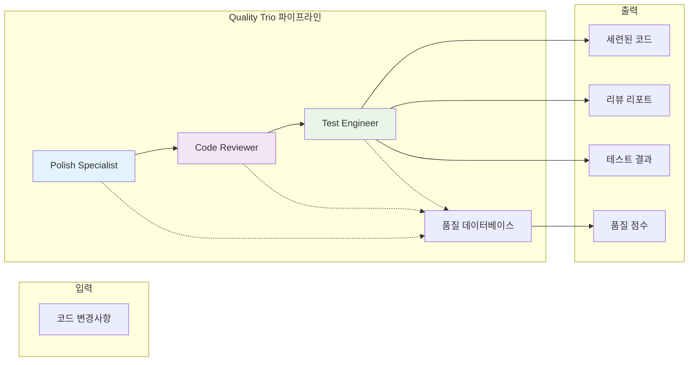

# Quality Trio 워크플로우

> *"조화롭게 협력하는 세 에이전트는 고립되어 작업하는 열 명의 개발자가 달성할 수 없는 것을 달성할 수 있다."* - VELOCITY-X Team

## 개요

Quality Trio는 VELOCITY-X의 가장 강력한 협업 워크플로우로, Polish Specialist, Code Reviewer, Test Engineer의 강점을 결합하여 원활한 품질 보증 파이프라인을 구성합니다. 이 장에서는 이 세 에이전트가 함께 작업하여 이슈를 조기에 발견하고, 코드를 지속적으로 개선하며, 전체 코드베이스에서 높은 표준을 유지하는 포괄적인 품질 게이트를 만드는 방법을 탐구합니다.

이 장을 마치면 다음을 이해하게 됩니다:
- Quality Trio 에이전트들이 협업하고 작업을 인계하는 방법
- 최대 효과를 위한 고급 오케스트레이션 패턴
- 다양한 프로젝트 유형에 대한 구성 전략
- 성능 최적화 및 모니터링 기법
- 실제 구현 시나리오 및 모범 사례

## 1. Quality Trio 소개

### 협업 모델

Quality Trio는 정교한 3단계 품질 보증 프로세스를 구현합니다:



### 에이전트 역할과 책임

트리오의 각 에이전트는 서로 다르지만 상호 보완적인 책임을 가집니다:

#### Polish Specialist
- **주요 초점**: 코드 품질 개선 및 최적화
- **핵심 활동**: 구조적 분석, 성능 최적화, 스타일 강화
- **출력**: 품질 개선이 적용된 향상된 코드
- **인계**: 개선된 코드와 품질 메트릭을 Code Reviewer에게 제공

#### Code Reviewer
- **주요 초점**: 표준 준수 및 이슈 감지
- **핵심 활동**: 모범 사례 검증, 보안 분석, 일관성 검사
- **출력**: 리뷰 피드백 및 승인/거부 결정
- **인계**: 검토된 코드와 피드백을 Test Engineer에게 제공

#### Test Engineer
- **주요 초점**: 기능 검증 및 테스트 커버리지
- **핵심 활동**: 테스트 생성, 실행, 커버리지 분석
- **출력**: 테스트 결과, 커버리지 리포트, 최종 품질 평가
- **인계**: 최종 품질 게이트 결정 및 포괄적인 리포트 제공

## 2. 워크플로우 오케스트레이션

### 핵심 오케스트레이션 엔진

Quality Trio는 에이전트 협업을 관리하는 정교한 오케스트레이션 엔진을 사용합니다:

```python
class QualityTrioOrchestrator:
    def __init__(self, config: TrioConfig):
        self.config = config
        self.polish_specialist = PolishSpecialist(config.polish_config)
        self.code_reviewer = CodeReviewer(config.review_config)
        self.test_engineer = TestEngineer(config.test_config)
        self.quality_database = QualityDatabase()
        self.metrics_collector = TrioMetricsCollector()
    
    def execute_quality_pipeline(self, changeset: Changeset) -> QualityResult:
        """완전한 Quality Trio 파이프라인 실행"""
        pipeline_id = self._generate_pipeline_id()
        context = PipelineContext(pipeline_id, changeset)
        
        try:
            # 1단계: Polish Specialist
            polish_result = self._execute_polish_stage(context)
            context.add_stage_result("polish", polish_result)
            
            # 2단계: Code Reviewer
            review_result = self._execute_review_stage(context)
            context.add_stage_result("review", review_result)
            
            # 3단계: Test Engineer
            test_result = self._execute_test_stage(context)
            context.add_stage_result("test", test_result)
            
            # 최종 품질 평가 생성
            final_result = self._generate_final_result(context)
            
            # 향후 참조를 위한 결과 저장
            self.quality_database.store_pipeline_result(pipeline_id, final_result)
            
            return final_result
            
        except Exception as e:
            return self._handle_pipeline_failure(pipeline_id, e)
    
    def _execute_polish_stage(self, context: PipelineContext) -> PolishResult:
        """컨텍스트와 함께 Polish Specialist 단계 실행"""
        with self.metrics_collector.time_stage("polish"):
            # Polish Specialist를 위한 입력 준비
            polish_input = PolishInput(
                changeset=context.changeset,
                quality_history=self.quality_database.get_quality_history(
                    context.changeset.files
                ),
                team_preferences=context.get_team_preferences()
            )
            
            # 폴리시 분석 및 개선 실행
            result = self.polish_specialist.analyze_and_improve(polish_input)
            
            # 중간 결과 저장
            self.quality_database.store_polish_results(context.pipeline_id, result)
            
            return result
    
    def _execute_review_stage(self, context: PipelineContext) -> ReviewResult:
        """폴리시 컨텍스트와 함께 Code Reviewer 단계 실행"""
        with self.metrics_collector.time_stage("review"):
            polish_result = context.get_stage_result("polish")
            
            # 폴리시 개선사항을 포함한 리뷰 입력 준비
            review_input = ReviewInput(
                original_changeset=context.changeset,
                polished_code=polish_result.improved_code,
                polish_improvements=polish_result.improvements,
                quality_metrics=polish_result.quality_metrics
            )
            
            # 개선사항의 컨텍스트와 함께 리뷰 실행
            result = self.code_reviewer.review_with_context(review_input)
            
            # 리뷰 결과 저장
            self.quality_database.store_review_results(context.pipeline_id, result)
            
            return result
    
    def _execute_test_stage(self, context: PipelineContext) -> TestResult:
        """전체 컨텍스트와 함께 Test Engineer 단계 실행"""
        with self.metrics_collector.time_stage("test"):
            polish_result = context.get_stage_result("polish")
            review_result = context.get_stage_result("review")
            
            # 모든 이전 컨텍스트를 포함한 테스트 입력 준비
            test_input = TestInput(
                polished_code=polish_result.improved_code,
                review_feedback=review_result.feedback,
                quality_improvements=polish_result.improvements,
                identified_risks=review_result.risks
            )
            
            # 포괄적인 테스트 실행
            result = self.test_engineer.test_with_context(test_input)
            
            # 테스트 결과 저장
            self.quality_database.store_test_results(context.pipeline_id, result)
            
            return result
```

### 고급 인계 메커니즘

트리오는 컨텍스트를 보존하고 효과를 극대화하기 위해 정교한 인계 메커니즘을 사용합니다:

```python
class ContextualHandoff:
    def __init__(self):
        self.context_serializer = ContextSerializer()
        self.handoff_validator = HandoffValidator()
    
    def create_handoff_package(self, sender: Agent, receiver: Agent, 
                              data: Any, context: Dict) -> HandoffPackage:
        """포괄적인 인계 패키지 생성"""
        package = HandoffPackage(
            sender=sender.name,
            receiver=receiver.name,
            timestamp=datetime.utcnow(),
            data=data,
            context=context
        )
        
        # 발신자별 컨텍스트 추가
        if sender.name == "polish_specialist":
            package.add_polish_context(
                improvements_made=data.improvements,
                quality_scores=data.quality_metrics,
                optimization_opportunities=data.remaining_opportunities
            )
        
        elif sender.name == "code_reviewer":
            package.add_review_context(
                issues_found=data.issues,
                standards_validated=data.validated_standards,
                approval_status=data.approval_status
            )
        
        # 인계 패키지 검증
        validation_result = self.handoff_validator.validate(package)
        if not validation_result.is_valid:
            raise HandoffValidationError(validation_result.errors)
        
        return package
    
    def receive_handoff(self, receiver: Agent, package: HandoffPackage) -> ProcessedHandoff:
        """수신 에이전트를 위한 들어오는 인계 처리"""
        # 수신자를 위한 컨텍스트 역직렬화
        receiver_context = self.context_serializer.deserialize_for_agent(
            package.context, receiver.name
        )
        
        # 수신자별 컨텍스트로 처리된 인계 생성
        processed = ProcessedHandoff(
            original_package=package,
            receiver_context=receiver_context,
            processing_timestamp=datetime.utcnow()
        )
        
        # 수신자별 처리 추가
        if receiver.name == "code_reviewer":
            processed.add_review_context(
                polish_improvements=package.get_polish_context(),
                areas_to_focus=self._determine_review_focus(package)
            )
        
        elif receiver.name == "test_engineer":
            processed.add_test_context(
                polish_changes=package.get_polish_context(),
                review_findings=package.get_review_context(),
                critical_areas=self._determine_test_focus(package)
            )
        
        return processed
```

### 병렬 처리 최적화

대규모 변경사항에 대해 트리오는 병렬 처리 전략을 사용할 수 있습니다:

```python
class ParallelTrioProcessor:
    def __init__(self, max_workers: int = 4):
        self.max_workers = max_workers
        self.task_splitter = TaskSplitter()
        self.result_aggregator = ResultAggregator()
    
    def process_large_changeset(self, changeset: Changeset) -> QualityResult:
        """병렬 전략을 사용하여 대규모 변경사항 처리"""
        
        # 병렬화 기회를 위한 변경사항 분석
        parallelization_plan = self.task_splitter.analyze_changeset(changeset)
        
        if parallelization_plan.can_parallelize:
            return self._execute_parallel_pipeline(changeset, parallelization_plan)
        else:
            return self._execute_sequential_pipeline(changeset)
    
    def _execute_parallel_pipeline(self, changeset: Changeset, 
                                 plan: ParallelizationPlan) -> QualityResult:
        """병렬 처리로 파이프라인 실행"""
        
        # 변경사항을 독립적인 청크로 분할
        file_chunks = self.task_splitter.split_files(changeset.files, plan)
        
        # Polish Specialist를 위한 청크 병렬 처리
        with ThreadPoolExecutor(max_workers=self.max_workers) as executor:
            polish_futures = []
            for chunk in file_chunks:
                future = executor.submit(
                    self.polish_specialist.process_file_chunk, chunk
                )
                polish_futures.append(future)
            
            # 폴리시 결과 수집
            polish_results = [future.result() for future in polish_futures]
        
        # 폴리시 결과 집계
        aggregated_polish = self.result_aggregator.aggregate_polish_results(
            polish_results
        )
        
        # 리뷰 및 테스트를 위한 순차 처리 계속
        # (이 단계들은 전체 컨텍스트가 필요하며 병렬화가 어려움)
        review_result = self.code_reviewer.review_aggregated_changes(
            aggregated_polish
        )
        
        test_result = self.test_engineer.test_aggregated_changes(
            aggregated_polish, review_result
        )
        
        return self._combine_parallel_results(
            aggregated_polish, review_result, test_result
        )
```

## 3. 구성 전략

### 프로젝트 유형별 구성

다양한 프로젝트 유형에는 다른 Quality Trio 구성이 필요합니다:

```yaml
# quality-trio-profiles.yaml
profiles:
  web_application:
    description: "웹 애플리케이션을 위한 구성"
    polish_specialist:
      focus_areas: ["performance", "security", "maintainability"]
      tools: ["ruff", "pylint", "black", "isort"]
      thresholds:
        complexity_max: 8
        function_length_max: 40
    
    code_reviewer:
      emphasis: ["security", "api_design", "error_handling"]
      security_tools: ["bandit", "safety"]
      custom_rules: ["api_versioning", "input_validation"]
    
    test_engineer:
      coverage_target: 85
      test_types: ["unit", "integration", "security"]
      tools: ["pytest", "coverage", "security_tests"]
  
  microservice:
    description: "마이크로서비스를 위한 구성"
    polish_specialist:
      focus_areas: ["performance", "resource_efficiency", "observability"]
      additional_tools: ["memory_profiler"]
      thresholds:
        complexity_max: 6
        memory_efficiency_min: 90
    
    code_reviewer:
      emphasis: ["distributed_systems", "error_handling", "monitoring"]
      custom_rules: ["circuit_breaker", "timeout_handling", "logging"]
    
    test_engineer:
      coverage_target: 90
      test_types: ["unit", "contract", "load", "chaos"]
      tools: ["pytest", "pact", "locust", "chaos_monkey"]
  
  data_pipeline:
    description: "데이터 처리 파이프라인을 위한 구성"
    polish_specialist:
      focus_areas: ["performance", "memory_efficiency", "data_validation"]
      tools: ["ruff", "pandas_vet", "great_expectations"]
    
    code_reviewer:
      emphasis: ["data_quality", "schema_validation", "error_handling"]
      custom_rules: ["data_lineage", "schema_evolution"]
    
    test_engineer:
      coverage_target: 95
      test_types: ["unit", "data_quality", "integration", "performance"]
      tools: ["pytest", "great_expectations", "data_profiler"]
```

### 동적 구성 조정

Quality Trio는 프로젝트 발전에 따라 구성을 동적으로 조정할 수 있습니다:

```python
class DynamicConfigurationManager:
    def __init__(self, project_analyzer: ProjectAnalyzer):
        self.project_analyzer = project_analyzer
        self.config_history = ConfigurationHistory()
        self.adaptation_engine = AdaptationEngine()
    
    def adapt_configuration(self, project_metrics: ProjectMetrics) -> TrioConfig:
        """프로젝트 메트릭을 기반으로 구성을 동적으로 적응"""
        
        current_config = self.get_current_config()
        project_characteristics = self.project_analyzer.analyze_characteristics(
            project_metrics
        )
        
        adaptations = []
        
        # 코드 복잡도 트렌드를 기반으로 적응
        if project_characteristics.complexity_trend == "increasing":
            adaptations.append(ConfigurationAdaptation(
                component="polish_specialist",
                parameter="complexity_threshold",
                change="decrease",
                reason="복잡도 증가 감지"
            ))
        
        # 오류 패턴을 기반으로 적응
        if project_characteristics.has_recurring_security_issues():
            adaptations.append(ConfigurationAdaptation(
                component="code_reviewer",
                parameter="security_scrutiny",
                change="increase",
                reason="반복되는 보안 이슈 감지"
            ))
        
        # 테스트 실패 패턴을 기반으로 적응
        if project_characteristics.test_failure_rate > 0.1:
            adaptations.append(ConfigurationAdaptation(
                component="test_engineer",
                parameter="test_depth",
                change="increase",
                reason="높은 테스트 실패율"
            ))
        
        # 적응 적용
        adapted_config = self.adaptation_engine.apply_adaptations(
            current_config, adaptations
        )
        
        # 구성 히스토리 저장
        self.config_history.record_adaptation(
            timestamp=datetime.utcnow(),
            original_config=current_config,
            adapted_config=adapted_config,
            reasons=adaptations
        )
        
        return adapted_config
```

### 팀별 사용자 정의

다양한 팀 역학과 스킬 레벨에 맞게 트리오를 사용자 정의:

```python
class TeamCustomizationEngine:
    def __init__(self, team_profile: TeamProfile):
        self.team_profile = team_profile
        self.skill_assessor = SkillAssessor()
        self.customization_rules = CustomizationRules()
    
    def customize_for_team(self, base_config: TrioConfig) -> TrioConfig:
        """특정 팀을 위한 트리오 구성 사용자 정의"""
        
        team_assessment = self.skill_assessor.assess_team(self.team_profile)
        customized_config = base_config.copy()
        
        # 팀 경험 수준에 따른 조정
        if team_assessment.average_experience == "junior":
            customized_config = self._apply_junior_team_adjustments(customized_config)
        elif team_assessment.average_experience == "senior":
            customized_config = self._apply_senior_team_adjustments(customized_config)
        
        # 팀의 강점과 약점을 기반으로 조정
        if team_assessment.weak_in_security:
            customized_config.code_reviewer.security_emphasis = "high"
            customized_config.code_reviewer.educational_feedback = True
        
        if team_assessment.strong_in_testing:
            customized_config.test_engineer.autonomy_level = "high"
            customized_config.test_engineer.advanced_testing_enabled = True
        
        # 팀 협업 스타일을 기반으로 조정
        if team_assessment.collaboration_style == "collaborative":
            customized_config.enable_cross_agent_feedback = True
            customized_config.shared_learning_mode = True
        
        return customized_config
    
    def _apply_junior_team_adjustments(self, config: TrioConfig) -> TrioConfig:
        """주니어 팀을 위한 조정 적용"""
        # 더 많은 교육적 피드백
        config.polish_specialist.explanation_detail = "high"
        config.code_reviewer.educational_mode = True
        config.test_engineer.test_explanation = True
        
        # 더 엄격한 품질 게이트를 위한 낮은 임계값
        config.polish_specialist.quality_threshold = 90
        config.code_reviewer.approval_threshold = 95
        config.test_engineer.coverage_requirement = 90
        
        return config
```

## 4. 성능 최적화

### 캐싱 전략

트리오 성능을 향상시키기 위한 지능적인 캐싱 구현:

```python
class TrioCacheManager:
    def __init__(self, cache_config: CacheConfig):
        self.file_cache = FileAnalysisCache()
        self.pattern_cache = PatternMatchCache()
        self.test_cache = TestResultCache()
        self.cross_agent_cache = CrossAgentCache()
    
    def get_cached_analysis(self, file_hash: str, agent_type: str) -> Optional[AnalysisResult]:
        """캐시된 분석 결과 검색"""
        cache_key = f"{agent_type}:{file_hash}"
        
        # 파일별 캐시 확인
        if agent_type == "polish":
            return self.file_cache.get_polish_result(cache_key)
        elif agent_type == "review":
            return self.file_cache.get_review_result(cache_key)
        elif agent_type == "test":
            return self.test_cache.get_test_result(cache_key)
        
        return None
    
    def cache_analysis_result(self, file_hash: str, agent_type: str, 
                            result: AnalysisResult, dependencies: List[str]):
        """의존성 추적과 함께 분석 결과 캐시"""
        cache_key = f"{agent_type}:{file_hash}"
        
        # 무효화를 위한 의존성 정보와 함께 캐시
        cache_entry = CacheEntry(
            key=cache_key,
            result=result,
            dependencies=dependencies,
            timestamp=datetime.utcnow(),
            ttl=self._calculate_ttl(result)
        )
        
        if agent_type == "polish":
            self.file_cache.store_polish_result(cache_entry)
        elif agent_type == "review":
            self.file_cache.store_review_result(cache_entry)
        elif agent_type == "test":
            self.test_cache.store_test_result(cache_entry)
    
    def invalidate_dependent_cache(self, changed_files: List[str]):
        """변경된 파일에 의존하는 캐시 항목 무효화"""
        for file_path in changed_files:
            file_hash = self._calculate_file_hash(file_path)
            
            # 의존적인 항목 찾기 및 무효화
            dependent_entries = self.cross_agent_cache.find_dependent_entries(file_hash)
            
            for entry in dependent_entries:
                self._invalidate_cache_entry(entry)
```

### 로드 밸런싱 및 확장

고처리량 시나리오를 위한 Quality Trio 확장:

```python
class TrioLoadBalancer:
    def __init__(self, scaling_config: ScalingConfig):
        self.scaling_config = scaling_config
        self.agent_pools = self._initialize_agent_pools()
        self.load_monitor = LoadMonitor()
        self.auto_scaler = AutoScaler()
    
    def execute_balanced_pipeline(self, changeset: Changeset) -> QualityResult:
        """로드 밸런싱과 함께 파이프라인 실행"""
        
        # 현재 로드 평가
        current_load = self.load_monitor.get_current_load()
        
        # 최적의 실행 전략 결정
        execution_strategy = self._determine_execution_strategy(
            changeset, current_load
        )
        
        if execution_strategy == "single_instance":
            return self._execute_single_instance(changeset)
        elif execution_strategy == "parallel_agents":
            return self._execute_parallel_agents(changeset)
        elif execution_strategy == "distributed":
            return self._execute_distributed(changeset)
    
    def _execute_parallel_agents(self, changeset: Changeset) -> QualityResult:
        """병렬 에이전트 인스턴스를 사용하여 실행"""
        
        # 사용 가능한 에이전트 인스턴스 가져오기
        polish_agents = self.agent_pools["polish"].get_available_agents()
        review_agents = self.agent_pools["review"].get_available_agents()
        test_agents = self.agent_pools["test"].get_available_agents()
        
        # 에이전트 간 작업 분산
        with ThreadPoolExecutor() as executor:
            # 여러 에이전트로 폴리시 단계
            polish_futures = []
            file_chunks = self._split_files_for_polish(changeset.files)
            
            for chunk, agent in zip(file_chunks, polish_agents):
                future = executor.submit(agent.process_chunk, chunk)
                polish_futures.append(future)
            
            # 폴리시 결과 집계
            polish_results = [f.result() for f in polish_futures]
            aggregated_polish = self._aggregate_polish_results(polish_results)
            
            # 리뷰 단계 (컨텍스트 요구사항으로 인해 일반적으로 단일 에이전트)
            review_agent = review_agents[0]
            review_result = review_agent.review(aggregated_polish)
            
            # 여러 에이전트로 테스트 단계
            test_futures = []
            test_chunks = self._split_tests_for_execution(
                aggregated_polish, review_result
            )
            
            for chunk, agent in zip(test_chunks, test_agents):
                future = executor.submit(agent.execute_tests, chunk)
                test_futures.append(future)
            
            # 테스트 결과 집계
            test_results = [f.result() for f in test_futures]
            aggregated_test = self._aggregate_test_results(test_results)
        
        return self._combine_results(aggregated_polish, review_result, aggregated_test)
```

## 5. 모니터링 및 분석

### 실시간 파이프라인 모니터링

Quality Trio 성능을 실시간으로 모니터링:

```python
class TrioMonitoringDashboard:
    def __init__(self, metrics_store: MetricsStore):
        self.metrics_store = metrics_store
        self.alert_manager = AlertManager()
        self.performance_analyzer = PerformanceAnalyzer()
    
    def monitor_pipeline_execution(self, pipeline_id: str) -> MonitoringSession:
        """파이프라인 실행을 실시간으로 모니터링"""
        session = MonitoringSession(pipeline_id)
        
        # 단계 실행 시간 추적
        session.track_metric("polish_stage_duration")
        session.track_metric("review_stage_duration")
        session.track_metric("test_stage_duration")
        session.track_metric("total_pipeline_duration")
        
        # 품질 메트릭 추적
        session.track_metric("quality_improvement_score")
        session.track_metric("issues_found_count")
        session.track_metric("test_coverage_delta")
        
        # 리소스 사용량 추적
        session.track_metric("memory_usage")
        session.track_metric("cpu_usage")
        session.track_metric("cache_hit_rate")
        
        # 실시간 경고 설정
        session.add_alert_condition(
            metric="total_pipeline_duration",
            threshold=300,  # 5분
            severity="warning",
            message="파이프라인 실행이 예상보다 오래 걸림"
        )
        
        session.add_alert_condition(
            metric="memory_usage",
            threshold=2048,  # 2GB
            severity="critical",
            message="높은 메모리 사용량 감지"
        )
        
        return session
    
    def generate_performance_report(self, time_period: str) -> PerformanceReport:
        """포괄적인 성능 리포트 생성"""
        data = self.metrics_store.get_period_data(time_period)
        
        report = PerformanceReport()
        
        # 파이프라인 성능 메트릭
        report.add_section("파이프라인 성능", {
            "평균_실행_시간": data.avg_execution_time,
            "95백분위_시간": data.p95_execution_time,
            "처리량": data.pipelines_per_hour,
            "성공률": data.success_rate
        })
        
        # 에이전트 성능 메트릭
        report.add_section("에이전트 성능", {
            "폴리시_평균_시간": data.avg_polish_time,
            "리뷰_평균_시간": data.avg_review_time,
            "테스트_평균_시간": data.avg_test_time,
            "병목_에이전트": data.bottleneck_agent
        })
        
        # 품질 메트릭
        report.add_section("품질 영향", {
            "평균_품질_개선": data.avg_quality_improvement,
            "예방된_이슈": data.issues_prevented_count,
            "커버리지_개선": data.avg_coverage_improvement
        })
        
        # 리소스 활용도
        report.add_section("리소스 활용도", {
            "평균_메모리_사용량": data.avg_memory_usage,
            "최대_메모리_사용량": data.peak_memory_usage,
            "캐시_효과성": data.cache_hit_rate
        })
        
        return report
```

### 품질 트렌드 분석

시간에 따른 품질 트렌드 분석:

```python
class QualityTrendAnalyzer:
    def __init__(self, historical_data: HistoricalDataStore):
        self.historical_data = historical_data
        self.trend_detector = TrendDetector()
        self.anomaly_detector = AnomalyDetector()
    
    def analyze_quality_trends(self, project_id: str, 
                             time_range: TimeRange) -> TrendAnalysis:
        """프로젝트의 품질 트렌드 분석"""
        
        # 히스토리 품질 데이터 수집
        quality_history = self.historical_data.get_quality_history(
            project_id, time_range
        )
        
        analysis = TrendAnalysis(project_id, time_range)
        
        # 전반적인 품질 트렌드 분석
        overall_trend = self.trend_detector.detect_trend(
            quality_history.overall_scores
        )
        analysis.overall_trend = overall_trend
        
        # 개별 에이전트 기여도 분석
        polish_trend = self.trend_detector.detect_trend(
            quality_history.polish_improvements
        )
        review_trend = self.trend_detector.detect_trend(
            quality_history.review_scores
        )
        test_trend = self.trend_detector.detect_trend(
            quality_history.test_coverage
        )
        
        analysis.agent_trends = {
            "polish": polish_trend,
            "review": review_trend,
            "test": test_trend
        }
        
        # 이상 감지
        anomalies = self.anomaly_detector.detect_anomalies(quality_history)
        analysis.anomalies = anomalies
        
        # 인사이트 및 권장사항 생성
        insights = self._generate_insights(analysis)
        analysis.insights = insights
        
        return analysis
    
    def _generate_insights(self, analysis: TrendAnalysis) -> List[Insight]:
        """트렌드 분석에서 실행 가능한 인사이트 생성"""
        insights = []
        
        # 전반적인 품질 인사이트
        if analysis.overall_trend.direction == "declining":
            insights.append(Insight(
                type="quality_decline",
                severity="high",
                message="전반적인 코드 품질이 저하되고 있음",
                recommendations=[
                    "품질 임계값 검토 및 강화",
                    "품질 관행에 대한 팀 교육 증가",
                    "복잡한 변경사항에 대한 페어 프로그래밍 고려"
                ]
            ))
        
        # 에이전트별 인사이트
        if analysis.agent_trends["test"].direction == "declining":
            insights.append(Insight(
                type="test_coverage_decline",
                severity="medium",
                message="테스트 커버리지가 시간에 따라 감소하고 있음",
                recommendations=[
                    "더 엄격한 테스트 커버리지 요구사항 강화",
                    "CI/CD 파이프라인에 테스트 커버리지 게이트 추가",
                    "테스트 모범 사례 교육 제공"
                ]
            ))
        
        # 이상 인사이트
        for anomaly in analysis.anomalies:
            if anomaly.type == "sudden_quality_drop":
                insights.append(Insight(
                    type="anomaly_alert",
                    severity="high",
                    message=f"{anomaly.date}에 급작스러운 품질 저하 감지",
                    recommendations=[
                        "이 날짜에 이뤄진 변경사항 조사",
                        "이 기간 동안의 팀 프로세스 검토",
                        "추가 품질 조치 고려"
                    ]
                ))
        
        return insights
```

## 6. 실제 구현 시나리오

### 엔터프라이즈 통합

대기업 환경에서 Quality Trio 구현:

```python
class EnterpriseTrioDeployment:
    def __init__(self, enterprise_config: EnterpriseConfig):
        self.enterprise_config = enterprise_config
        self.department_configs = {}
        self.compliance_manager = ComplianceManager()
        self.audit_logger = AuditLogger()
    
    def deploy_across_departments(self) -> DeploymentResult:
        """여러 부서에 걸쳐 Quality Trio 배포"""
        
        deployment_result = DeploymentResult()
        
        for dept in self.enterprise_config.departments:
            try:
                # 부서를 위한 구성 사용자 정의
                dept_config = self._customize_for_department(dept)
                
                # 트리오 인스턴스 배포
                trio_instance = self._deploy_trio_instance(dept, dept_config)
                
                # 컴플라이언스 모니터링 설정
                compliance_monitor = self.compliance_manager.setup_monitoring(
                    dept, trio_instance
                )
                
                # 감사 로깅 구성
                self.audit_logger.configure_for_department(dept, trio_instance)
                
                deployment_result.add_success(dept, trio_instance)
                
            except Exception as e:
                deployment_result.add_failure(dept, e)
        
        return deployment_result
    
    def _customize_for_department(self, department: Department) -> TrioConfig:
        """특정 부서를 위한 트리오 구성 사용자 정의"""
        base_config = self.enterprise_config.base_trio_config
        
        # 부서별 사용자 정의 적용
        if department.type == "finance":
            return self._apply_finance_customizations(base_config)
        elif department.type == "healthcare":
            return self._apply_healthcare_customizations(base_config)
        elif department.type == "retail":
            return self._apply_retail_customizations(base_config)
        
        return base_config
    
    def _apply_finance_customizations(self, config: TrioConfig) -> TrioConfig:
        """금융 업계 사용자 정의 적용"""
        # 강화된 보안 요구사항
        config.code_reviewer.security_level = "maximum"
        config.code_reviewer.add_custom_rules([
            "pci_compliance",
            "sox_compliance",
            "data_privacy"
        ])
        
        # 더 엄격한 감사 요구사항
        config.audit_level = "detailed"
        config.require_approval_chain = True
        
        # 거래 시스템을 위한 성능 요구사항
        config.polish_specialist.performance_emphasis = "extreme"
        config.test_engineer.include_performance_tests = True
        
        return config
```

### 스타트업/애자일 환경

빠르게 움직이는 스타트업 환경에 맞게 Quality Trio 적응:

```python
class AgileTrioDeployment:
    def __init__(self, team_size: int, sprint_length: int):
        self.team_size = team_size
        self.sprint_length = sprint_length
        self.agile_optimizer = AgileOptimizer()
    
    def setup_agile_trio(self) -> AgileTrioConfig:
        """애자일 개발에 최적화된 트리오 설정"""
        
        config = AgileTrioConfig()
        
        # 품질을 유지하면서 속도 최적화
        config.polish_specialist.mode = "rapid"
        config.polish_specialist.focus_on_critical_issues = True
        
        config.code_reviewer.review_depth = "standard"
        config.code_reviewer.educational_mode = True  # 팀 학습 도움
        
        config.test_engineer.prioritize_quick_tests = True
        config.test_engineer.minimum_coverage = 70  # 속도를 위한 실용적 수준
        
        # 스프린트별 적응
        if self.sprint_length <= 7:  # 1주 스프린트
            config.enable_continuous_feedback = True
            config.daily_quality_reports = True
        
        # 팀 크기 적응
        if self.team_size <= 5:  # 소규모 팀
            config.enable_shared_learning = True
            config.cross_training_mode = True
        
        return config
    
    def setup_sprint_integration(self, sprint_config: SprintConfig) -> SprintIntegration:
        """스프린트 계획 및 회고와 트리오 통합"""
        
        integration = SprintIntegration()
        
        # 스프린트 계획 통합
        integration.add_planning_hook(
            "quality_estimation",
            self._estimate_quality_effort
        )
        
        # 일일 스탠드업 통합
        integration.add_standup_hook(
            "quality_status_report",
            self._generate_daily_quality_status
        )
        
        # 스프린트 회고 통합
        integration.add_retrospective_hook(
            "quality_retrospective",
            self._generate_quality_retrospective
        )
        
        return integration
```

## 7. 고급 패턴 및 기법

### 조건부 워크플로우 실행

변경사항 특성에 따른 스마트 워크플로우 실행 구현:

```python
class ConditionalWorkflowEngine:
    def __init__(self):
        self.change_analyzer = ChangeAnalyzer()
        self.workflow_router = WorkflowRouter()
    
    def execute_conditional_workflow(self, changeset: Changeset) -> QualityResult:
        """변경사항 특성에 따른 워크플로우 실행"""
        
        # 변경사항 특성 분석
        characteristics = self.change_analyzer.analyze(changeset)
        
        # 적절한 워크플로우 결정
        workflow = self.workflow_router.route_workflow(characteristics)
        
        if workflow == "critical_path":
            return self._execute_critical_path_workflow(changeset)
        elif workflow == "experimental":
            return self._execute_experimental_workflow(changeset)
        elif workflow == "hotfix":
            return self._execute_hotfix_workflow(changeset)
        else:
            return self._execute_standard_workflow(changeset)
    
    def _execute_critical_path_workflow(self, changeset: Changeset) -> QualityResult:
        """중요한 변경사항을 위한 고정밀 워크플로우"""
        config = TrioConfig()
        config.polish_specialist.strictness = "maximum"
        config.code_reviewer.require_senior_approval = True
        config.test_engineer.include_stress_tests = True
        
        return self._execute_with_config(changeset, config)
    
    def _execute_experimental_workflow(self, changeset: Changeset) -> QualityResult:
        """실험적 변경사항을 위한 가벼운 워크플로우"""
        config = TrioConfig()
        config.polish_specialist.mode = "exploratory"
        config.code_reviewer.focus_on_major_issues = True
        config.test_engineer.basic_coverage_only = True
        
        return self._execute_with_config(changeset, config)
```

### 머신러닝 통합

머신러닝 기능으로 트리오 강화:

```python
class MLEnhancedTrio:
    def __init__(self):
        self.quality_predictor = QualityPredictor()
        self.issue_classifier = IssueClassifier()
        self.optimization_recommender = OptimizationRecommender()
    
    def predict_quality_impact(self, changeset: Changeset) -> QualityPrediction:
        """파이프라인 실행 전 품질 영향 예측"""
        
        features = self._extract_changeset_features(changeset)
        prediction = self.quality_predictor.predict(features)
        
        return QualityPrediction(
            expected_quality_score=prediction.quality_score,
            confidence=prediction.confidence,
            potential_issues=prediction.potential_issues,
            recommended_focus_areas=prediction.focus_areas
        )
    
    def optimize_trio_configuration(self, historical_results: List[QualityResult]) -> TrioConfig:
        """ML을 사용하여 트리오 구성 최적화"""
        
        # 히스토리 성능 분석
        performance_data = self._analyze_historical_performance(historical_results)
        
        # 최적화 권장사항 생성
        recommendations = self.optimization_recommender.recommend(performance_data)
        
        # 구성에 권장사항 적용
        optimized_config = self._apply_ml_recommendations(recommendations)
        
        return optimized_config
```

## 8. 요약

Quality Trio 워크플로우는 협업적 에이전트 기반 품질 보증의 정점을 나타냅니다. 정교한 오케스트레이션, 지능적인 인계, 적응적 구성을 통해 개발 속도를 유지하면서 포괄적인 품질 커버리지를 제공합니다.

### 주요 포인트

✅ **협업적 지능**: 세 개의 전문화된 에이전트가 함께 작업하여 단일 에이전트보다 더 나은 결과 달성

✅ **컨텍스트 보존**: 정교한 인계 메커니즘으로 단계 간 정보 손실 방지

✅ **적응적 구성**: 프로젝트 요구사항과 팀 특성에 따른 동적 구성 조정

✅ **성능 최적화**: 확장 가능한 실행을 위한 캐싱, 로드 밸런싱, 병렬 처리

✅ **포괄적인 모니터링**: 지속적인 개선을 위한 실시간 모니터링 및 트렌드 분석

### 구현 체크리스트

- [ ] 프로젝트 유형에 적합한 구성 프로파일 선택
- [ ] 에이전트 협업 및 인계 메커니즘 설정
- [ ] 캐싱 및 성능 최적화 구성
- [ ] 모니터링 및 경고 구현
- [ ] 지속적인 개선을 위한 피드백 루프 설정
- [ ] 트리오 결과 해석에 대한 팀 교육
- [ ] 점진적 도입 및 확장 전략 계획

## 연습 문제

1. **구성 설계**: 특정 프로젝트와 팀을 위한 Quality Trio 구성 설계

2. **워크플로우 최적화**: 샘플 트리오 실행에서 병목 현상 식별 및 최적화 제안

3. **사용자 정의 통합**: 기존 개발 도구 및 워크플로우와 통합 구현

4. **성능 분석**: 트리오 성능 메트릭 분석 및 개선 권장사항 작성

5. **고급 시나리오**: 코드베이스의 다양한 변경사항 유형에 대한 조건부 워크플로우 설계

## 추가 자료

- [사용자 정의 에이전트 개발](07-custom-agent-development.md)
- [워크플로우 설계 패턴](08-workflow-design-patterns.md)
- [엔터프라이즈 구현](09-enterprise-implementation.md)
- [성능 최적화 가이드](appendix-performance.md)

---

*다음 장: [사용자 정의 에이전트 개발](07-custom-agent-development.md) - 고유한 요구사항을 위한 전문화된 에이전트 생성 방법 학습*