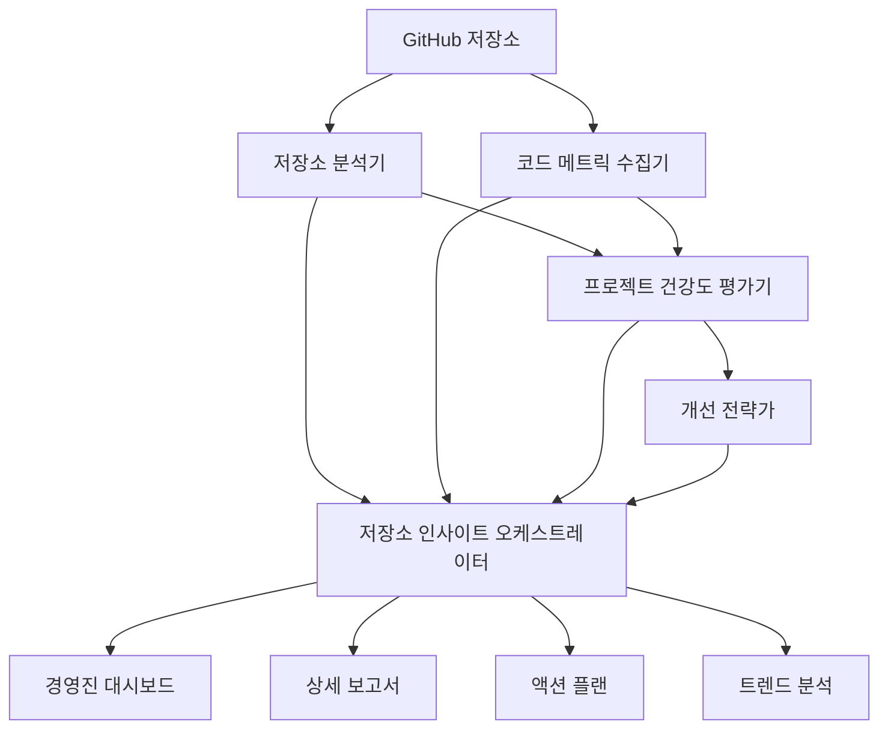

# GitHub 분석 및 저장소 인사이트

> *"측정은 제어로 이어지고, 결국 개선으로 이어지는 첫 번째 단계이다."* - H. James Harrington

## 소개

현대 소프트웨어 개발 환경에서 프로젝트의 건강도를 파악하는 것은 단순히 코드 기능성을 넘어서는 영역입니다. 저장소 분석은 개발 패턴, 팀 협업 효과성, 프로젝트 지속가능성에 대한 중요한 인사이트를 제공합니다. VELOCITY-X의 GitHub 분석 시스템은 5개의 전문화된 에이전트가 협력하여 포괄적인 저장소 인사이트를 제공합니다.

이 장에서는 VELOCITY-X가 원시 GitHub 데이터를 실행 가능한 지능으로 변환하여, 팀이 개발 프로세스, 코드 품질, 전략적 개선에 대해 데이터 기반 의사결정을 내릴 수 있도록 지원하는 방법을 탐구합니다.

## GitHub 분석 생태계

VELOCITY-X의 GitHub 분석 시스템은 포괄적인 분석 파이프라인을 구성하는 5개의 전문화된 에이전트로 구성됩니다:

### 1. 저장소 분석기 (velocity-x-repo-analyzer)
**역할**: GitHub 메타데이터 수집 및 분석 전문가

저장소 분석기는 분석 시스템의 기반 역할을 하며, 다음을 수집하고 분석합니다:

- **커밋 히스토리 패턴**: 빈도, 크기, 시간적 패턴
- **기여자 활동**: 코드 기여도 및 협업 패턴  
- **브랜치 전략 분석**: 브랜치 생명주기 및 병합 패턴
- **이슈 및 PR 분석**: 관리 효율성 및 품질 메트릭
- **워크플로우 성능**: CI/CD 성공률 및 빌드 시간

### 2. 코드 메트릭 수집기 (velocity-x-code-metrics-collector)
**역할**: 코드 정량화 및 품질 분석 전문가

이 에이전트는 다음을 측정하기 위해 심층적인 코드 분석을 수행합니다:

- **복잡도 메트릭**: 순환 및 인지 복잡도
- **품질 지표**: 코드 중복, 기술 부채, 유지보수성
- **테스트 품질**: 커버리지, 테스트 효과성, 유지보수
- **의존성 분석**: 내부 및 외부 의존성 건강도

### 3. 프로젝트 건강도 평가기 (velocity-x-project-health-evaluator)
**역할**: 포괄적인 프로젝트 건강도 평가 전문가

평가기는 여러 소스의 데이터를 종합하여 다음을 제공합니다:

- **전체 건강도 점수**: 여러 차원에 걸친 가중 평가
- **트렌드 분석**: 성능 궤적 및 회귀 탐지
- **리스크 평가**: 기술적, 조직적, 운영적 위험
- **벤치마킹**: 업계 및 동료 비교

### 4. 개선 전략가 (velocity-x-improvement-strategist)
**역할**: 전략적 개선 계획 전문가

건강도 평가를 바탕으로 이 에이전트는 다음을 개발합니다:

- **우선순위 액션 플랜**: 임팩트 vs 노력 분석
- **ROI 계산**: 투자 수익률 예측
- **구현 로드맵**: 단계별 개선 전략
- **리소스 계획**: 현실적인 역량 및 일정 추정

### 5. 저장소 인사이트 오케스트레이터 (velocity-x-repo-insights-orchestrator)
**역할**: 마스터 조정 및 보고 에이전트

오케스트레이터는 전체 워크플로우를 관리합니다:

- **다중 에이전트 조정**: 병렬 및 순차 실행 관리
- **데이터 통합**: 포괄적인 결과 종합
- **보고서 생성**: 경영진 요약 및 상세 분석
- **시각화**: 인터랙티브 대시보드 및 차트

## 핵심 분석 프레임워크

### 건강도 점수 모델

VELOCITY-X는 4개의 핵심 차원을 평가하는 포괄적인 건강도 점수 모델을 사용합니다:

```python
health_dimensions = {
    'development_velocity': {
        'weight': 0.25,
        'metrics': {
            'commit_frequency': '일일 활동 수준',
            'pr_throughput': '리뷰 및 병합 효율성',
            'feature_delivery_time': '개발 사이클 속도',
            'bug_fix_time': '이슈 해결 속도'
        }
    },
    'code_quality': {
        'weight': 0.30,
        'metrics': {
            'test_coverage': '코드 보호 수준',
            'complexity_score': '유지보수성 지수',
            'duplication_ratio': '코드 재사용 효율성',
            'technical_debt': '누적된 유지보수 비용'
        }
    },
    'team_collaboration': {
        'weight': 0.25,
        'metrics': {
            'review_coverage': '동료 리뷰 참여도',
            'knowledge_sharing': '팀 간 협업',
            'communication_quality': '토론 효과성',
            'contributor_diversity': '팀 참여 균형'
        }
    },
    'project_stability': {
        'weight': 0.20,
        'metrics': {
            'build_success_rate': 'CI/CD 신뢰성',
            'deployment_frequency': '릴리즈 주기',
            'rollback_rate': '배포 품질',
            'incident_frequency': '운영 안정성'
        }
    }
}
```

### 분석 워크플로우 아키텍처



## 저장소 분석 심화

### 커밋 패턴 분석

저장소 분석기는 개발 리듬을 이해하기 위해 커밋 패턴을 검사합니다:

```python
class CommitPatternAnalyzer:
    def analyze_commit_patterns(self, commits_data):
        """인사이트를 위한 커밋 패턴 분석"""
        patterns = {
            'temporal_distribution': self._analyze_time_patterns(commits_data),
            'size_distribution': self._analyze_commit_sizes(commits_data),
            'author_contributions': self._analyze_author_patterns(commits_data),
            'message_quality': self._analyze_commit_messages(commits_data)
        }
        
        insights = []
        
        # 작업 패턴 탐지
        if patterns['temporal_distribution']['weekend_ratio'] > 0.3:
            insights.append({
                'type': 'concern',
                'message': '높은 주말 활동 탐지 - 워라밸 이슈 가능성',
                'recommendation': '팀 업무량 및 데드라인 관리 검토'
            })
        
        # 커밋 크기 분석
        if patterns['size_distribution']['large_commits_ratio'] > 0.2:
            insights.append({
                'type': 'improvement',
                'message': '대형 커밋이 많이 탐지됨 - 더 작고 빈번한 커밋 고려',
                'recommendation': '피처 브랜칭 및 더 빈번한 통합 구현'
            })
        
        return {
            'patterns': patterns,
            'insights': insights,
            'health_score': self._calculate_commit_health_score(patterns)
        }
```

### 풀 리퀘스트 품질 평가

PR 분석은 협업 효과성을 보여줍니다:

```python
def analyze_pr_quality(self, pr_data):
    """포괄적인 PR 품질 분석"""
    
    metrics = {
        'review_thoroughness': {
            'avg_reviewers_per_pr': pr_data['avg_reviewers'],
            'avg_comments_per_pr': pr_data['avg_comments'],
            'review_time_distribution': pr_data['review_times']
        },
        'pr_characteristics': {
            'size_distribution': self._categorize_pr_sizes(pr_data),
            'approval_patterns': self._analyze_approval_patterns(pr_data),
            'merge_strategies': self._analyze_merge_patterns(pr_data)
        }
    }
    
    # 품질 점수 계산
    quality_score = self._calculate_pr_quality_score(metrics)
    
    recommendations = []
    if metrics['review_thoroughness']['avg_reviewers_per_pr'] < 2:
        recommendations.append({
            'priority': 'high',
            'suggestion': '리뷰어 참여 증가 필요 - PR당 2명 이상 목표',
            'impact': '코드 품질 향상 및 지식 공유'
        })
    
    return {
        'metrics': metrics,
        'quality_score': quality_score,
        'recommendations': recommendations
    }
```

## 코드 품질 메트릭

### 복잡도 분석

코드 복잡도 메트릭은 객관적인 품질 측정을 제공합니다:

```python
class ComplexityAnalyzer:
    def __init__(self):
        self.thresholds = {
            'cyclomatic_complexity': {
                'low': 5,
                'medium': 10,
                'high': 15,
                'critical': 20
            },
            'cognitive_complexity': {
                'low': 10,
                'medium': 20,
                'high': 30,
                'critical': 40
            }
        }
    
    def analyze_project_complexity(self, codebase_path):
        """포괄적인 복잡도 분석"""
        
        file_complexities = []
        for file_path in self._get_source_files(codebase_path):
            file_complexity = self._analyze_file_complexity(file_path)
            file_complexities.append(file_complexity)
        
        # 집계 통계
        complexity_summary = {
            'total_functions': sum(fc['function_count'] for fc in file_complexities),
            'avg_cyclomatic_complexity': self._calculate_average_cc(file_complexities),
            'complexity_distribution': self._create_complexity_distribution(file_complexities),
            'hotspots': self._identify_complexity_hotspots(file_complexities)
        }
        
        # 건강도 평가
        health_indicators = {
            'maintainability_risk': self._assess_maintainability_risk(complexity_summary),
            'refactoring_candidates': self._identify_refactoring_candidates(file_complexities),
            'complexity_trend': self._analyze_complexity_trend(complexity_summary)
        }
        
        return {
            'summary': complexity_summary,
            'health_indicators': health_indicators,
            'file_details': file_complexities
        }
```

### 기술 부채 정량화

기술 부채 측정은 구체적인 개선 목표를 제공합니다:

```python
def calculate_technical_debt(self, analysis_results):
    """기술 부채를 시간과 비용으로 정량화"""
    
    debt_sources = {
        'code_complexity': self._debt_from_complexity(analysis_results['complexity']),
        'code_duplication': self._debt_from_duplication(analysis_results['duplication']),
        'test_coverage_gaps': self._debt_from_coverage(analysis_results['coverage']),
        'outdated_dependencies': self._debt_from_dependencies(analysis_results['dependencies']),
        'code_smells': self._debt_from_smells(analysis_results['smells'])
    }
    
    total_debt_hours = sum(debt_sources.values())
    
    # 비용 계산 (평균 개발자 시급 사용)
    hourly_rate = 100  # USD
    debt_cost = total_debt_hours * hourly_rate
    
    # 우선순위 매트릭스
    debt_priority = {
        'critical': debt_sources['code_complexity'] + debt_sources['test_coverage_gaps'],
        'high': debt_sources['code_duplication'] + debt_sources['code_smells'],
        'medium': debt_sources['outdated_dependencies']
    }
    
    return {
        'total_hours': total_debt_hours,
        'estimated_cost': debt_cost,
        'by_source': debt_sources,
        'priority_breakdown': debt_priority,
        'payoff_timeline': self._calculate_payoff_timeline(debt_sources)
    }
```

## 프로젝트 건강도 평가

### 다차원 건강도 평가

건강도 평가기는 여러 데이터 소스를 종합합니다:

```python
class ProjectHealthEvaluator:
    def evaluate_comprehensive_health(self, repo_data, code_metrics, historical_data=None):
        """포괄적인 프로젝트 건강도 평가"""
        
        # 카테고리 평가
        health_categories = {
            'development_velocity': self._evaluate_velocity(repo_data, code_metrics),
            'code_quality': self._evaluate_quality(code_metrics),
            'team_collaboration': self._evaluate_collaboration(repo_data),
            'project_stability': self._evaluate_stability(repo_data, code_metrics)
        }
        
        # 전체 건강도 계산
        overall_score = self._calculate_weighted_score(health_categories)
        
        # 리스크 평가
        risk_analysis = self._assess_project_risks(health_categories, historical_data)
        
        # 트렌드 분석 (과거 데이터가 있는 경우)
        trends = {}
        if historical_data:
            trends = self._analyze_health_trends(health_categories, historical_data)
        
        # 벤치마킹
        benchmarks = self._compare_with_benchmarks(health_categories)
        
        return {
            'overall_health': {
                'score': overall_score,
                'grade': self._score_to_grade(overall_score),
                'percentile': benchmarks['overall_percentile']
            },
            'category_health': health_categories,
            'risk_analysis': risk_analysis,
            'trend_analysis': trends,
            'benchmarking': benchmarks,
            'recommendations': self._generate_health_recommendations(health_categories, risk_analysis)
        }
```

### 리스크 평가 프레임워크

리스크 평가는 여러 차원을 다룹니다:

```python
def assess_project_risks(self, project_data):
    """포괄적인 리스크 평가"""
    
    risk_categories = {
        'technical_risks': {
            'high_complexity_code': self._assess_complexity_risk(project_data),
            'low_test_coverage': self._assess_coverage_risk(project_data),
            'outdated_dependencies': self._assess_dependency_risk(project_data),
            'security_vulnerabilities': self._assess_security_risk(project_data)
        },
        'organizational_risks': {
            'key_person_dependency': self._assess_knowledge_concentration(project_data),
            'low_team_engagement': self._assess_collaboration_risk(project_data),
            'skill_gaps': self._assess_competency_risk(project_data)
        },
        'operational_risks': {
            'deployment_issues': self._assess_deployment_risk(project_data),
            'monitoring_gaps': self._assess_observability_risk(project_data),
            'incident_frequency': self._assess_stability_risk(project_data)
        }
    }
    
    # 전체 리스크 점수 계산
    overall_risk = self._calculate_composite_risk(risk_categories)
    
    # 임팩트와 확률로 리스크 우선순위 결정
    prioritized_risks = self._prioritize_risks(risk_categories)
    
    return {
        'overall_risk_level': overall_risk,
        'risk_categories': risk_categories,
        'top_risks': prioritized_risks[:5],
        'mitigation_strategies': self._suggest_risk_mitigations(prioritized_risks)
    }
```

## 전략적 개선 계획

### ROI 기반 우선순위

개선 전략가는 데이터 기반 ROI 분석을 사용합니다:

```python
class ImprovementROICalculator:
    def calculate_improvement_roi(self, improvement_opportunity):
        """개선 이니셔티브의 ROI 계산"""
        
        # 투자 계산
        development_cost = improvement_opportunity['estimated_hours'] * self.hourly_rate
        training_cost = improvement_opportunity.get('training_hours', 0) * self.hourly_rate
        tool_cost = improvement_opportunity.get('tool_costs', 0)
        total_investment = development_cost + training_cost + tool_cost
        
        # 효익 계산
        time_savings_annual = (
            improvement_opportunity.get('time_savings_per_week', 0) * 52 * self.hourly_rate
        )
        
        quality_benefits = self._calculate_quality_benefits(improvement_opportunity)
        risk_reduction_benefits = self._calculate_risk_reduction_benefits(improvement_opportunity)
        
        total_annual_benefits = time_savings_annual + quality_benefits + risk_reduction_benefits
        
        # ROI 메트릭
        roi_percentage = ((total_annual_benefits - total_investment) / total_investment) * 100
        payback_months = total_investment / (total_annual_benefits / 12)
        npv_3_years = self._calculate_npv(total_investment, total_annual_benefits, 3)
        
        return {
            'investment': total_investment,
            'annual_benefits': total_annual_benefits,
            'roi_percentage': round(roi_percentage, 2),
            'payback_period_months': round(payback_months, 1),
            'npv_3_years': round(npv_3_years, 2),
            'confidence_level': improvement_opportunity.get('success_probability', 0.8)
        }
```

### 전략적 로드맵 생성

다단계 개선 계획:

```python
def create_improvement_roadmap(self, opportunities, team_capacity):
    """단계별 개선 로드맵 생성"""
    
    # 임팩트와 노력에 따른 기회 분류
    categorized_opportunities = {
        'quick_wins': [],      # 높은 임팩트, 낮은 노력
        'major_projects': [],  # 높은 임팩트, 높은 노력
        'fill_ins': [],       # 낮은 임팩트, 낮은 노력
        'questionable': []     # 낮은 임팩트, 높은 노력
    }
    
    for opp in opportunities:
        category = self._categorize_opportunity(opp['impact_score'], opp['effort_score'])
        categorized_opportunities[category].append(opp)
    
    # 구현 단계 생성
    roadmap = {
        'phase_1_quick_wins': {
            'duration': '4-6주',
            'initiatives': categorized_opportunities['quick_wins'][:3],
            'focus': '즉각적인 가치 제공 및 추진력 구축'
        },
        'phase_2_foundation': {
            'duration': '8-12주',
            'initiatives': self._select_foundation_initiatives(opportunities),
            'focus': '인프라 및 프로세스 개선'
        },
        'phase_3_transformation': {
            'duration': '3-6개월',
            'initiatives': categorized_opportunities['major_projects'][:2],
            'focus': '전략적 개선 및 주요 리팩토링'
        }
    }
    
    # 리소스 배분 및 의존성 추가
    for phase in roadmap.values():
        phase['resource_requirements'] = self._calculate_phase_resources(phase['initiatives'])
        phase['dependencies'] = self._identify_phase_dependencies(phase['initiatives'])
        phase['success_metrics'] = self._define_phase_metrics(phase['initiatives'])
    
    return roadmap
```

## 포괄적인 대시보드 및 보고

### 경영진 대시보드

오케스트레이터는 경영진 수준의 인사이트를 생성합니다:

```python
def create_executive_dashboard(self, comprehensive_analysis):
    """핵심 인사이트를 포함한 경영진 대시보드 생성"""
    
    dashboard = {
        'health_overview': {
            'overall_score': comprehensive_analysis['health_evaluation']['overall_health']['score'],
            'grade': comprehensive_analysis['health_evaluation']['overall_health']['grade'],
            'trend': self._determine_health_trend(comprehensive_analysis),
            'peer_ranking': comprehensive_analysis['health_evaluation']['benchmarking']['percentile']
        },
        
        'key_metrics': {
            'development_velocity': self._extract_velocity_kpis(comprehensive_analysis),
            'quality_indicators': self._extract_quality_kpis(comprehensive_analysis),
            'team_performance': self._extract_team_kpis(comprehensive_analysis),
            'stability_metrics': self._extract_stability_kpis(comprehensive_analysis)
        },
        
        'top_insights': self._extract_top_insights(comprehensive_analysis),
        
        'improvement_summary': {
            'total_opportunities': len(comprehensive_analysis['improvement_strategy']['opportunities']),
            'quick_wins_available': len([o for o in comprehensive_analysis['improvement_strategy']['opportunities'] 
                                        if o['category'] == 'quick_wins']),
            'expected_roi': comprehensive_analysis['improvement_strategy']['expected_roi'],
            'implementation_timeline': comprehensive_analysis['improvement_strategy']['timeline']
        },
        
        'risk_summary': {
            'overall_risk_level': comprehensive_analysis['health_evaluation']['risk_analysis']['overall_risk_level'],
            'critical_risks': [r for r in comprehensive_analysis['health_evaluation']['risk_analysis']['top_risks'] 
                              if r['severity'] == 'critical'],
            'mitigation_priority': comprehensive_analysis['health_evaluation']['risk_analysis']['mitigation_strategies'][:3]
        }
    }
    
    return dashboard
```

### 인터랙티브 시각화

풍부하고 인터랙티브한 차트가 깊은 인사이트를 제공합니다:

```python
def create_interactive_visualizations(self, analysis_data):
    """인터랙티브 시각화 컴포넌트 생성"""
    
    import plotly.graph_objects as go
    import plotly.express as px
    
    visualizations = {}
    
    # 건강도 점수 레이더 차트
    health_categories = analysis_data['health_evaluation']['category_health']
    visualizations['health_radar'] = self._create_health_radar_chart(health_categories)
    
    # 개발 속도 트렌드
    if 'historical_data' in analysis_data:
        visualizations['velocity_trends'] = self._create_velocity_trend_chart(analysis_data['historical_data'])
    
    # 코드 품질 히트맵
    visualizations['quality_heatmap'] = self._create_quality_heatmap(analysis_data['code_metrics'])
    
    # 리스크 매트릭스
    visualizations['risk_matrix'] = self._create_risk_matrix(analysis_data['health_evaluation']['risk_analysis'])
    
    # ROI vs 노력 산점도
    visualizations['roi_effort_matrix'] = self._create_roi_effort_chart(analysis_data['improvement_strategy'])
    
    # 팀 협업 네트워크
    visualizations['collaboration_network'] = self._create_collaboration_network(analysis_data['repo_analysis'])
    
    return visualizations

def _create_health_radar_chart(self, health_categories):
    """건강도 카테고리를 위한 레이더 차트 생성"""
    
    categories = list(health_categories.keys())
    scores = [health_categories[cat]['score'] for cat in categories]
    
    fig = go.Figure()
    
    fig.add_trace(go.Scatterpolar(
        r=scores,
        theta=categories,
        fill='toself',
        name='현재 건강도',
        line=dict(color='rgb(67, 170, 139)')
    ))
    
    # 업계 벤치마크 추가
    benchmark_scores = [75, 80, 70, 85]  # 예시 벤치마크
    fig.add_trace(go.Scatterpolar(
        r=benchmark_scores,
        theta=categories,
        fill='toself',
        name='업계 평균',
        line=dict(color='rgb(255, 127, 80)', dash='dash'),
        opacity=0.6
    ))
    
    fig.update_layout(
        polar=dict(
            radialaxis=dict(
                visible=True,
                range=[0, 100]
            )),
        showlegend=True,
        title="프로젝트 건강도 평가"
    )
    
    return fig
```

## 실무 구현

### GitHub 분석 설정

```bash
# VELOCITY-X GitHub 분석 시스템 설치
pip install velocity-x-github-analytics

# GitHub 액세스 구성
export GITHUB_TOKEN="your_github_token"
export GITHUB_ENTERPRISE_URL="https://github.your-company.com"  # GitHub Enterprise 사용 시

# 종합 분석 실행
velocity-x-analytics analyze \
  --repo "your-org/your-repo" \
  --analysis-depth comprehensive \
  --output-formats json html pdf \
  --include-historical \
  --benchmark-against industry
```

### 구성 옵션

```yaml
# analytics-config.yaml
analysis_settings:
  depth: comprehensive  # basic, standard, comprehensive
  historical_period_days: 180
  include_dependencies: true
  benchmark_sources:
    - industry_standards
    - organization_peers
    - similar_projects

output_settings:
  formats: [json, html, pdf, excel]
  dashboard:
    enabled: true
    auto_refresh: true
    refresh_interval: "1h"
  
notifications:
  enabled: true
  channels:
    - slack: "#development-metrics"
    - email: "team-leads@company.com"
  
triggers:
  health_score_threshold: 70
  risk_level_threshold: "high"
  trend_degradation_alert: true
```

### 지속적 모니터링 설정

```python
# 자동화된 분석 설정
from jae_analytics import AnalyticsScheduler

scheduler = AnalyticsScheduler()

# 일일 가벼운 분석
scheduler.add_job(
    func=run_daily_analysis,
    trigger="cron",
    hour=6,
    minute=0,
    args=["--analysis-depth", "basic"]
)

# 주간 종합 분석
scheduler.add_job(
    func=run_weekly_analysis,
    trigger="cron",
    day_of_week="sun",
    hour=2,
    minute=0,
    args=["--analysis-depth", "comprehensive"]
)

scheduler.start()
```

## 모범 사례 및 가이드라인

### 1. 기준선 설정

개선을 구현하기 전에 명확한 기준선을 설정하세요:

```python
def establish_project_baseline(repo_url):
    """개선 추적을 위한 프로젝트 기준선 메트릭 설정"""
    
    baseline_analysis = run_comprehensive_analysis(repo_url)
    
    baseline_metrics = {
        'measurement_date': datetime.now().isoformat(),
        'health_score': baseline_analysis['health_score'],
        'key_metrics': {
            'test_coverage': baseline_analysis['code_metrics']['test_coverage'],
            'technical_debt_hours': baseline_analysis['code_metrics']['technical_debt'],
            'avg_pr_review_time': baseline_analysis['repo_analysis']['avg_pr_review_time'],
            'deployment_frequency': baseline_analysis['repo_analysis']['deployment_frequency']
        },
        'team_metrics': {
            'active_contributors': baseline_analysis['repo_analysis']['active_contributors'],
            'knowledge_distribution': baseline_analysis['collaboration']['knowledge_distribution']
        }
    }
    
    # 향후 비교를 위한 기준선 저장
    save_baseline(repo_url, baseline_metrics)
    
    return baseline_metrics
```

### 2. 메트릭 해석 가이드라인

메트릭의 진정한 의미 이해:

```python
def interpret_metrics(analysis_results):
    """메트릭에 대한 맥락과 해석 제공"""
    
    interpretations = {
        'test_coverage': {
            'value': analysis_results['test_coverage'],
            'interpretation': get_coverage_interpretation(analysis_results['test_coverage']),
            'industry_context': get_industry_coverage_context(analysis_results['project_type']),
            'actionability': get_coverage_actions(analysis_results['test_coverage'])
        },
        'technical_debt': {
            'value': analysis_results['technical_debt_hours'],
            'interpretation': get_debt_interpretation(analysis_results['technical_debt_hours'], 
                                                    analysis_results['team_size']),
            'urgency': get_debt_urgency(analysis_results['technical_debt_ratio']),
            'payoff_timeline': estimate_debt_payoff(analysis_results['technical_debt_hours'])
        }
    }
    
    return interpretations

def get_coverage_interpretation(coverage_percentage):
    """테스트 커버리지를 맥락에서 해석"""
    
    if coverage_percentage >= 90:
        return {
            'level': 'excellent',
            'description': '강력한 안전망을 제공하는 우수한 커버리지',
            'focus': '품질 유지 및 에지 케이스 집중'
        }
    elif coverage_percentage >= 80:
        return {
            'level': 'good',
            'description': '개선 여지가 있는 양호한 커버리지',
            'focus': '중요한 미커버 경로 식별 및 커버'
        }
    elif coverage_percentage >= 60:
        return {
            'level': 'moderate',
            'description': '보통 커버리지 - 상당한 개선 필요',
            'focus': '핵심 비즈니스 로직 테스트 우선순위'
        }
    else:
        return {
            'level': 'poor',
            'description': '낮은 커버리지는 상당한 위험을 제시',
            'focus': '긴급: 포괄적인 테스트 전략 구현'
        }
```

### 3. 지속적 개선 사이클

체계적인 개선 구현:

```python
class ContinuousImprovementManager:
    def __init__(self, repo_url):
        self.repo_url = repo_url
        self.improvement_cycles = []
    
    def start_improvement_cycle(self, duration_weeks=8):
        """새로운 개선 사이클 시작"""
        
        # 현재 상태 분석
        current_analysis = run_comprehensive_analysis(self.repo_url)
        
        # 개선 기회 식별
        opportunities = identify_improvement_opportunities(current_analysis)
        
        # 사이클 초점 선택
        cycle_focus = self.select_cycle_focus(opportunities, duration_weeks)
        
        # 구현 계획 생성
        implementation_plan = create_implementation_plan(cycle_focus, duration_weeks)
        
        cycle = {
            'cycle_id': f"cycle_{len(self.improvement_cycles) + 1}",
            'start_date': datetime.now(),
            'duration_weeks': duration_weeks,
            'focus_areas': cycle_focus,
            'baseline_metrics': current_analysis['key_metrics'],
            'implementation_plan': implementation_plan,
            'success_criteria': define_success_criteria(cycle_focus)
        }
        
        self.improvement_cycles.append(cycle)
        return cycle
    
    def track_cycle_progress(self, cycle_id):
        """현재 개선 사이클의 진행 상황 추적"""
        
        cycle = self.get_cycle(cycle_id)
        current_analysis = run_comprehensive_analysis(self.repo_url)
        
        progress = {
            'weeks_elapsed': (datetime.now() - cycle['start_date']).days // 7,
            'completion_percentage': calculate_completion_percentage(cycle, current_analysis),
            'metric_improvements': compare_metrics(cycle['baseline_metrics'], 
                                                 current_analysis['key_metrics']),
            'on_track': assess_if_on_track(cycle, current_analysis)
        }
        
        return progress
```

## 결론

VELOCITY-X의 GitHub 분석 시스템은 반응적에서 능동적 프로젝트 관리로의 패러다임 전환을 나타냅니다. 저장소 건강도, 코드 품질, 팀 성과에 대한 포괄적이고 데이터 기반의 인사이트를 제공함으로써, 팀은 개발 프로세스에 대해 정보에 기반한 의사결정을 내릴 수 있습니다.

5개 에이전트 시스템은 조화롭게 작동하여 다음을 제공합니다:

1. **포괄적인 분석**: 저장소 건강도의 모든 측면에 대한 깊은 인사이트
2. **실행 가능한 지능**: 우선순위가 정해진 ROI 기반 개선 권장사항
3. **지속적 모니터링**: 지속적인 건강도 추적 및 트렌드 분석
4. **전략적 계획**: 체계적인 개선을 위한 데이터 기반 로드맵

### 핵심 교훈

- **측정이 개선을 이끈다**: 측정되는 것이 관리된다
- **맥락이 중요하다**: 메트릭은 프로젝트 및 업계 맥락에서 해석이 필요하다
- **균형이 중요하다**: 개별 메트릭이 아닌 포괄적인 건강도에 초점을 맞춘다
- **지속적 진화**: 정기적인 분석과 반복적인 개선 사이클
- **팀 참여**: 분석은 판단을 대체하는 것이 아니라 팀을 강화해야 한다

### 다음 단계

1. **기본 분석 구현**: 기본적인 저장소 분석부터 시작
2. **기준선 설정**: 변경하기 전에 현재 상태를 문서화
3. **빠른 성과에 집중**: 높은 임팩트, 낮은 노력의 개선으로 추진력 구축
4. **반복 및 개선**: 데이터를 사용하여 지속적인 개선 사이클 가이드
5. **조직 전체로 확장**: 여러 저장소와 팀으로 분석 확장

데이터 기반 개발 우수성을 향한 여정은 현재 위치를 이해하는 것부터 시작됩니다. VELOCITY-X의 GitHub 분석 시스템은 그 여정을 위한 나침반을 제공하여, 팀을 더 높은 생산성, 더 나은 품질, 더 지속가능한 개발 관행으로 안내합니다.