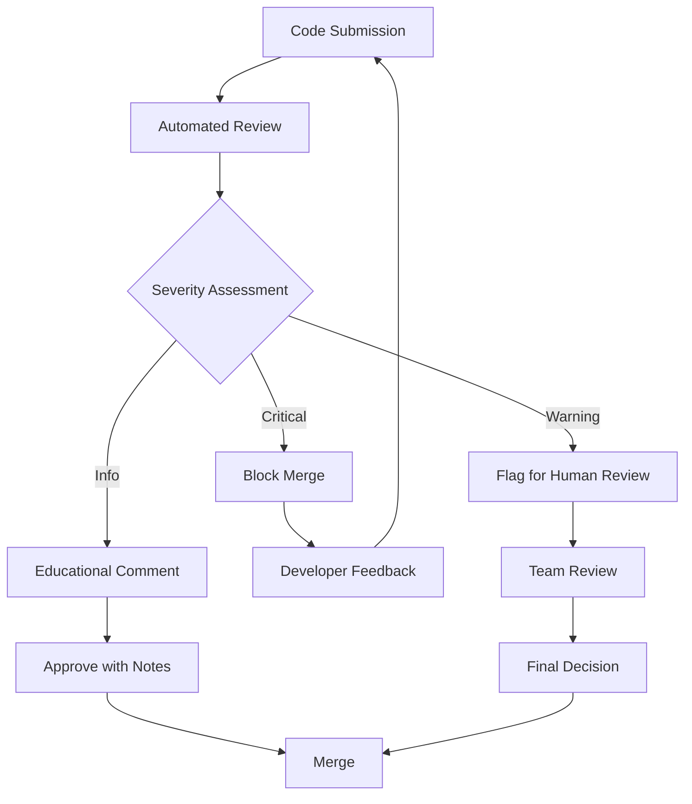

# Code Reviewer Utilization

> *"Code reviews are not about finding bugs, they're about sharing knowledge, ensuring consistency, and building better software together."* - Jeff Atwood

## Overview

The Code Reviewer agent represents VELOCITY-X's commitment to maintaining high code quality through automated, intelligent reviews. This chapter explores how to effectively utilize this agent to create a robust, consistent, and educational review process that scales with your team.

By the end of this chapter, you'll understand:
- The Code Reviewer's analysis methodology and capabilities
- Advanced configuration for different review scenarios
- Integration with existing review workflows and tools
- Customization for team-specific standards and practices
- Measuring and improving review effectiveness

## 1. Introduction to Code Reviewer

### Mission and Scope

The Code Reviewer agent serves as an intelligent, tireless reviewer that:

- **Ensures Consistency**: Applies uniform standards across all code changes
- **Catches Issues Early**: Identifies problems before they reach production
- **Educates Developers**: Provides explanatory feedback for learning
- **Scales Review Capacity**: Handles initial review load, freeing humans for complex decisions
- **Maintains Standards**: Enforces coding guidelines and best practices

### Review Philosophy



The Code Reviewer follows a severity-based approach, escalating only issues that require human judgment while providing immediate feedback for clear-cut problems.

## 2. Core Review Capabilities

### Multi-Dimensional Analysis

The Code Reviewer evaluates code across multiple dimensions:

```python
class ReviewDimensions:
    """Core dimensions of code review analysis"""
    
    FUNCTIONALITY = "functionality"
    READABILITY = "readability"
    MAINTAINABILITY = "maintainability"
    PERFORMANCE = "performance"
    SECURITY = "security"
    TESTING = "testing"
    DOCUMENTATION = "documentation"
    ARCHITECTURE = "architecture"

class CodeReviewEngine:
    def __init__(self, config: ReviewConfig):
        self.config = config
        self.analyzers = self._initialize_analyzers()
        self.knowledge_base = ReviewKnowledgeBase()
    
    def review_changeset(self, changeset: Changeset) -> ReviewResult:
        """Comprehensive review of code changes"""
        result = ReviewResult(changeset.id)
        
        for file_change in changeset.files:
            file_review = self._review_file_change(file_change)
            result.add_file_review(file_review)
        
        # Cross-file analysis
        architectural_issues = self._analyze_architecture(changeset)
        result.add_architectural_feedback(architectural_issues)
        
        # Generate summary and recommendations
        result.summary = self._generate_review_summary(result)
        
        return result
    
    def _review_file_change(self, file_change: FileChange) -> FileReview:
        """Detailed review of individual file changes"""
        review = FileReview(file_change.path)
        
        # Analyze each changed line
        for line_change in file_change.line_changes:
            if line_change.type == ChangeType.ADDITION:
                issues = self._analyze_new_code(line_change)
                review.add_line_issues(line_change.line_number, issues)
            elif line_change.type == ChangeType.MODIFICATION:
                issues = self._analyze_code_modification(line_change)
                review.add_line_issues(line_change.line_number, issues)
        
        # File-level analysis
        file_issues = self._analyze_file_structure(file_change)
        review.add_file_issues(file_issues)
        
        return review
```

### Intelligent Pattern Recognition

The agent uses sophisticated pattern recognition for common code issues:

```python
class ReviewPatternMatcher:
    def __init__(self):
        self.patterns = self._load_review_patterns()
        self.ml_classifier = self._load_ml_model()
    
    def match_patterns(self, code_block: CodeBlock) -> List[ReviewIssue]:
        """Match code against known problematic patterns"""
        issues = []
        
        # Static pattern matching
        for pattern in self.patterns:
            if pattern.matches(code_block):
                issues.append(ReviewIssue(
                    type=pattern.issue_type,
                    severity=pattern.severity,
                    message=pattern.message,
                    suggestion=pattern.suggestion,
                    confidence=pattern.confidence
                ))
        
        # ML-based pattern detection
        ml_issues = self.ml_classifier.predict_issues(code_block)
        issues.extend(ml_issues)
        
        return issues
    
    def _load_review_patterns(self) -> List[ReviewPattern]:
        """Load predefined review patterns"""
        return [
            # Security patterns
            ReviewPattern(
                name="sql_injection_risk",
                pattern=r"execute\s*\(\s*[\"'].*\%.*[\"']\s*\)",
                issue_type="security",
                severity="high",
                message="Potential SQL injection vulnerability",
                suggestion="Use parameterized queries instead"
            ),
            
            # Performance patterns
            ReviewPattern(
                name="inefficient_loop",
                pattern=r"for.*in.*:\s*if.*in.*:",
                issue_type="performance",
                severity="medium",
                message="Nested loop with membership test",
                suggestion="Consider using set for faster lookups"
            ),
            
            # Maintainability patterns
            ReviewPattern(
                name="magic_numbers",
                pattern=r"(?<![\w.])[0-9]{2,}(?![\w.])",
                issue_type="maintainability",
                severity="low",
                message="Magic number detected",
                suggestion="Consider using named constants"
            )
        ]
```

### Context-Aware Analysis

The Code Reviewer considers contextual information for more accurate reviews:

```python
class ContextualAnalyzer:
    def __init__(self, repository: Repository):
        self.repository = repository
        self.history_analyzer = HistoryAnalyzer()
        self.dependency_graph = DependencyGraph()
    
    def analyze_with_context(self, change: FileChange) -> ContextualReview:
        """Analyze code change with full context"""
        context = self._build_context(change)
        
        review = ContextualReview()
        
        # Historical context
        historical_issues = self._analyze_historical_patterns(change, context)
        review.add_historical_insights(historical_issues)
        
        # Dependency context
        dependency_impacts = self._analyze_dependency_impact(change, context)
        review.add_dependency_analysis(dependency_impacts)
        
        # Team context
        team_patterns = self._analyze_team_patterns(change, context)
        review.add_team_insights(team_patterns)
        
        return review
    
    def _build_context(self, change: FileChange) -> ReviewContext:
        """Build comprehensive context for review"""
        return ReviewContext(
            file_history=self.repository.get_file_history(change.path),
            recent_changes=self.repository.get_recent_changes(change.path),
            related_files=self.dependency_graph.get_dependencies(change.path),
            team_members=self.repository.get_contributors(change.path),
            project_conventions=self._extract_conventions(change.path)
        )
```

## 3. Advanced Configuration

### Review Profiles

Configure different review intensities for different scenarios:

```yaml
# review-profiles.yaml
profiles:
  strict:
    description: "Maximum scrutiny for critical code"
    enabled_analyzers:
      - security_analyzer
      - performance_analyzer
      - maintainability_analyzer
      - architecture_analyzer
      - documentation_analyzer
    thresholds:
      block_merge_on: ["high", "critical"]
      require_human_review: ["medium", "high", "critical"]
      auto_approve: []
    
  standard:
    description: "Balanced review for regular development"
    enabled_analyzers:
      - security_analyzer
      - maintainability_analyzer
      - documentation_analyzer
    thresholds:
      block_merge_on: ["critical"]
      require_human_review: ["high", "critical"]
      auto_approve: ["info", "low"]
    
  rapid:
    description: "Quick feedback for feature branches"
    enabled_analyzers:
      - security_analyzer
      - basic_quality_analyzer
    thresholds:
      block_merge_on: ["critical"]
      require_human_review: ["critical"]
      auto_approve: ["info", "low", "medium"]

# Profile assignment
file_patterns:
  "src/core/**": "strict"
  "src/api/**": "strict"
  "tests/**": "standard"
  "examples/**": "rapid"
  "docs/**": "rapid"
```

### Custom Review Rules

Create organization-specific review rules:

```python
# custom_review_rules.py
class CustomReviewRules:
    def __init__(self, rules_config: dict):
        self.rules = self._parse_rules(rules_config)
    
    def apply_custom_rules(self, code_change: CodeChange) -> List[ReviewIssue]:
        """Apply organization-specific review rules"""
        issues = []
        
        for rule in self.rules:
            if rule.applies_to(code_change):
                violations = rule.check(code_change)
                issues.extend(violations)
        
        return issues

class APICompatibilityRule(ReviewRule):
    """Ensure API backward compatibility"""
    
    def applies_to(self, code_change: CodeChange) -> bool:
        return code_change.affects_public_api()
    
    def check(self, code_change: CodeChange) -> List[ReviewIssue]:
        issues = []
        
        # Check for breaking changes
        if code_change.removes_public_method():
            issues.append(ReviewIssue(
                type="api_compatibility",
                severity="critical",
                message="Public method removal detected",
                suggestion="Deprecate method instead of removing"
            ))
        
        if code_change.changes_method_signature():
            issues.append(ReviewIssue(
                type="api_compatibility",
                severity="high",
                message="Public method signature changed",
                suggestion="Add new method and deprecate old one"
            ))
        
        return issues

class DatabaseSchemaRule(ReviewRule):
    """Validate database schema changes"""
    
    def applies_to(self, code_change: CodeChange) -> bool:
        return any("migration" in file.path for file in code_change.files)
    
    def check(self, code_change: CodeChange) -> List[ReviewIssue]:
        issues = []
        
        for migration_file in code_change.get_migration_files():
            # Check for destructive operations
            if migration_file.contains_drop_table():
                issues.append(ReviewIssue(
                    type="data_safety",
                    severity="critical",
                    message="DROP TABLE detected in migration",
                    suggestion="Use IF EXISTS and backup data first"
                ))
            
            # Check for missing rollback
            if not migration_file.has_rollback():
                issues.append(ReviewIssue(
                    type="migration_safety",
                    severity="medium",
                    message="Migration missing rollback procedure",
                    suggestion="Add DOWN migration for rollback"
                ))
        
        return issues
```

### Team-Specific Customization

Tailor reviews to team expertise and preferences:

```python
class TeamCustomization:
    def __init__(self, team_config: TeamConfig):
        self.team_config = team_config
        self.skill_matrix = SkillMatrix()
    
    def customize_review_for_author(self, author: Developer, 
                                  change: CodeChange) -> ReviewCustomization:
        """Customize review based on author's profile"""
        author_profile = self.skill_matrix.get_profile(author)
        
        customization = ReviewCustomization()
        
        # Adjust scrutiny based on experience
        if author_profile.experience_level == "junior":
            customization.increase_scrutiny = True
            customization.provide_educational_comments = True
        elif author_profile.experience_level == "senior":
            customization.focus_on_architecture = True
            customization.reduce_basic_checks = True
        
        # Focus on areas of development
        if author_profile.is_developing_skill("security"):
            customization.emphasize_security_feedback = True
        
        # Consider expertise areas
        if change.affects_area(author_profile.expertise_areas):
            customization.trust_level = "high"
        else:
            customization.request_domain_expert_review = True
        
        return customization
```

## 4. Integration Patterns

### Git Workflow Integration

Seamlessly integrate with various Git workflows:

```python
# git_integration.py
class GitWorkflowIntegration:
    def __init__(self, workflow_type: str):
        self.workflow_type = workflow_type
        self.hooks = self._setup_hooks()
    
    def setup_pull_request_review(self):
        """Setup automated review for pull requests"""
        if self.workflow_type == "github":
            return GitHubPRIntegration()
        elif self.workflow_type == "gitlab":
            return GitLabMRIntegration()
        elif self.workflow_type == "bitbucket":
            return BitbucketPRIntegration()

class GitHubPRIntegration:
    def __init__(self):
        self.github_client = GitHubClient()
    
    def handle_pull_request(self, pr_event: PullRequestEvent):
        """Handle GitHub pull request events"""
        if pr_event.action == "opened" or pr_event.action == "synchronize":
            self._trigger_review(pr_event.pull_request)
    
    def _trigger_review(self, pull_request: PullRequest):
        """Trigger code review for pull request"""
        changeset = self._extract_changeset(pull_request)
        review_result = self.code_reviewer.review_changeset(changeset)
        
        # Post review comments
        self._post_review_comments(pull_request, review_result)
        
        # Set review status
        status = self._determine_status(review_result)
        self.github_client.set_status(pull_request, status)
    
    def _post_review_comments(self, pr: PullRequest, review: ReviewResult):
        """Post line-by-line review comments"""
        for file_review in review.file_reviews:
            for line_issue in file_review.line_issues:
                self.github_client.create_review_comment(
                    pr.number,
                    file_review.path,
                    line_issue.line_number,
                    line_issue.message
                )
```

### IDE Integration

Provide real-time review feedback in development environments:

```python
# ide_integration.py
class IDEReviewIntegration:
    def __init__(self, ide_type: str):
        self.ide_type = ide_type
        self.review_engine = CodeReviewEngine()
        self.background_processor = BackgroundProcessor()
    
    def enable_real_time_review(self):
        """Enable real-time review as developers type"""
        self.background_processor.start()
        self._register_event_handlers()
    
    def on_file_save(self, file_path: str):
        """Trigger review when file is saved"""
        # Quick review for immediate feedback
        quick_review = self.review_engine.quick_review(file_path)
        self._update_ide_annotations(file_path, quick_review)
    
    def on_commit_prepare(self, staged_files: List[str]):
        """Comprehensive review before commit"""
        changeset = self._create_changeset(staged_files)
        full_review = self.review_engine.review_changeset(changeset)
        
        if full_review.has_blocking_issues():
            self._show_commit_warning(full_review)
        else:
            self._show_commit_summary(full_review)
    
    def _update_ide_annotations(self, file_path: str, review: QuickReview):
        """Update IDE with review annotations"""
        annotations = []
        
        for issue in review.issues:
            annotation = IDEAnnotation(
                line=issue.line_number,
                message=issue.message,
                severity=self._map_severity(issue.severity),
                quick_fix=issue.suggested_fix if issue.has_fix else None
            )
            annotations.append(annotation)
        
        self.ide_client.update_annotations(file_path, annotations)
```

### CI/CD Pipeline Integration

Embed reviews into continuous integration pipelines:

```yaml
# .github/workflows/code-review.yml
name: Automated Code Review
on:
  pull_request:
    types: [opened, synchronize]

jobs:
  code-review:
    runs-on: ubuntu-latest
    steps:
      - name: Checkout code
        uses: actions/checkout@v3
        with:
          fetch-depth: 0  # Full history for better context
      
      - name: Setup VELOCITY-X environment
        uses: ./.github/actions/setup-jae
      
      - name: Run Code Reviewer
        id: review
        run: |
          ./temp_hooks/commands/agents/velocity-x-code-reviewer/command.sh \
            --base-ref ${{ github.event.pull_request.base.sha }} \
            --head-ref ${{ github.event.pull_request.head.sha }} \
            --output-format github-actions \
            --profile standard
      
      - name: Post Review Comments
        uses: ./.github/actions/post-review-comments
        with:
          review-file: ${{ steps.review.outputs.review-file }}
          github-token: ${{ secrets.GITHUB_TOKEN }}
      
      - name: Update Check Status
        run: |
          if [ "${{ steps.review.outputs.blocking-issues }}" == "true" ]; then
            echo "Blocking issues found"
            exit 1
          fi
```

## 5. Review Quality Metrics

### Measuring Review Effectiveness

Track the impact and accuracy of automated reviews:

```python
class ReviewMetrics:
    def __init__(self, metrics_store: MetricsStore):
        self.metrics_store = metrics_store
    
    def calculate_review_effectiveness(self, time_period: str) -> EffectivenessReport:
        """Calculate how effective reviews are at catching issues"""
        data = self.metrics_store.get_review_data(time_period)
        
        # Calculate key metrics
        precision = self._calculate_precision(data)
        recall = self._calculate_recall(data)
        false_positive_rate = self._calculate_false_positive_rate(data)
        developer_satisfaction = self._calculate_satisfaction(data)
        
        return EffectivenessReport(
            precision=precision,
            recall=recall,
            false_positive_rate=false_positive_rate,
            developer_satisfaction=developer_satisfaction,
            issues_caught=data.automated_issues_count,
            issues_missed=data.missed_issues_count,
            time_saved=data.estimated_time_saved
        )
    
    def _calculate_precision(self, data: ReviewData) -> float:
        """Calculate precision: true positives / (true positives + false positives)"""
        true_positives = data.valid_issues_found
        false_positives = data.invalid_issues_flagged
        
        if true_positives + false_positives == 0:
            return 0.0
        
        return true_positives / (true_positives + false_positives)
    
    def generate_improvement_recommendations(self, 
                                           metrics: EffectivenessReport) -> List[Recommendation]:
        """Generate recommendations for improving review quality"""
        recommendations = []
        
        if metrics.false_positive_rate > 0.2:
            recommendations.append(Recommendation(
                type="threshold_adjustment",
                priority="high",
                description="High false positive rate detected",
                action="Review and adjust detection thresholds"
            ))
        
        if metrics.recall < 0.8:
            recommendations.append(Recommendation(
                type="coverage_expansion",
                priority="medium",
                description="Some issues are being missed",
                action="Expand review patterns and rules"
            ))
        
        return recommendations
```

### Developer Feedback Integration

Collect and act on developer feedback:

```python
class FeedbackSystem:
    def __init__(self):
        self.feedback_store = FeedbackStore()
        self.pattern_updater = PatternUpdater()
    
    def collect_feedback(self, review_id: str, feedback: ReviewFeedback):
        """Collect developer feedback on review quality"""
        self.feedback_store.store(review_id, feedback)
        
        # Immediate adjustments for clear feedback
        if feedback.is_false_positive():
            self._adjust_pattern_sensitivity(feedback.issue_type, decrease=True)
        elif feedback.is_missed_issue():
            self._enhance_pattern_detection(feedback.issue_type)
    
    def analyze_feedback_trends(self) -> FeedbackAnalysis:
        """Analyze feedback patterns to improve reviews"""
        recent_feedback = self.feedback_store.get_recent_feedback()
        
        analysis = FeedbackAnalysis()
        
        # Identify problematic patterns
        problem_patterns = self._identify_problem_patterns(recent_feedback)
        analysis.add_problem_patterns(problem_patterns)
        
        # Identify successful patterns
        successful_patterns = self._identify_successful_patterns(recent_feedback)
        analysis.add_successful_patterns(successful_patterns)
        
        # Generate improvement actions
        actions = self._generate_improvement_actions(analysis)
        analysis.add_recommended_actions(actions)
        
        return analysis
```

## 6. Advanced Features

### Machine Learning Enhancement

Continuously improve review accuracy through machine learning:

```python
class MLEnhancedReviewer:
    def __init__(self):
        self.model = self._load_review_model()
        self.training_pipeline = TrainingPipeline()
    
    def predict_issue_severity(self, code_change: CodeChange) -> IssueSeverity:
        """Use ML to predict issue severity more accurately"""
        features = self._extract_features(code_change)
        prediction = self.model.predict(features)
        
        return IssueSeverity(
            level=prediction.severity_level,
            confidence=prediction.confidence,
            reasoning=prediction.explanation
        )
    
    def continuous_learning(self):
        """Continuously improve model based on feedback"""
        # Collect training data from recent reviews and feedback
        training_data = self._collect_training_data()
        
        # Retrain model periodically
        if self._should_retrain(training_data):
            self.training_pipeline.retrain_model(training_data)
            self.model = self.training_pipeline.get_updated_model()
    
    def _extract_features(self, code_change: CodeChange) -> FeatureVector:
        """Extract features for ML prediction"""
        return FeatureVector([
            code_change.complexity_delta,
            code_change.lines_added,
            code_change.lines_removed,
            code_change.file_count,
            code_change.test_coverage_change,
            code_change.author_experience_level,
            code_change.affects_critical_path,
            code_change.time_since_last_change
        ])
```

### Smart Review Routing

Intelligently route reviews to appropriate human reviewers:

```python
class SmartReviewRouter:
    def __init__(self, team_structure: TeamStructure):
        self.team_structure = team_structure
        self.expertise_matcher = ExpertiseMatcher()
        self.workload_balancer = WorkloadBalancer()
    
    def route_for_human_review(self, review_result: ReviewResult) -> ReviewAssignment:
        """Intelligently assign human reviewers"""
        assignment = ReviewAssignment()
        
        # Determine required expertise
        required_expertise = self._analyze_required_expertise(review_result)
        
        # Find suitable reviewers
        candidate_reviewers = self.expertise_matcher.find_experts(required_expertise)
        
        # Consider workload and availability
        available_reviewers = self.workload_balancer.filter_available(candidate_reviewers)
        
        # Assign primary and secondary reviewers
        assignment.primary_reviewer = self._select_primary_reviewer(available_reviewers)
        assignment.secondary_reviewer = self._select_secondary_reviewer(
            available_reviewers, assignment.primary_reviewer)
        
        # Set urgency and context
        assignment.urgency = self._determine_urgency(review_result)
        assignment.context = self._prepare_context(review_result)
        
        return assignment
    
    def _analyze_required_expertise(self, review_result: ReviewResult) -> List[Expertise]:
        """Determine what expertise is needed for human review"""
        expertise_needed = []
        
        if review_result.has_security_issues():
            expertise_needed.append(Expertise.SECURITY)
        
        if review_result.has_performance_issues():
            expertise_needed.append(Expertise.PERFORMANCE)
        
        if review_result.has_architectural_concerns():
            expertise_needed.append(Expertise.ARCHITECTURE)
        
        # Add domain-specific expertise based on affected components
        domain_expertise = self._determine_domain_expertise(review_result)
        expertise_needed.extend(domain_expertise)
        
        return expertise_needed
```

## 7. Best Practices

### Review Configuration Strategy

```yaml
# Recommended configuration progression
stages:
  initial_deployment:
    profile: "permissive"
    block_merge: false
    focus: "education"
    feedback_collection: "aggressive"
  
  stabilization:
    profile: "standard"
    block_merge: true
    severity_threshold: "high"
    focus: "quality_improvement"
  
  mature_adoption:
    profile: "strict"
    custom_rules: "enabled"
    ml_enhancement: "enabled"
    focus: "continuous_optimization"

# Team-specific adjustments
team_profiles:
  frontend:
    emphasized_areas: ["accessibility", "performance", "user_experience"]
    tools: ["eslint", "lighthouse", "axe"]
  
  backend:
    emphasized_areas: ["security", "performance", "scalability"]
    tools: ["sonarqube", "snyk", "performance_profiler"]
  
  devops:
    emphasized_areas: ["security", "reliability", "maintainability"]
    tools: ["checkov", "hadolint", "yamllint"]
```

### Gradual Adoption Strategy

```python
class GradualAdoptionStrategy:
    def __init__(self, team_size: int, current_practices: dict):
        self.team_size = team_size
        self.current_practices = current_practices
        self.adoption_phases = self._plan_adoption_phases()
    
    def _plan_adoption_phases(self) -> List[AdoptionPhase]:
        """Plan gradual adoption phases"""
        return [
            AdoptionPhase(
                name="observation",
                duration_weeks=2,
                configuration="non_blocking",
                goals=["collect_baseline_metrics", "familiarize_team"]
            ),
            AdoptionPhase(
                name="education",
                duration_weeks=4,
                configuration="educational",
                goals=["provide_learning_feedback", "adjust_thresholds"]
            ),
            AdoptionPhase(
                name="enforcement",
                duration_weeks=8,
                configuration="standard",
                goals=["enforce_quality_gates", "optimize_workflow"]
            ),
            AdoptionPhase(
                name="optimization",
                duration_weeks=float('inf'),
                configuration="custom",
                goals=["continuous_improvement", "advanced_features"]
            )
        ]
```

## 8. Troubleshooting Common Issues

### High False Positive Rate

```python
def diagnose_false_positives(review_history: List[ReviewResult]) -> Diagnosis:
    """Diagnose causes of false positives"""
    false_positives = [r for r in review_history if r.marked_as_false_positive]
    
    # Analyze patterns in false positives
    common_patterns = analyze_common_patterns(false_positives)
    problematic_rules = identify_problematic_rules(false_positives)
    
    recommendations = []
    
    for pattern in common_patterns:
        if pattern.frequency > 0.15:  # More than 15% of false positives
            recommendations.append(
                f"Adjust threshold for {pattern.rule_type} - "
                f"currently causing {pattern.frequency:.1%} of false positives"
            )
    
    return Diagnosis(
        issue="high_false_positive_rate",
        causes=common_patterns,
        recommendations=recommendations
    )
```

### Performance Issues

```python
def optimize_review_performance(performance_data: PerformanceData) -> OptimizationPlan:
    """Create plan to optimize review performance"""
    bottlenecks = identify_bottlenecks(performance_data)
    
    optimizations = []
    
    if bottlenecks.includes("file_analysis"):
        optimizations.append(Optimization(
            type="caching",
            description="Implement file-level result caching",
            expected_improvement="40-60% speed increase"
        ))
    
    if bottlenecks.includes("pattern_matching"):
        optimizations.append(Optimization(
            type="parallel_processing",
            description="Parallelize pattern matching",
            expected_improvement="25-40% speed increase"
        ))
    
    return OptimizationPlan(optimizations)
```

## 9. Summary

The Code Reviewer agent represents a sophisticated approach to maintaining code quality at scale. Through intelligent analysis, contextual awareness, and continuous learning, it provides valuable feedback while scaling review capacity.

### Key Takeaways

✅ **Multi-dimensional Analysis**: Reviews code across functionality, security, performance, and maintainability

✅ **Contextual Intelligence**: Considers historical patterns, dependencies, and team dynamics

✅ **Flexible Configuration**: Adapts to different teams, projects, and development stages

✅ **Seamless Integration**: Works with existing Git workflows, IDEs, and CI/CD pipelines

✅ **Continuous Improvement**: Learns from feedback and optimizes over time

### Implementation Checklist

- [ ] Configure review profiles for different code areas
- [ ] Set up Git workflow integration
- [ ] Define custom rules for organization standards
- [ ] Establish feedback collection mechanisms
- [ ] Configure team-specific customizations
- [ ] Set up metrics and monitoring
- [ ] Plan gradual adoption strategy

## Exercises

1. **Profile Configuration**: Create review profiles for your team's different code areas (frontend, backend, tests)

2. **Custom Rule Development**: Implement a custom review rule for your organization's specific requirements

3. **Integration Setup**: Configure the Code Reviewer with your existing Git workflow

4. **Metrics Analysis**: Set up review effectiveness tracking and analyze initial results

5. **Feedback Loop**: Implement a system for collecting and acting on developer feedback

## Further Reading

- [Quality Trio Workflow](06-quality-trio.md)
- [Custom Agent Development](07-agent-development.md)
- [Team Collaboration Strategies](11-team-collaboration.md)
- [Review Metrics Dashboard](appendix-metrics.md)

---

*Next Chapter: [Quality Trio Workflow](06-quality-trio.md) - Orchestrate Polish Specialist, Code Reviewer, and Test Engineer for maximum impact*