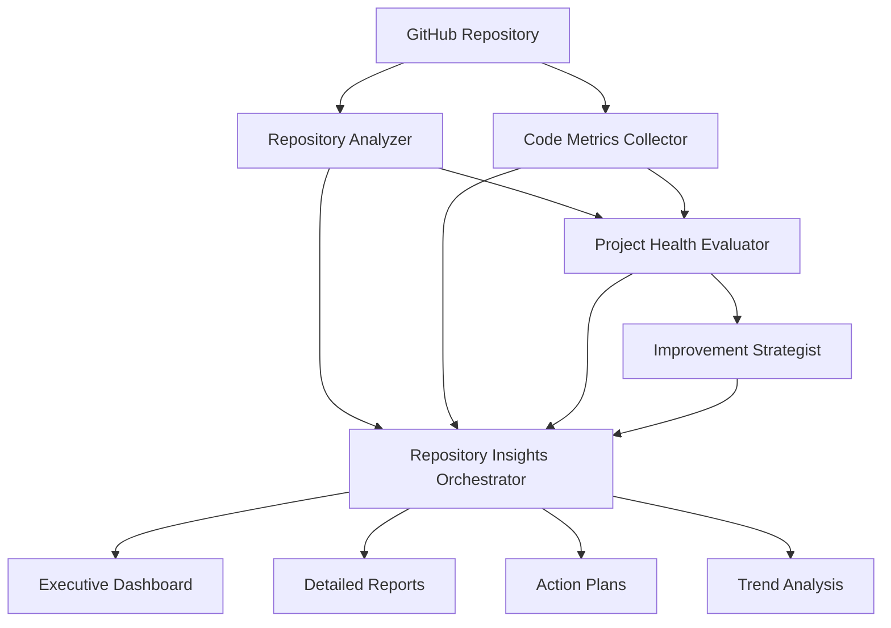

# GitHub Analytics and Repository Insights

> *"Measurement is the first step that leads to control and eventually to improvement."* - H. James Harrington

## Introduction

In the modern software development landscape, understanding your project's health goes far beyond code functionality. Repository analytics provide crucial insights into development patterns, team collaboration effectiveness, and project sustainability. VELOCITY-X's GitHub Analytics System introduces five specialized agents that work together to deliver comprehensive repository insights.

This chapter explores how VELOCITY-X transforms raw GitHub data into actionable intelligence, helping teams make data-driven decisions about their development processes, code quality, and strategic improvements.

## The GitHub Analytics Ecosystem

VELOCITY-X's GitHub Analytics System consists of five specialized agents that form a comprehensive analysis pipeline:

### 1. Repository Analyzer (velocity-x-repo-analyzer)
**Role**: GitHub metadata collection and analysis expert

The Repository Analyzer serves as the foundation of the analytics system, collecting and analyzing:

- **Commit History Patterns**: Frequency, size, and temporal patterns
- **Contributor Activity**: Code contribution levels and collaboration patterns  
- **Branch Strategy Analysis**: Branch lifecycle and merge patterns
- **Issue and PR Analytics**: Management efficiency and quality metrics
- **Workflow Performance**: CI/CD success rates and build times

### 2. Code Metrics Collector (velocity-x-code-metrics-collector)
**Role**: Code quantification and quality analysis expert

This agent performs deep code analysis to measure:

- **Complexity Metrics**: Cyclomatic and cognitive complexity
- **Quality Indicators**: Code duplication, technical debt, maintainability
- **Test Quality**: Coverage, test effectiveness, and maintenance
- **Dependency Analysis**: Internal and external dependency health

### 3. Project Health Evaluator (velocity-x-project-health-evaluator)
**Role**: Comprehensive project health assessment expert

The evaluator synthesizes data from multiple sources to provide:

- **Overall Health Scoring**: Weighted assessment across multiple dimensions
- **Trend Analysis**: Performance trajectory and regression detection
- **Risk Assessment**: Technical, organizational, and operational risks
- **Benchmarking**: Industry and peer comparisons

### 4. Improvement Strategist (velocity-x-improvement-strategist)
**Role**: Strategic improvement planning expert

Based on health evaluations, this agent develops:

- **Prioritized Action Plans**: Impact vs. effort analysis
- **ROI Calculations**: Investment return projections
- **Implementation Roadmaps**: Phased improvement strategies
- **Resource Planning**: Realistic capacity and timeline estimates

### 5. Repository Insights Orchestrator (velocity-x-repo-insights-orchestrator)
**Role**: Master coordination and reporting agent

The orchestrator manages the entire workflow:

- **Multi-agent Coordination**: Parallel and sequential execution management
- **Data Integration**: Comprehensive result synthesis
- **Report Generation**: Executive summaries and detailed analysis
- **Visualization**: Interactive dashboards and charts

## Core Analytics Framework

### Health Scoring Model

VELOCITY-X uses a comprehensive health scoring model that evaluates four key dimensions:

```python
health_dimensions = {
    'development_velocity': {
        'weight': 0.25,
        'metrics': {
            'commit_frequency': 'daily activity levels',
            'pr_throughput': 'review and merge efficiency',
            'feature_delivery_time': 'development cycle speed',
            'bug_fix_time': 'issue resolution speed'
        }
    },
    'code_quality': {
        'weight': 0.30,
        'metrics': {
            'test_coverage': 'code protection level',
            'complexity_score': 'maintainability index',
            'duplication_ratio': 'code reuse efficiency',
            'technical_debt': 'accumulated maintenance cost'
        }
    },
    'team_collaboration': {
        'weight': 0.25,
        'metrics': {
            'review_coverage': 'peer review engagement',
            'knowledge_sharing': 'cross-team collaboration',
            'communication_quality': 'discussion effectiveness',
            'contributor_diversity': 'team participation balance'
        }
    },
    'project_stability': {
        'weight': 0.20,
        'metrics': {
            'build_success_rate': 'CI/CD reliability',
            'deployment_frequency': 'release cadence',
            'rollback_rate': 'deployment quality',
            'incident_frequency': 'operational stability'
        }
    }
}
```

### Analytics Workflow Architecture



## Repository Analysis Deep Dive

### Commit Pattern Analysis

The Repository Analyzer examines commit patterns to understand development rhythms:

```python
class CommitPatternAnalyzer:
    def analyze_commit_patterns(self, commits_data):
        """Analyze commit patterns for insights"""
        patterns = {
            'temporal_distribution': self._analyze_time_patterns(commits_data),
            'size_distribution': self._analyze_commit_sizes(commits_data),
            'author_contributions': self._analyze_author_patterns(commits_data),
            'message_quality': self._analyze_commit_messages(commits_data)
        }
        
        insights = []
        
        # Detect working patterns
        if patterns['temporal_distribution']['weekend_ratio'] > 0.3:
            insights.append({
                'type': 'concern',
                'message': 'High weekend activity detected - potential work-life balance issues',
                'recommendation': 'Review team workload and deadline management'
            })
        
        # Analyze commit sizes
        if patterns['size_distribution']['large_commits_ratio'] > 0.2:
            insights.append({
                'type': 'improvement',
                'message': 'Many large commits detected - consider smaller, more frequent commits',
                'recommendation': 'Implement feature branching and more frequent integration'
            })
        
        return {
            'patterns': patterns,
            'insights': insights,
            'health_score': self._calculate_commit_health_score(patterns)
        }
```

### Pull Request Quality Assessment

PR analysis reveals collaboration effectiveness:

```python
def analyze_pr_quality(self, pr_data):
    """Comprehensive PR quality analysis"""
    
    metrics = {
        'review_thoroughness': {
            'avg_reviewers_per_pr': pr_data['avg_reviewers'],
            'avg_comments_per_pr': pr_data['avg_comments'],
            'review_time_distribution': pr_data['review_times']
        },
        'pr_characteristics': {
            'size_distribution': self._categorize_pr_sizes(pr_data),
            'approval_patterns': self._analyze_approval_patterns(pr_data),
            'merge_strategies': self._analyze_merge_patterns(pr_data)
        }
    }
    
    # Quality scoring
    quality_score = self._calculate_pr_quality_score(metrics)
    
    recommendations = []
    if metrics['review_thoroughness']['avg_reviewers_per_pr'] < 2:
        recommendations.append({
            'priority': 'high',
            'suggestion': 'Increase reviewer participation - aim for 2+ reviewers per PR',
            'impact': 'Improved code quality and knowledge sharing'
        })
    
    return {
        'metrics': metrics,
        'quality_score': quality_score,
        'recommendations': recommendations
    }
```

## Code Quality Metrics

### Complexity Analysis

Code complexity metrics provide objective quality measurements:

```python
class ComplexityAnalyzer:
    def __init__(self):
        self.thresholds = {
            'cyclomatic_complexity': {
                'low': 5,
                'medium': 10,
                'high': 15,
                'critical': 20
            },
            'cognitive_complexity': {
                'low': 10,
                'medium': 20,
                'high': 30,
                'critical': 40
            }
        }
    
    def analyze_project_complexity(self, codebase_path):
        """Comprehensive complexity analysis"""
        
        file_complexities = []
        for file_path in self._get_source_files(codebase_path):
            file_complexity = self._analyze_file_complexity(file_path)
            file_complexities.append(file_complexity)
        
        # Aggregate statistics
        complexity_summary = {
            'total_functions': sum(fc['function_count'] for fc in file_complexities),
            'avg_cyclomatic_complexity': self._calculate_average_cc(file_complexities),
            'complexity_distribution': self._create_complexity_distribution(file_complexities),
            'hotspots': self._identify_complexity_hotspots(file_complexities)
        }
        
        # Health assessment
        health_indicators = {
            'maintainability_risk': self._assess_maintainability_risk(complexity_summary),
            'refactoring_candidates': self._identify_refactoring_candidates(file_complexities),
            'complexity_trend': self._analyze_complexity_trend(complexity_summary)
        }
        
        return {
            'summary': complexity_summary,
            'health_indicators': health_indicators,
            'file_details': file_complexities
        }
```

### Technical Debt Quantification

Technical debt measurement provides concrete improvement targets:

```python
def calculate_technical_debt(self, analysis_results):
    """Quantify technical debt in hours and cost"""
    
    debt_sources = {
        'code_complexity': self._debt_from_complexity(analysis_results['complexity']),
        'code_duplication': self._debt_from_duplication(analysis_results['duplication']),
        'test_coverage_gaps': self._debt_from_coverage(analysis_results['coverage']),
        'outdated_dependencies': self._debt_from_dependencies(analysis_results['dependencies']),
        'code_smells': self._debt_from_smells(analysis_results['smells'])
    }
    
    total_debt_hours = sum(debt_sources.values())
    
    # Cost calculation (using average developer hourly rate)
    hourly_rate = 100  # USD
    debt_cost = total_debt_hours * hourly_rate
    
    # Priority matrix
    debt_priority = {
        'critical': debt_sources['code_complexity'] + debt_sources['test_coverage_gaps'],
        'high': debt_sources['code_duplication'] + debt_sources['code_smells'],
        'medium': debt_sources['outdated_dependencies']
    }
    
    return {
        'total_hours': total_debt_hours,
        'estimated_cost': debt_cost,
        'by_source': debt_sources,
        'priority_breakdown': debt_priority,
        'payoff_timeline': self._calculate_payoff_timeline(debt_sources)
    }
```

## Project Health Evaluation

### Multi-dimensional Health Assessment

The health evaluator synthesizes multiple data sources:

```python
class ProjectHealthEvaluator:
    def evaluate_comprehensive_health(self, repo_data, code_metrics, historical_data=None):
        """Comprehensive project health evaluation"""
        
        # Category evaluations
        health_categories = {
            'development_velocity': self._evaluate_velocity(repo_data, code_metrics),
            'code_quality': self._evaluate_quality(code_metrics),
            'team_collaboration': self._evaluate_collaboration(repo_data),
            'project_stability': self._evaluate_stability(repo_data, code_metrics)
        }
        
        # Overall health calculation
        overall_score = self._calculate_weighted_score(health_categories)
        
        # Risk assessment
        risk_analysis = self._assess_project_risks(health_categories, historical_data)
        
        # Trend analysis (if historical data available)
        trends = {}
        if historical_data:
            trends = self._analyze_health_trends(health_categories, historical_data)
        
        # Benchmarking
        benchmarks = self._compare_with_benchmarks(health_categories)
        
        return {
            'overall_health': {
                'score': overall_score,
                'grade': self._score_to_grade(overall_score),
                'percentile': benchmarks['overall_percentile']
            },
            'category_health': health_categories,
            'risk_analysis': risk_analysis,
            'trend_analysis': trends,
            'benchmarking': benchmarks,
            'recommendations': self._generate_health_recommendations(health_categories, risk_analysis)
        }
```

### Risk Assessment Framework

Risk evaluation covers multiple dimensions:

```python
def assess_project_risks(self, project_data):
    """Comprehensive risk assessment"""
    
    risk_categories = {
        'technical_risks': {
            'high_complexity_code': self._assess_complexity_risk(project_data),
            'low_test_coverage': self._assess_coverage_risk(project_data),
            'outdated_dependencies': self._assess_dependency_risk(project_data),
            'security_vulnerabilities': self._assess_security_risk(project_data)
        },
        'organizational_risks': {
            'key_person_dependency': self._assess_knowledge_concentration(project_data),
            'low_team_engagement': self._assess_collaboration_risk(project_data),
            'skill_gaps': self._assess_competency_risk(project_data)
        },
        'operational_risks': {
            'deployment_issues': self._assess_deployment_risk(project_data),
            'monitoring_gaps': self._assess_observability_risk(project_data),
            'incident_frequency': self._assess_stability_risk(project_data)
        }
    }
    
    # Calculate overall risk score
    overall_risk = self._calculate_composite_risk(risk_categories)
    
    # Prioritize risks by impact and likelihood
    prioritized_risks = self._prioritize_risks(risk_categories)
    
    return {
        'overall_risk_level': overall_risk,
        'risk_categories': risk_categories,
        'top_risks': prioritized_risks[:5],
        'mitigation_strategies': self._suggest_risk_mitigations(prioritized_risks)
    }
```

## Strategic Improvement Planning

### ROI-Based Prioritization

The Improvement Strategist uses data-driven ROI analysis:

```python
class ImprovementROICalculator:
    def calculate_improvement_roi(self, improvement_opportunity):
        """Calculate ROI for improvement initiatives"""
        
        # Investment calculation
        development_cost = improvement_opportunity['estimated_hours'] * self.hourly_rate
        training_cost = improvement_opportunity.get('training_hours', 0) * self.hourly_rate
        tool_cost = improvement_opportunity.get('tool_costs', 0)
        total_investment = development_cost + training_cost + tool_cost
        
        # Benefit calculation
        time_savings_annual = (
            improvement_opportunity.get('time_savings_per_week', 0) * 52 * self.hourly_rate
        )
        
        quality_benefits = self._calculate_quality_benefits(improvement_opportunity)
        risk_reduction_benefits = self._calculate_risk_reduction_benefits(improvement_opportunity)
        
        total_annual_benefits = time_savings_annual + quality_benefits + risk_reduction_benefits
        
        # ROI metrics
        roi_percentage = ((total_annual_benefits - total_investment) / total_investment) * 100
        payback_months = total_investment / (total_annual_benefits / 12)
        npv_3_years = self._calculate_npv(total_investment, total_annual_benefits, 3)
        
        return {
            'investment': total_investment,
            'annual_benefits': total_annual_benefits,
            'roi_percentage': round(roi_percentage, 2),
            'payback_period_months': round(payback_months, 1),
            'npv_3_years': round(npv_3_years, 2),
            'confidence_level': improvement_opportunity.get('success_probability', 0.8)
        }
```

### Strategic Roadmap Generation

Multi-phase improvement planning:

```python
def create_improvement_roadmap(self, opportunities, team_capacity):
    """Create phased improvement roadmap"""
    
    # Categorize opportunities by impact and effort
    categorized_opportunities = {
        'quick_wins': [],      # High impact, low effort
        'major_projects': [],  # High impact, high effort
        'fill_ins': [],       # Low impact, low effort
        'questionable': []     # Low impact, high effort
    }
    
    for opp in opportunities:
        category = self._categorize_opportunity(opp['impact_score'], opp['effort_score'])
        categorized_opportunities[category].append(opp)
    
    # Create implementation phases
    roadmap = {
        'phase_1_quick_wins': {
            'duration': '4-6 weeks',
            'initiatives': categorized_opportunities['quick_wins'][:3],
            'focus': 'Immediate value delivery and momentum building'
        },
        'phase_2_foundation': {
            'duration': '8-12 weeks',
            'initiatives': self._select_foundation_initiatives(opportunities),
            'focus': 'Infrastructure and process improvements'
        },
        'phase_3_transformation': {
            'duration': '3-6 months',
            'initiatives': categorized_opportunities['major_projects'][:2],
            'focus': 'Strategic improvements and major refactoring'
        }
    }
    
    # Add resource allocation and dependencies
    for phase in roadmap.values():
        phase['resource_requirements'] = self._calculate_phase_resources(phase['initiatives'])
        phase['dependencies'] = self._identify_phase_dependencies(phase['initiatives'])
        phase['success_metrics'] = self._define_phase_metrics(phase['initiatives'])
    
    return roadmap
```

## Comprehensive Dashboard and Reporting

### Executive Dashboard

The orchestrator generates executive-level insights:

```python
def create_executive_dashboard(self, comprehensive_analysis):
    """Generate executive dashboard with key insights"""
    
    dashboard = {
        'health_overview': {
            'overall_score': comprehensive_analysis['health_evaluation']['overall_health']['score'],
            'grade': comprehensive_analysis['health_evaluation']['overall_health']['grade'],
            'trend': self._determine_health_trend(comprehensive_analysis),
            'peer_ranking': comprehensive_analysis['health_evaluation']['benchmarking']['percentile']
        },
        
        'key_metrics': {
            'development_velocity': self._extract_velocity_kpis(comprehensive_analysis),
            'quality_indicators': self._extract_quality_kpis(comprehensive_analysis),
            'team_performance': self._extract_team_kpis(comprehensive_analysis),
            'stability_metrics': self._extract_stability_kpis(comprehensive_analysis)
        },
        
        'top_insights': self._extract_top_insights(comprehensive_analysis),
        
        'improvement_summary': {
            'total_opportunities': len(comprehensive_analysis['improvement_strategy']['opportunities']),
            'quick_wins_available': len([o for o in comprehensive_analysis['improvement_strategy']['opportunities'] 
                                        if o['category'] == 'quick_wins']),
            'expected_roi': comprehensive_analysis['improvement_strategy']['expected_roi'],
            'implementation_timeline': comprehensive_analysis['improvement_strategy']['timeline']
        },
        
        'risk_summary': {
            'overall_risk_level': comprehensive_analysis['health_evaluation']['risk_analysis']['overall_risk_level'],
            'critical_risks': [r for r in comprehensive_analysis['health_evaluation']['risk_analysis']['top_risks'] 
                              if r['severity'] == 'critical'],
            'mitigation_priority': comprehensive_analysis['health_evaluation']['risk_analysis']['mitigation_strategies'][:3]
        }
    }
    
    return dashboard
```

### Interactive Visualizations

Rich, interactive charts provide deep insights:

```python
def create_interactive_visualizations(self, analysis_data):
    """Generate interactive visualization components"""
    
    import plotly.graph_objects as go
    import plotly.express as px
    
    visualizations = {}
    
    # Health score radar chart
    health_categories = analysis_data['health_evaluation']['category_health']
    visualizations['health_radar'] = self._create_health_radar_chart(health_categories)
    
    # Development velocity trends
    if 'historical_data' in analysis_data:
        visualizations['velocity_trends'] = self._create_velocity_trend_chart(analysis_data['historical_data'])
    
    # Code quality heatmap
    visualizations['quality_heatmap'] = self._create_quality_heatmap(analysis_data['code_metrics'])
    
    # Risk matrix
    visualizations['risk_matrix'] = self._create_risk_matrix(analysis_data['health_evaluation']['risk_analysis'])
    
    # ROI vs Effort scatter plot
    visualizations['roi_effort_matrix'] = self._create_roi_effort_chart(analysis_data['improvement_strategy'])
    
    # Team collaboration network
    visualizations['collaboration_network'] = self._create_collaboration_network(analysis_data['repo_analysis'])
    
    return visualizations

def _create_health_radar_chart(self, health_categories):
    """Create radar chart for health categories"""
    
    categories = list(health_categories.keys())
    scores = [health_categories[cat]['score'] for cat in categories]
    
    fig = go.Figure()
    
    fig.add_trace(go.Scatterpolar(
        r=scores,
        theta=categories,
        fill='toself',
        name='Current Health',
        line=dict(color='rgb(67, 170, 139)')
    ))
    
    # Add industry benchmark
    benchmark_scores = [75, 80, 70, 85]  # Example benchmarks
    fig.add_trace(go.Scatterpolar(
        r=benchmark_scores,
        theta=categories,
        fill='toself',
        name='Industry Average',
        line=dict(color='rgb(255, 127, 80)', dash='dash'),
        opacity=0.6
    ))
    
    fig.update_layout(
        polar=dict(
            radialaxis=dict(
                visible=True,
                range=[0, 100]
            )),
        showlegend=True,
        title="Project Health Assessment"
    )
    
    return fig
```

## Practical Implementation

### Setting Up GitHub Analytics

```bash
# Install VELOCITY-X GitHub Analytics System
pip install velocity-x-github-analytics

# Configure GitHub access
export GITHUB_TOKEN="your_github_token"
export GITHUB_ENTERPRISE_URL="https://github.your-company.com"  # If using GitHub Enterprise

# Run comprehensive analysis
velocity-x-analytics analyze \
  --repo "your-org/your-repo" \
  --analysis-depth comprehensive \
  --output-formats json html pdf \
  --include-historical \
  --benchmark-against industry
```

### Configuration Options

```yaml
# analytics-config.yaml
analysis_settings:
  depth: comprehensive  # basic, standard, comprehensive
  historical_period_days: 180
  include_dependencies: true
  benchmark_sources:
    - industry_standards
    - organization_peers
    - similar_projects

output_settings:
  formats: [json, html, pdf, excel]
  dashboard:
    enabled: true
    auto_refresh: true
    refresh_interval: "1h"
  
notifications:
  enabled: true
  channels:
    - slack: "#development-metrics"
    - email: "team-leads@company.com"
  
triggers:
  health_score_threshold: 70
  risk_level_threshold: "high"
  trend_degradation_alert: true
```

### Continuous Monitoring Setup

```python
# Set up automated analysis
from velocity_x_analytics import AnalyticsScheduler

scheduler = AnalyticsScheduler()

# Daily light analysis
scheduler.add_job(
    func=run_daily_analysis,
    trigger="cron",
    hour=6,
    minute=0,
    args=["--analysis-depth", "basic"]
)

# Weekly comprehensive analysis
scheduler.add_job(
    func=run_weekly_analysis,
    trigger="cron",
    day_of_week="sun",
    hour=2,
    minute=0,
    args=["--analysis-depth", "comprehensive"]
)

scheduler.start()
```

## Best Practices and Guidelines

### 1. Establishing Baselines

Before implementing improvements, establish clear baselines:

```python
def establish_project_baseline(repo_url):
    """Establish baseline metrics for improvement tracking"""
    
    baseline_analysis = run_comprehensive_analysis(repo_url)
    
    baseline_metrics = {
        'measurement_date': datetime.now().isoformat(),
        'health_score': baseline_analysis['health_score'],
        'key_metrics': {
            'test_coverage': baseline_analysis['code_metrics']['test_coverage'],
            'technical_debt_hours': baseline_analysis['code_metrics']['technical_debt'],
            'avg_pr_review_time': baseline_analysis['repo_analysis']['avg_pr_review_time'],
            'deployment_frequency': baseline_analysis['repo_analysis']['deployment_frequency']
        },
        'team_metrics': {
            'active_contributors': baseline_analysis['repo_analysis']['active_contributors'],
            'knowledge_distribution': baseline_analysis['collaboration']['knowledge_distribution']
        }
    }
    
    # Store baseline for future comparisons
    save_baseline(repo_url, baseline_metrics)
    
    return baseline_metrics
```

### 2. Metric Interpretation Guidelines

Understanding what metrics really mean:

```python
def interpret_metrics(analysis_results):
    """Provide context and interpretation for metrics"""
    
    interpretations = {
        'test_coverage': {
            'value': analysis_results['test_coverage'],
            'interpretation': get_coverage_interpretation(analysis_results['test_coverage']),
            'industry_context': get_industry_coverage_context(analysis_results['project_type']),
            'actionability': get_coverage_actions(analysis_results['test_coverage'])
        },
        'technical_debt': {
            'value': analysis_results['technical_debt_hours'],
            'interpretation': get_debt_interpretation(analysis_results['technical_debt_hours'], 
                                                    analysis_results['team_size']),
            'urgency': get_debt_urgency(analysis_results['technical_debt_ratio']),
            'payoff_timeline': estimate_debt_payoff(analysis_results['technical_debt_hours'])
        }
    }
    
    return interpretations

def get_coverage_interpretation(coverage_percentage):
    """Interpret test coverage in context"""
    
    if coverage_percentage >= 90:
        return {
            'level': 'excellent',
            'description': 'Excellent coverage providing strong safety net',
            'focus': 'Maintain quality and focus on edge cases'
        }
    elif coverage_percentage >= 80:
        return {
            'level': 'good',
            'description': 'Good coverage with room for improvement',
            'focus': 'Identify and cover critical uncovered paths'
        }
    elif coverage_percentage >= 60:
        return {
            'level': 'moderate',
            'description': 'Moderate coverage - significant improvement needed',
            'focus': 'Prioritize testing critical business logic'
        }
    else:
        return {
            'level': 'poor',
            'description': 'Low coverage presents significant risk',
            'focus': 'Urgent: Implement comprehensive testing strategy'
        }
```

### 3. Continuous Improvement Cycles

Implementing systematic improvement:

```python
class ContinuousImprovementManager:
    def __init__(self, repo_url):
        self.repo_url = repo_url
        self.improvement_cycles = []
    
    def start_improvement_cycle(self, duration_weeks=8):
        """Start a new improvement cycle"""
        
        # Current state analysis
        current_analysis = run_comprehensive_analysis(self.repo_url)
        
        # Identify improvement opportunities
        opportunities = identify_improvement_opportunities(current_analysis)
        
        # Select cycle focus
        cycle_focus = self.select_cycle_focus(opportunities, duration_weeks)
        
        # Create implementation plan
        implementation_plan = create_implementation_plan(cycle_focus, duration_weeks)
        
        cycle = {
            'cycle_id': f"cycle_{len(self.improvement_cycles) + 1}",
            'start_date': datetime.now(),
            'duration_weeks': duration_weeks,
            'focus_areas': cycle_focus,
            'baseline_metrics': current_analysis['key_metrics'],
            'implementation_plan': implementation_plan,
            'success_criteria': define_success_criteria(cycle_focus)
        }
        
        self.improvement_cycles.append(cycle)
        return cycle
    
    def track_cycle_progress(self, cycle_id):
        """Track progress of current improvement cycle"""
        
        cycle = self.get_cycle(cycle_id)
        current_analysis = run_comprehensive_analysis(self.repo_url)
        
        progress = {
            'weeks_elapsed': (datetime.now() - cycle['start_date']).days // 7,
            'completion_percentage': calculate_completion_percentage(cycle, current_analysis),
            'metric_improvements': compare_metrics(cycle['baseline_metrics'], 
                                                 current_analysis['key_metrics']),
            'on_track': assess_if_on_track(cycle, current_analysis)
        }
        
        return progress
```

## Conclusion

VELOCITY-X's GitHub Analytics System represents a paradigm shift from reactive to proactive project management. By providing comprehensive, data-driven insights into repository health, code quality, and team performance, teams can make informed decisions about their development processes.

The five-agent system works in harmony to deliver:

1. **Comprehensive Analysis**: Deep insights into all aspects of repository health
2. **Actionable Intelligence**: Prioritized, ROI-based improvement recommendations
3. **Continuous Monitoring**: Ongoing health tracking and trend analysis
4. **Strategic Planning**: Data-driven roadmaps for systematic improvement

### Key Takeaways

- **Measurement Drives Improvement**: What gets measured gets managed
- **Context Matters**: Metrics need interpretation within project and industry context
- **Balance is Critical**: Focus on comprehensive health, not just individual metrics
- **Continuous Evolution**: Regular analysis and iterative improvement cycles
- **Team Engagement**: Analytics should empower teams, not replace judgment

### Next Steps

1. **Implement Basic Analytics**: Start with fundamental repository analysis
2. **Establish Baselines**: Document current state before making changes
3. **Focus on Quick Wins**: Build momentum with high-impact, low-effort improvements
4. **Iterate and Refine**: Use data to guide continuous improvement cycles
5. **Scale Across Organization**: Extend analytics to multiple repositories and teams

The journey toward data-driven development excellence begins with understanding where you are today. VELOCITY-X's GitHub Analytics System provides the compass for that journey, guiding teams toward higher productivity, better quality, and more sustainable development practices.