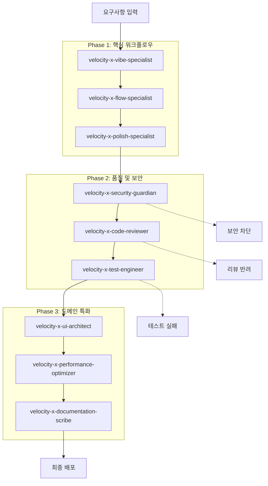
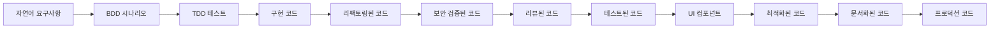

# VELOCITY-X 통합 워크플로우: 9개 에이전트의 유기적 협업

## 개요

VELOCITY-X(Velocity-X Agentic Engine)는 9개의 전문화된 에이전트가 체계적으로 협업하여 소프트웨어 개발 라이프사이클 전반을 자동화하는 다중 에이전트 시스템입니다. 각 에이전트는 특정 영역에 특화되어 있으며, 정의된 핸드오프를 통해 코드가 단계적으로 개선되어 최종적으로 프로덕션 준비 상태에 도달합니다.

## 전체 워크플로우 아키텍처



## 단계별 워크플로우 상세

### Phase 1: 핵심 워크플로우

#### 1. 요구사항 → BDD 시나리오 (velocity-x-vibe-specialist)
```yaml
입력:
  - 자연어 사용자 스토리
  - 제품 요구사항 문서
  - 이해관계자 피드백

처리:
  - 요구사항 분석 및 명확화
  - BDD 시나리오 생성 (Given-When-Then)
  - 엣지 케이스 및 예외 상황 정의

출력:
  - .feature 파일 (Gherkin 형식)
  - 구현 우선순위 문서
  - 테스트 케이스 초안

다음 단계: velocity-x-flow-specialist
```

#### 2. BDD → TDD 구현 (velocity-x-flow-specialist)
```yaml
입력:
  - BDD 시나리오 (.feature 파일)
  - 기존 코드베이스
  - 기술 요구사항

처리:
  - Red-Green-Refactor 사이클 실행
  - 실패하는 테스트 먼저 작성
  - 최소한의 구현으로 테스트 통과
  - PR 생성 및 커밋 메시지 자동화

출력:
  - 테스트 코드
  - 구현 코드
  - Pull Request
  - 커버리지 리포트

다음 단계: velocity-x-polish-specialist
```

#### 3. 코드 정제 (velocity-x-polish-specialist)
```yaml
입력:
  - 구현된 기능 코드
  - 정적 분석 리포트
  - 코드 메트릭

처리:
  - 코드 스멜 식별 및 제거
  - DRY, KISS, SOLID 원칙 적용
  - 리팩토링 패턴 적용
  - 복잡도 및 중복 최소화

출력:
  - 리팩토링된 코드
  - 개선 사항 보고서
  - 코드 품질 메트릭

다음 단계: velocity-x-security-guardian (병렬), velocity-x-code-reviewer
```

### Phase 2: 품질 및 보안 보증

#### 4. 보안 검증 (velocity-x-security-guardian) 🔒
```yaml
입력:
  - 모든 소스 코드
  - 의존성 파일
  - 설정 파일

처리:
  - SAST/DAST 스캔 실행
  - ISMS-P 통제 항목 검증
  - OWASP Top 10 대응 확인
  - 시크릿 및 취약점 탐지

출력:
  - 보안 스캔 리포트
  - 취약점 수정 제안
  - 보안 승인/차단 결정

게이트웨이: 
  - HIGH 심각도 → 워크플로우 중단
  - MEDIUM/LOW → 경고 후 진행

다음 단계: velocity-x-code-reviewer (보안 통과 시)
```

#### 5. 코드 리뷰 (velocity-x-code-reviewer)
```yaml
입력:
  - 리팩토링된 코드
  - 보안 검증된 코드
  - PR diff 및 메타데이터

처리:
  - 기능성, 가독성, 성능, 보안 검토
  - 모범 사례 준수 확인
  - 자동화된 리뷰 코멘트 생성
  - 코드 품질 점수 산정

출력:
  - 상세한 리뷰 코멘트
  - 승인/변경 요청 결정
  - 학습 리소스 추천

다음 단계: velocity-x-test-engineer (승인 시)
```

#### 6. 테스트 강화 (velocity-x-test-engineer)
```yaml
입력:
  - 리뷰 통과된 코드
  - BDD 시나리오
  - 기존 테스트 스위트

처리:
  - 단위/통합/E2E 테스트 생성
  - 테스트 커버리지 분석
  - 엣지 케이스 테스트 추가
  - 변이 테스트 실행

출력:
  - 포괄적인 테스트 스위트
  - 커버리지 리포트 (목표: 85%+)
  - 테스트 실행 결과

다음 단계: velocity-x-ui-architect (UI 관련 시), velocity-x-performance-optimizer
```

### Phase 3: 도메인 특화 최적화

#### 7. UI 컴포넌트 생성 (velocity-x-ui-architect) 🎨
```yaml
조건: UI/프론트엔드 관련 코드인 경우에만 활성화

입력:
  - 디자인 시스템 사양
  - 와이어프레임/목업
  - 접근성 요구사항

처리:
  - 재사용 가능한 컴포넌트 생성
  - 디자인 토큰 적용
  - WCAG 2.1 접근성 준수
  - 반응형 디자인 구현

출력:
  - React/Vue/Angular 컴포넌트
  - 스토리북 스토리
  - 타입 정의 파일
  - 컴포넌트 사용 가이드

다음 단계: velocity-x-performance-optimizer
```

#### 8. 성능 최적화 (velocity-x-performance-optimizer) ⚡
```yaml
입력:
  - 모든 구현된 코드
  - 성능 테스트 결과
  - 시스템 메트릭

처리:
  - 알고리즘 복잡도 분석
  - 메모리 사용량 최적화
  - 데이터베이스 쿼리 최적화
  - 웹 성능 (Core Web Vitals) 개선

출력:
  - 성능 분석 보고서
  - 최적화된 코드
  - 벤치마크 결과
  - 성능 가이드라인

다음 단계: velocity-x-documentation-scribe
```

#### 9. 문서화 (velocity-x-documentation-scribe) 📚
```yaml
입력:
  - 최종 코드베이스
  - 커밋 히스토리
  - 설계 결정 사항

처리:
  - API 문서 자동 생성
  - 아키텍처 다이어그램 생성
  - 사용자 가이드 작성
  - ADR (Architecture Decision Records) 업데이트

출력:
  - 통합 문서 사이트
  - API 문서
  - 개발자 가이드
  - 지식 베이스

최종 결과: 프로덕션 배포 준비 완료
```

## 에이전트 간 상호작용 패턴

### 1. 순차적 처리 (Sequential Processing)
```yaml
기본 플로우:
  vibe → flow → polish → security → reviewer → test → ui → performance → docs

특징:
  - 각 에이전트의 출력이 다음 에이전트의 입력
  - 품질이 단계적으로 향상
  - 명확한 책임 분리
```

### 2. 병렬 처리 (Parallel Processing)
```yaml
보안 스캔:
  polish-specialist 출력 → security-guardian (병렬)
                        → code-reviewer (병렬)

UI 개발:
  test-engineer → ui-architect (UI 관련 시)
              → performance-optimizer (일반)

특징:
  - 독립적인 작업의 동시 실행
  - 전체 처리 시간 단축
  - 리소스 효율성 극대화
```

### 3. 조건부 처리 (Conditional Processing)
```yaml
보안 게이트:
  IF security_risk == "HIGH":
    BLOCK workflow
    RETURN security_report
  ELSE:
    CONTINUE to code-reviewer

UI 분기:
  IF code_type == "frontend":
    ROUTE to ui-architect
  ELSE:
    SKIP to performance-optimizer

특징:
  - 스마트한 라우팅
  - 불필요한 처리 방지
  - 맥락 인식 처리
```

### 4. 피드백 루프 (Feedback Loops)
```yaml
품질 개선 루프:
  code-reviewer → REJECT → polish-specialist → code-reviewer

테스트 강화 루프:
  test-engineer → COVERAGE_LOW → flow-specialist → test-engineer

성능 개선 루프:
  performance-optimizer → SLOW → polish-specialist → performance-optimizer

특징:
  - 지속적 품질 개선
  - 자동화된 피드백
  - 수렴적 최적화
```

## 데이터 흐름 및 아티팩트

### 핵심 데이터 구조
```yaml
WorkflowContext:
  project_info:
    name: string
    version: string
    tech_stack: array
    
  current_state:
    phase: string
    active_agent: string
    status: string
    
  artifacts:
    source_code: CodeBase
    tests: TestSuite
    documentation: DocSet
    reports: ReportSet
    
  metrics:
    quality_score: float
    coverage: float
    security_rating: string
    performance_score: float

AgentHandoff:
  from_agent: string
  to_agent: string
  input_data: object
  metadata: object
  timestamp: datetime
  success: boolean
```

### 아티팩트 진화 과정


## 품질 게이트 및 메트릭

### 필수 통과 기준
```yaml
보안 게이트:
  - 심각도 HIGH 취약점: 0개
  - 시크릿 노출: 0개
  - ISMS-P 준수율: 100%

품질 게이트:
  - 코드 복잡도: <10 (McCabe)
  - 테스트 커버리지: >85%
  - 코드 중복률: <5%

성능 게이트:
  - API 응답시간: <200ms
  - 메모리 사용률: <80%
  - Core Web Vitals: Good 등급
```

### 종합 품질 점수
```python
def calculate_jae_quality_score(artifacts):
    """VELOCITY-X 종합 품질 점수 계산"""
    weights = {
        'functionality': 0.25,    # 기능 정확성
        'security': 0.25,         # 보안 점수
        'maintainability': 0.20,  # 유지보수성
        'performance': 0.15,      # 성능
        'documentation': 0.15     # 문서화
    }
    
    scores = {
        'functionality': calculate_test_success_rate(artifacts.tests),
        'security': calculate_security_score(artifacts.security_report),
        'maintainability': calculate_code_quality_score(artifacts.code),
        'performance': calculate_performance_score(artifacts.metrics),
        'documentation': calculate_doc_coverage(artifacts.docs)
    }
    
    total_score = sum(score * weights[metric] for metric, score in scores.items())
    return min(100, max(0, total_score))
```

## 확장성 및 커스터마이징

### 에이전트 추가/제거
```yaml
MVP 구성 (해커톤):
  - velocity-x-polish-specialist
  - velocity-x-code-reviewer  
  - velocity-x-test-engineer

완전한 구성:
  - 모든 9개 에이전트

커스텀 구성:
  - 프로젝트 요구사항에 따라 선택적 활성화
  - 워크플로우 순서 조정 가능
  - 에이전트별 설정 커스터마이징
```

### 통합 설정 예시
```yaml
jae_workflow_config:
  name: "Quality Trio MVP"
  version: "1.0.0"
  
  enabled_agents:
    - velocity-x-polish-specialist
    - velocity-x-code-reviewer
    - velocity-x-test-engineer
  
  workflow_sequence:
    - name: "polish"
      agent: "velocity-x-polish-specialist"
      required: true
      timeout: 300  # seconds
      
    - name: "review"
      agent: "velocity-x-code-reviewer"
      required: true
      depends_on: ["polish"]
      
    - name: "test"
      agent: "velocity-x-test-engineer"
      required: true
      depends_on: ["review"]
  
  quality_gates:
    min_coverage: 80
    max_complexity: 10
    security_level: "medium"
  
  notifications:
    success: ["slack://dev-team"]
    failure: ["email://tech-lead@company.com"]
```

## 성공 지표 및 ROI

### DORA 메트릭 개선 목표
```yaml
배포 빈도 (Deployment Frequency):
  현재: 주 1회
  목표: 일 1회
  VELOCITY-X 기여: 자동화된 품질 검증으로 배포 신뢰성 향상

변경 리드 타임 (Lead Time for Changes):
  현재: 5일
  목표: 2일
  VELOCITY-X 기여: 자동화된 리뷰 및 테스트로 대기 시간 단축

변경 실패율 (Change Failure Rate):
  현재: 15%
  목표: 5%
  VELOCITY-X 기여: 다층적 품질 검증으로 결함 사전 차단

서비스 복구 시간 (Mean Time to Recovery):
  현재: 4시간
  목표: 1시간
  VELOCITY-X 기여: 포괄적 테스트와 문서화로 빠른 문제 진단
```

### 비즈니스 가치
```yaml
개발 생산성:
  - 코드 리뷰 시간 70% 단축
  - 버그 수정 시간 50% 감소
  - 문서 작성 시간 80% 절약

코드 품질:
  - 기술 부채 40% 감소
  - 코드 재사용성 60% 향상
  - 신규 개발자 온보딩 시간 50% 단축

비용 절감:
  - 연간 개발자 시간 1,200시간 절약
  - 프로덕션 장애 건수 75% 감소
  - 유지보수 비용 30% 절감
```

VELOCITY-X 통합 워크플로우는 단순한 도구의 집합이 아닌, 개발팀의 집단 지성을 소프트웨어로 구현한 지능적 시스템입니다. 각 에이전트의 전문성이 유기적으로 결합되어 기술 부채를 줄이고, 코드 품질을 향상시키며, 개발자가 창조적 작업에 집중할 수 있는 환경을 만듭니다.